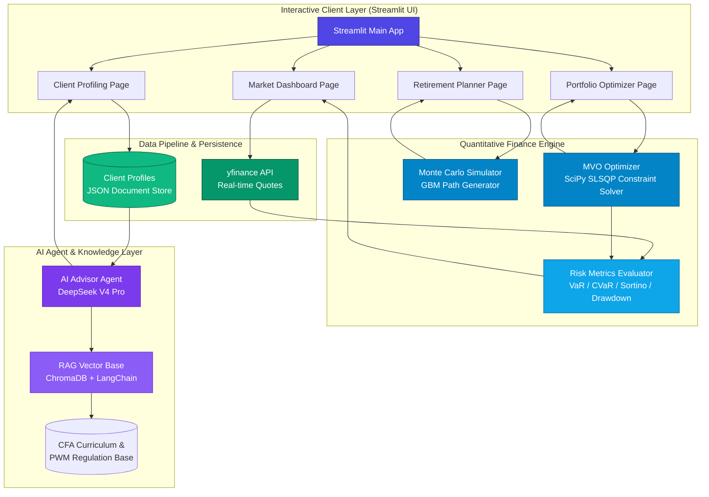

<p align="right">
  <a href="./README.md">English</a> | <a href="./README.zh-CN.md">简体中文</a> | <strong>日本語</strong>
</p>

<div align="center">
  

  # AI WealthPilot

  *CFA®知識体系に準拠したインテリジェント・ウェルス・マネジメント＆ポートフォリオ量化投資エンジン*

  [](https://www.python.org)
  [](https://streamlit.io)
  [](https://www.cfainstitute.org)
  [](LICENSE)
  [](https://github.com/Michelia-L/AI-WealthPilot/actions)

  ⭐ もしこのプロジェクトが気に入ったら、GitHubでスターを付けてください！とても励みになります！

  [概要](#概要) • [主な特徴](#主な特徴) • [システムアーキテクチャ](#システムアーキテクチャ) • [金融の数学的モデル](#金融の数学的モデル) • [ディレクトリ構成](#ディレクトリ構成) • [クイックスタート](#クイックスタート) • [テストの実行](#テストの実行) • [免責事項](#免責事項)

</div>

---

## 概要

**AI WealthPilot** は、プライベート・ウェルス・マネジメント（PWM）向けに設計された、機関投資家レベルの本格的な資産配分・意思決定支援システムです。**CFA® Level III (Private Wealth Management)** のコアシラバスを堅牢なコードとして具現化し、定量的金融理論と現代のソフトウェア工学を高い次元で融合させています。

本システムは、**現代ポートフォリオ理論（MPT）**に基づく平均分散最適化ソルバーと、**幾何ブラウン運動（GBM）**を用いた生涯収支モンテカルロ・シミュレーターを搭載し、さらに **AI アドバイザー Agent** を通じて行動ファイナンスに基づいた最適な資産計画提案書を生成します。

> [!TIP]
> ポートフォリオ最適化エンジンおよびマーケットダッシュボードは、標準の公開APIを利用して完全にオフラインで動作可能です。DeepSeek APIキーを設定することで、AIアドバイザーのストリーミング提案書自動生成機能が有効化されます。

---

## 主な特徴

- 🎓 **CFA® Level III PWMフレームワークへの準拠**  
  客観的な財務上のリスク許容**能力（Ability）**と、主観的な心理的リスク許容**意思（Willingness）**の双方から評価する双方向プロファイリングを実装。CFAの慎重原則に則り、両者に乖離がある場合は「低い方のスコア」を採用して顧客資産を守ります。
- 🧮 **厳格な平均分散最適化 (MVO)**  
  `SciPy` の SLSQP 求解アルゴリズムを使用して効率的フロンティア (Efficient Frontier) を描き、シャープ比率を最大化する接点ポートフォリオ (Tangency Portfolio) および資本配分線 (CAL) を算出します。
- 🎲 **ライフサイクル・モンテカルロシミュレーション**  
  離散時間の**幾何ブラウン運動 (GBM)**モデルを採用し、**イェンゼンの不等式によるボラティリティ・ドラッグの修正**を加えた10,000パスの長期資産シミュレーションを実行。積立期（資産形成）と取崩し期（リタイア後）の二段階ライフサイクルに対応。
- 🛡️ **包括的なテールリスク測定**  
  下方変動のみにペナルティを課す **Sortino Ratio (ソルティノ比率)**、およびヒストリカル・シミュレーション法による信頼水準 $\alpha = 95\%$ の日次 **Value at Risk (VaR)** と **Conditional VaR (CVaR / Expected Shortfall)** を算出。非対称かつファットテールな資産に最適。
- 🤖 **AI アドバイザー Agent**  
  LLM (`DeepSeek V4 Pro`) を活用し、顧客の財務状態および意思決定における行動バイアス（損失回避や過剰自信など）を検知し、パーソナライズされた資産計画書を流式に出力します。
- 📊 **金融端末レベルの美しいインタラクション**  
  Streamlit で構築された洗練されたダークテーマに、Plotly を使ったマルチディメンションなインタラクティブグラフを統合。拡大・縮小やホバー情報をスムーズに表示。

---

## システムアーキテクチャ

以下は、可視化レイヤー、クオンツ計算エンジン、データ・永続化層、および AI エージェントコア間の通信とデータフローを示すダイアグラムです。



---

## 金融の数学的モデル

### 1. 現代ポートフォリオ理論と平均分散最適化 (MVO)
共分散行列と $N$ 個の資産の期待収益率が与えられたとき、システムは `SLSQP` アルゴリズムを用いて以下の制約付き最適化問題を解きます。

*   **目的関数 (ポートフォリオ分散の最小化)**:
    $$\min_{w} \sigma_p^2 = w^T \Sigma w$$
*   **制約条件**:
    $$\sum_{i=1}^N w_i = 1 \quad (\text{フルインベストメント制約})$$
    $$w_i \in [0, 1] \quad (\text{ロングオンリー制約})$$
    $$w^T \mu = R_{\text{target}} \quad (\text{目標収益率制約})$$

ここで、$w \in \mathbb{R}^N$ はポートフォリオウェイトベクトル、$\Sigma \in \mathbb{R}^{N \times N}$ は年率換算共分散行列、$\mu \in \mathbb{R}^N$ は年率換算期待収益率ベクトルです。

### 2. 資本配分線 (CAL) と接点ポートフォリオ (Tangency Portfolio)
接点ポートフォリオは、無リスク金利下でシャープ比率 (Sharpe Ratio) を最大化するリスク資産の組み合わせです。

$$\max_{w} \text{Sharpe} = \frac{w^T \mu - R_f}{\sqrt{w^T \Sigma w}}$$

ここで $R_f$ は年率換算無リスク金利（デフォルトは米国債金利に基づく $4.5\%$）です。

### 3. 幾何ブラウン運動 (GBM) とボラティリティ・ドラッグの修正
長期的な資産寿命の推計において、幾何平均と算術平均の乖離による過大評価を防ぐため、イェンゼンの不等式による対数正規修正（ボラティリティ・ドラッグの修正）を加えた離散時間幾何ブラウン運動を用いて資産シミュレーションを行います。

$$S_{t+\Delta t} = S_t \exp \left( \left(\mu - \frac{1}{2}\sigma^2\right)\Delta t + \sigma \sqrt{\Delta t} Z_t \right)$$

- **蓄積期**: $V_{t+1} = V_t e^{(\mu - \frac{1}{2}\sigma^2) + \sigma Z_t} + \text{Annual Savings}$
- **取崩し期**: $V_{t+1} = V_t e^{(\mu_{new} - \frac{1}{2}\sigma^2_{new}) + \sigma_{new} Z_t} - \text{Annual Outflow}$

### 4. テールリスクおよび下方偏差別指標
- **下方偏差 ($\sigma_{\text{downside}}$)**: 無リスク金利またはゼロを下回るリターン変動のみを対象とします。
  $$\sigma_{\text{downside}} = \sqrt{\frac{252}{T} \sum_{t=1}^T \left(\min(R_{p,t}, 0)\right)^2}$$
- **ソルティノ比率 (Sortino Ratio)**:
  $$\text{Sortino Ratio} = \frac{R_p - R_f}{\sigma_{\text{downside}}}$$
- **Value at Risk (VaR)** & **Conditional VaR (CVaR)**: ヒストリカル・シミュレーション法を用い、信頼区間 $\alpha = 95\%$ にて歪度および尖度を考慮したリスク値を測定します。

---

## ディレクトリ構成

```
AI-WealthPilot/
├── src/
│   ├── app.py                    # Streamlit メインエントリーおよびルーティング
│   ├── config.py                 # 共通設定（13資産クラス定義）、ハイパーパラメータ
│   ├── portfolio/                # 【クオンツ計算コアエンジン】
│   │   ├── optimizer.py          # MVOソルバー、接点ポートフォリオ、ディリクレシミュレーション
│   │   ├── simulator.py          # GBMシミュレーター、積立・取崩しライフサイクル生成
│   │   ├── risk_metrics.py       # リスク指標計算（Sharpe, Sortino, VaR, CVaR）
│   │   └── views.py              # Black-Litterman 視点マトリクスプロセッサー
│   ├── data/                     # 【データ取得】
│   │   └── market_data.py        # yfinance リアルタイムデータ取得・相関行列計算
│   ├── visualization/            # 【チャート描画】
│   │   └── charts.py             # Plotly インタラクティブ描画コンポーネント
│   ├── views/                    # 【Streamlit画面】
│   │   ├── market_dashboard.py   # 主要アセット相関・市況ダッシュボード
│   │   ├── portfolio_optimizer.py# MVO & Black-Litterman 最適化画面
│   │   ├── retirement_planner.py # ライフサイクル資産寿命プランナー
│   │   ├── client_profiling.py   # CFA IPS 準拠対話型リスク評価・顧客管理
│   │   └── ai_advisor.py         # AIアドバイザー提案書生成画面（ストリーム）
│   ├── agents/                   # 【AIエージェント】
│   │   ├── profiler.py           # 顧客プロファイル解析エージェント
│   │   ├── advisor.py            # DeepSeek V4 Pro 提案書生成エージェント
│   │   ├── portfolio_recommender.py # 個別化ポートフォリオマッチングエージェント
│   │   └── report_storage.py     # JSONアドバイザリー報告書保存
│   └── rag/                      # 【RAGナレッジベース】(開発予定)
├── tests/                        # 【自動テスト】
│   ├── test_portfolio.py         # ポートフォリオ最適化、GBMなどのテスト
│   ├── test_profiler.py          # 顧客プロファイリング・就低原則テスト (22ケース)
│   ├── test_black_litterman.py   # Black-Litterman モデル計算のテスト
│   ├── test_advanced_portfolio.py# 重抽様フロンティア、行列正則化テスト
│   ├── test_advisor.py           # DeepSeek 統合テスト
│   └── test_phase3_features.py   # フェーズ3機能のエンドツーエンドテスト
└── data/
    ├── profiles/                 # 顧客プロファイル（JSONドキュメント）
    ├── reports/                  # 生成済みAI提案書（JSON）
    └── sample/                   # オフライン用データキャッシュ
```

---

## クイックスタート

### 動作要件

- **Python 3.11+**
- Git

### インストール方法

1. **コードのクローン**
   ```bash
   git clone https://github.com/Michelia-L/AI-WealthPilot.git
   cd AI-WealthPilot
   ```

2. **仮想環境の有効化**
   ```bash
   # Windows
   python -m venv .venv
   .venv\Scripts\activate

   # macOS / Linux
   python3 -m venv .venv
   source .venv/bin/activate
   ```

3. **パッケージのインストール**
   ```bash
   pip install -r requirements.txt
   ```

4. **環境変数の設定**
   ```bash
   cp .env.example .env
   # .env ファイルを開き、DEEPSEEK_API_KEY を設定してAIアドバイザーを有効化します。
   # キーの取得はこちら: https://platform.deepseek.com
   ```

5. **アプリの起動**
   ```bash
   streamlit run src/app.py
   ```
   ブラウザで自動的に `http://localhost:8501` が開きます。

---

## テストの実行

ポートフォリオ計算モデル、リスク評価ロジック、およびエージェント統合のテストを実行するには：

```bash
pytest -v
```

---

## 免責事項

> [!WARNING]
> **コンプライアンスに関する免責声明**:
> 
> 1. 本プロジェクト（AI WealthPilot）は、著者の**クオンツ・プログラミング、CFA®知識体系の実践、および AI Agent アーキテクチャのスキルを示すポートフォリオ作品**として作成されたものです。
> 2. 当システムから算出されるポートフォリオの比率、最適化曲線、資産生存確率、AIによる提案は、**過去の統計データおよび仮定に基づく理論上のシミュレーション結果であり、いかなる場合も実際の投資アドバイスや財務計画を構成するものではありません**。
> 3. 金融市場には極めて高いリスクが伴います。モデルのドリフトや黒天鵝テールリスクなどにより発生した実際の運用上の損失について、著者および当プロジェクトは一切の責任を負いません。
