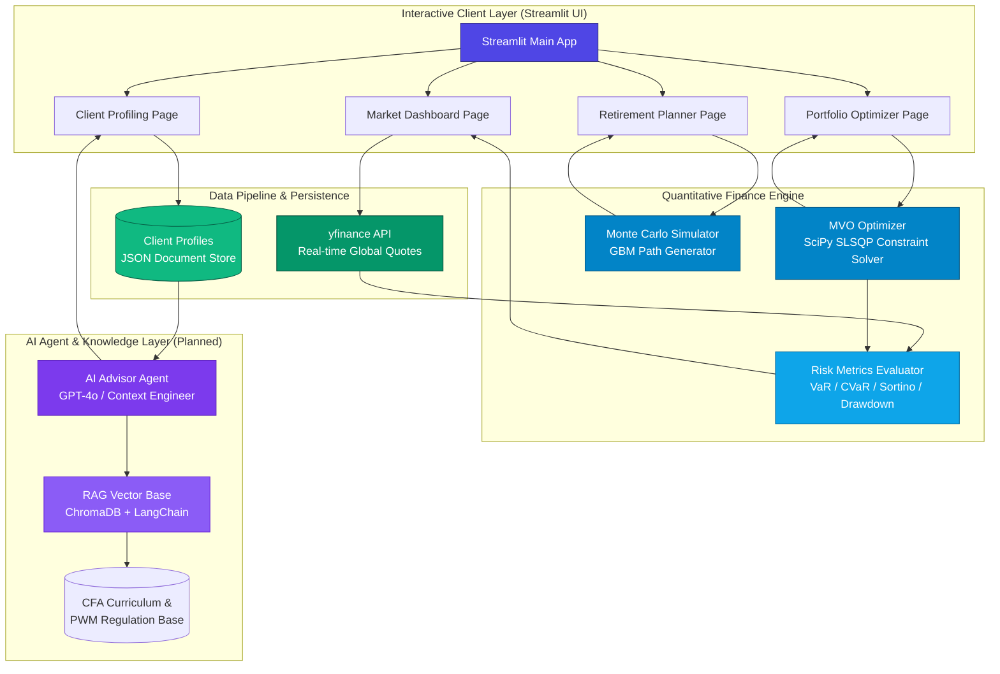

<p align="right">
  <a href="./README.md">English</a> | <a href="./README.zh-CN.md">简体中文</a> | <strong>日本語</strong>
</p>

# 🏦 AI WealthPilot

> **CFA®知識体系に準拠したインテリジェント・ウェルス・マネジメント＆ポートフォリオ量化投資エンジン**
>
> **AI Agent + RAG**技術を基盤とした高度プライベート・ウェルス・マネジメント（PWM）設計支援システム。**CFA®協会（CFA Institute）のプライベート・ウェルス・マネジメント（PWM）フレームワーク**と、最先端の**クオンツ・ファイナンス・エンジン**および**大規模言語モデル（LLM）**を統合。

<p align="center">
  
  
  
  
  
</p>

---

## 🌟 プロジェクトのビジョンと特徴

**AI WealthPilot** は、単なる金融分析のトイ・プロジェクトではなく、**機関投資家レベルのプライベート・ウェルス・マネジメント（PWM）を想定した、本格的な資産配分・意思決定支援システム**です。難解な CFA® 知識体系を高信頼性のコードとして具現化し、厳格な金融理論と現代のソフトウェア工学のベストプラクティスを融合させました。

1. **CFA® L3 準拠の専門的なフレームワーク**：**CFA® Level III (Private Wealth Management Pathway)** の主要シラバスを完全実装。顧客の客観的な財務的リスク許容能力（**Ability**）と主観的なリスク許容意思（**Willingness**）の双方から評価するアプローチから、ゴールベースの資産設計（**Goal-Based Wealth Planning**）まで、すべてのビジネスロジックは CFA 標準のテキストに基づいています。
2. **厳密なクオンツ・ファイナンス・エンジン**：`SciPy` 科学計算ライブラリを用いて、現代ポートフォリオ理論（MPT）最適化ソルバーを構築。`Dirichlet`（ディリクレ）分布を用いた均一ランダムな重みシミュレーションによる効率的フロンティアの描画のほか、離散時間**幾何ブラウン運動（GBM）**プロセスと **イェンゼンの不等式（Jensen's Inequality）によるボラティリティ・ドラッグの修正**を用いた10,000パスの超大規模モンテカルロ・シミュレーションを実行します。
3. **包括的なリスクメトリクス**：通常のシャープ・レシオ（Sharpe Ratio）だけでなく、暗号資産（BTC等）のような非対称かつファットテールな資産のリスクを正確に評価するため、下方偏差のみを考慮する**ソルティノ・レシオ（Sortino Ratio）**を算出。また、ヒストリカル・シミュレーション法による高度な **Value at Risk (VaR)** および **Conditional VaR (CVaR / Expected Shortfall)** を提供します。
4. **金融端末レベルの美しい UI/UX**：Streamlit をベースにカスタマイズされたダークテーマの金融システムライクなインターフェースに、高性能な **Plotly インタラクティブチャート**を組み合わせました。効率的フロンティア（Efficient Frontier）、収益相関ヒートマップ、資産寿命の存続確率曲線、モンテカルロ経路分布などを完璧にレンダリングします。

---

## 📈 システムのコアモジュール

| モジュール名 | 金融理論・手法 | 技術スタック・実装詳細 | 開発ステータス |
| :--- | :--- | :--- | :---: |
| 📊 **Portfolio Engine<br/>ポートフォリオ最適化エンジン** | 現代ポートフォリオ理論（MPT）、平均分散最適化（MVO）、接点ポートフォリオ、資本配分線（CAL） | `SciPy (SLSQP)` 制約付きソルバー、`NumPy` 行列代数による年率化計算、`Dirichlet` 重みシミュレーション | **✅ 実装済** |
| 🎯 **Retirement Planner<br/>二段階リタイアメント設計** | 人的資本（Human Capital）と金融資本の移転、長寿リスク管理、資産生存率分析 | **幾何ブラウン運動（GBM）**パス依存シミュレーション、ライフサイクル資産負債モデル | **✅ 実装済** |
| 🧠 **Client Profiling<br/>顧客プロファイリング＆評価** | 投資政策ステートメント（IPS）フレームワーク、Ability & Willingness 双方向リスク許容度評価モデル | `dataclasses` 強力な型定義データモデル、対話型スライダー問診票、`JSON` ローカル永続化と履歴管理 | **✅ 実装済** |
| 📈 **Market Dashboard<br/>リアルタイム市場モニタリング** | 複数資産クラス配分、クロスアセット相関行列、多次元ヒストリカルリスク分析 | `yfinance` リアルタイムAPIパイプライン、`Plotly` テクニカルチャート、相関ヒートマップ | **✅ 実装済** |
| 🤖 **AI Advisor Agent<br/>AI アドバイザー・エージェント** | 行動ファイナンス（Behavioral Finance）バイアス検知、個別化された資産配分提案書の自動生成 | `OpenAI GPT-4o` API、プロフェッショナルな顧客対応プロンプトテンプレート、コンテキストエンジニアリング | **📋 開発予定** |
| 📝 **IPS Generator<br/>RAG駆動型 IPS 生成器** | 古典的 IPS の 7 つの構成要素（運用目標と制約条件）の自動起草 | `ChromaDB` ベクトルデータベース、`LangChain` フレームワーク、CFA PWM シラバスに基づく精密な RAG 検索 | **📋 開発予定** |
| 🔄 **Rebalancing Monitor<br/>動的リバランス監視** | カレンダー・リバランスおよび許容レンジ（%）リバランス、税効率および取引摩擦コスト制御 | ポートフォリオウェイト乖離（Drift）分析、取引スリッページシミュレーション、スマートアラート | **📋 開発予定** |

---

## 🏗️ システムアーキテクチャとデータフロー



---

## 🧮 クオンツ・ファイナンスの数学的アプローチ

本プロジェクトは、定量的ポートフォリオ管理およびプライベート・ウェルス・マネジメントにおける厳格な数学的定式化を忠実に実装しています。

### 1. 現代ポートフォリオ理論と平均分散最適化（MVO）
**ハリー・マーコウィッツ（Harry Markowitz）**の古典的モデルに基づき、共分散行列と資産の期待収益率が与えられた状況において、システムは `SciPy` の `SLSQP` アルゴリズムを用いて以下の制約付き非線形最適化問題を解きます。

*   **目的関数（ポートフォリオ分散の最小化）**：
    $$\min_{w} \sigma_p^2 = w^T \Sigma w$$
*   **制約条件**：
    $$\sum_{i=1}^N w_i = 1 \quad (\text{フルインベストメント制約 / Fully Invested Constraint})$$
    $$w_i \in [0, 1] \quad (\text{ロングオンリー制約 / Long-Only Constraint, 設定可能})$$
    $$w^T \mu = R_{\text{target}} \quad (\text{目標収益率制約 / Target Return Constraint})$$

ここで：
*   $w \in \mathbb{R}^N$ は各資産の投資比率（ウェイト）ベクトル。
*   $\Sigma \in \mathbb{R}^{N \times N}$ は年率換算された資産共分散行列（日次共分散行列 $\times 252$）。
*   $\mu \in \mathbb{R}^N$ は年率換算された期待収益率ベクトル（日次平均収益率 $\times 252$）。

### 2. 資本配分線（CAL）と接点ポートフォリオ（Tangency Portfolio）
接点ポートフォリオ（Tangency Portfolio）は、無リスク資産を導入した際の資本配分線（CAL）がリスク資産の効率的フロンティアと接する唯一のポートフォリオであり、**与えられた無リスク金利下でシャープ・レシオ（Sharpe Ratio）を最大化する最適な組み合わせ**です。

$$\max_{w} \text{Sharpe} = \frac{R_p - R_f}{\sigma_p} = \frac{w^T \mu - R_f}{\sqrt{w^T \Sigma w}}$$

ここで：
*   $R_f$ は年率換算された無リスク金利（デフォルト値として米国債金利に基づく $4.5\%$ を採用）。
*   **トービンの分離定理（Tobin's Separation Theorem）**により、あらゆる合理的な投資家の最適なリスク資産ポートフォリオは、この接点ポートフォリオ１点に集約され、個人のリスク嗜好は無リスク資産と接点ポートフォリオの配合比率のみで調整されます。

### 3. 幾何ブラウン運動（GBM）とボラティリティ・ドラッグの修正
長期的な資産寿命の推計において、誤解を招きやすい「確定的な期待収益率の線形運用」を排除し、システムは**幾何ブラウン運動（GBM）**確率過程を用いて10,000本のランダム資産経路を生成します。その確率微分方程式（SDE）は以下の通りです。

$$dS_t = \mu S_t dt + \sigma S_t dW_t$$

離散時間ステップ幅 $\Delta t$（本システムでは $\Delta t = 1$ 年を採用）の下で、複利効果の幾何平均累積がもたらす系統的な過大評価を防ぐために、**イェンゼンの不等式による対数正規修正（すなわち、ボラティリティ・ドラッグの修正 / Volatility Drag Adjustment）**を導入する必要があります。離散時間モデルの漸化式は以下の通りです。

$$S_{t+\Delta t} = S_t \exp \left( \left(\mu - \frac{1}{2}\sigma^2\right)\Delta t + \sigma \sqrt{\Delta t} Z_t \right)$$

本システムの二段階（リタイア前・リタイア後）ライフサイクルモデルでは：
*   **蓄積期（Accumulation Phase）**：$V_{t+1} = V_t e^{(\mu - \frac{1}{2}\sigma^2) + \sigma Z_t} + \text{Annual Savings}$（人的資本が高く、定期的な貯蓄が追加される段階）。
*   **取崩し期（Distribution Phase）**：$V_{t+1} = V_t e^{(\mu_{new} - \frac{1}{2}\sigma^2_{new}) + \sigma_{new} Z_t} - \text{Annual Outflow}$（人的資本が枯渇し、保守的ポートフォリオへ配分が移行、毎年生活資金を取り崩す段階。資産が枯渇した時点で失敗と判定）。

### 4. テールリスク評価と下方偏差別指標
暗号資産（BTC等）のように顕著な**歪度（Skewness）**と**過剰尖度（Fat Tails / 太い尾部）**を持つ資産クラスを組み入れる場合、従来の平均分散モデルはテールリスクを著しく過小評価する危険があります。システムは以下の指標を算出します。

*   **下方偏差（Downside Deviation, $\sigma_{\text{downside}}$）**：無リスク利率またはゼロを下回るリターンの変動のみをペナルティとして計算。**ソルティノ・レシオ（Sortino Ratio）**の分母として用いられます。
    $$\sigma_{\text{downside}} = \sqrt{\frac{252}{T} \sum_{t=1}^T \left(\min(R_{p,t}, 0)\right)^2}$$
    $$\text{Sortino Ratio} = \frac{R_p - R_f}{\sigma_{\text{downside}}}$$
*   **Value at Risk ($\text{VaR}_\alpha$)**：ある一定の信頼水準 $\alpha$（本システムでは $95\%$ を採用）において、一定期間内に発生し得る最大損失の上限。
    *   *ヒストリカル・シミュレーション法*：$\text{VaR}_{0.95} = -\text{Percentile}(R_{p, \text{daily}}, 5\%)$。
*   **Conditional VaR ($\text{CVaR}_\alpha$ / Expected Shortfall)**：VaRの限界を補い、**損失がVaRの閾値を超えた状況における「極端な損失」の条件付き期待値**を算出します。
    $$\text{CVaR}_\alpha = \mathbb{E}[-R_p \mid -R_p > \text{VaR}_\alpha]$$

### 5. CFA® IPS 準拠の顧客リスクプロファイリング規準
プライベート・ウェルス・マネジメントにおいて、顧客の最終的なリスク許容度は、財務的なリスク許容**能力（Ability）**と精神的なリスク許容**意思（Willingness）**の双方によって決定されます。
*   **能力スコア ($Score_{\text{ability}}$)**：客観的な財務状況（年収の安定性、純資産に対する投資可能資産比率、緊急資金の保有月数、投資期間、自己資本比率など）から評価。
*   **意思スコア ($Score_{\text{willingness}}$)**：主観的な心理的許容度（過去の急落時の反応、ボラティリティに対する心理的快適度など）から評価。
*   **慎重意思決定プロセス（CFA Compliance）**：
    $$\text{Final Risk Tolerance Score} = \min(Score_{\text{ability}}, Score_{\text{willingness}})$$
    *CFA 執業原則：客観的な財務能力と主観的なリスク許容意思の間に乖離（コンフリクト）がある場合、アドバイザーは必ず慎重な原則に従って「低い方のスコア」を採用してポートフォリオを構築し、その後、必要に応じて顧客の投資教育を行う義務があります。*

---

## 📂 プロジェクトのディレクトリ構成

リポジトリは、高結合・低結合の設計原則に従い、高度にモジュール化されています。

```
AI-WealthPilot/
├── src/
│   ├── app.py                    # Streamlit メインエントリーポイント、ナビゲーションおよびルーティング制御
│   ├── config.py                 # 共通構成管理センター（13種の資産クラス定義、ハイパーパラメータ、パス等）
│   ├── portfolio/                # 【クオンツ計算コアエンジン】
│   │   ├── optimizer.py          # MVO最適化ソルバー、接点ポートフォリオ探索、ディリクレ経路シミュレーション
│   │   ├── simulator.py          # モンテカルロシミュレーター（GBMパス生成＆リタイアメント２段階ライフサイクル）
│   │   └── risk_metrics.py       # リスク・リターン評価指標ライブラリ（Sharpe, Sortino, MaxDD, VaR, CVaR）
│   ├── data/                     # 【データパイプライン】
│   │   └── market_data.py        # yfinanceデータ取得、リターン算出、相関行列計算
│   ├── visualization/            # 【チャートレンダラー】
│   │   └── charts.py             # Plotlyベースのインタラクティブチャート（MVO, MC, ヒートマップ等）
│   ├── pages/                    # 【Streamlit フロントエンド画面】
│   │   ├── market_dashboard.py   # マーケット動向監視、主要アセットヒストリカルデータ表示
│   │   ├── portfolio_optimizer.py# MVO効率的フロンティア対話型資産配分シミュレーション
│   │   ├── retirement_planner.py # モンテカルロ法を用いた資産寿命シミュレーション設計
│   │   └── client_profiling.py   # CFA IPS 準拠の対話型リスク評価・問診票および顧客プロファイル管理
│   └── rag/                      # 【RAG ナレッジベース】（Phase 4 実装予定）
├── tests/                        # 【自動テストプログラム】
│   ├── test_portfolio.py         # ポートフォリオエンジンの整合性、GBM及びリスク統計値のテスト
│   └── test_profiler.py          # 顧客プロファイリングロジックの厳格な検証（22テストケース）
├── data/
│   ├── profiles/                 # 顧客プロファイルデータを保持するJSONデータベース
│   └── sample/                   # オフライン資産リターンデータのキャッシュフォルダ
├── requirements.txt              # 本番依存ライブラリ一覧
└── README.md                     # メイン英語ドキュメント（GitHubデフォルト）
```

---

## 🛠️ 先端技術スタックとエンジニアリング

本システムは、現代的なデータサイエンスと AI アーキテクチャを用いて構築されています。

*   **データサイエンス・クオンツ計算コア**：
    *   `numpy` & `pandas`：ベクトル演算、高速な行列代数、および時系列データの処理。
    *   `scipy`：`scipy.optimize.minimize` にて逐次二次計画法 **SLSQP (Sequential Least Squares Programming)** を用い、等式・不等式制約条件下の非線形最適化問題を求解。
    *   `yfinance`：Yahoo Finance API からマルチスレッドで市場のリアルタイム価格およびヒストリカル OHLCV データを動的に取得。
*   **インタラクティブ UI/UX**：
    *   `Streamlit`：Python だけで洗練された金融端末風 Web インターフェースを構築するライブラリ。
    *   `Plotly`：JavaScript 駆動の高性能描画ライブラリで、拡大・縮小、ホバー（懸架情報表示）などの操作をサポートするインタラクティブベクトルグラフを提供。
*   **AI エージェント ＆ ナレッジベース（Phase 3.5 & 4）**：
    *   `OpenAI` & `LangChain`：LLMに推論能力（Chain of Thought）とメモリをもたせ、プロフェッショナルなアドバイザーエージェントを構築。
    *   `ChromaDB` / `FAISS`：CFA Curriculum や各国の金融規制法案を Embedding 化して保存し、セマンティック検索を用いて回答を補強する RAG データベース。
*   **テスト＆CI/CD**：
    *   `pytest`：並列テストランナーによる堅牢なコード検証。
    *   `python-dotenv`：環境変数の分離管理。

---

## 🚀 インストールとローカル起動方法

動作には **Python 3.11** 以上が必要です。端末を開き、以下の手順を実行してください。

### 1. リポジトリのクローン
```bash
git clone https://github.com/Michelia-L/AI-WealthPilot.git
cd AI-WealthPilot
```

### 2. 仮想環境の作成と有効化
```bash
# Windows
python -m venv .venv
.venv\Scripts\activate

# macOS / Linux
python3 -m venv .venv
source .venv/bin/activate
```

### 3. 依存ライブラリのインストール
```bash
pip install -r requirements.txt
```

### 4. 環境変数の設定
```bash
cp .env.example .env
# 必要に応じて .env ファイルを開き、OPENAI_API_KEY を設定します（量化エンジン単独動作時は不要）
```

### 5. Webアプリケーションの起動
```bash
streamlit run src/app.py
```
起動が成功すると、自動的にブラウザで `http://localhost:8501` が開きます。

---

## 🧑‍💻 自動化ユニットテストの実行

計算エンジンおよび顧客プロファイリングロジックの正確性を検証するテストを実行するには：

```bash
pytest -v
```

テストカバレッジ：
*   **`tests/test_portfolio.py`**：MVO ソルバーが制約条件下で収斂すること、接点ポートフォリオが理論上の最大シャープ・レシオと合致すること、GBM 幾何ブラウン運動シミュレーションにおける対数正規修正の正確性、VaR/CVaR の算出ロジックを検証します。
*   **`tests/test_profiler.py`**：Ability/Willingness のスコアリングモデル、コンフリクト時のセーフティガード（就低原則）、および JSON ファイル書き出しの完全性を保証する 22 ケースの自動テストを実行します。

---

## 📜 免責事項とコンプライアンスについて

> ⚠️ **重要コンプライアンスに関する免責声明**：
>
> 1. 本プロジェクト（AI WealthPilot）は、制作者の**金融プログラミング能力、CFA®シラバスの理解、および AI Agent 開発技術を証明するための、純粋なプロフェッショナル・ポートフォリオ（作品集）**です。
> 2. 当システムが算出するすべての最適化ポートフォリオウェイト、効率的フロンティア、資産生存確率、および AI 顧問のアドバイスは、**過去の統計データおよび特定の数学的仮定に基づく理論上のシミュレーション結果であり、どのような状況下でも実際の投資勧誘や財務アドバイスを構成するものではありません**。
> 3. 金融市場には極めて高い不確実性とリスクが存在します。過去の実績は将来の収益を保証するものではありません。モデルのドリフトやテールイベント（ブラックスワン）等のリスクを考慮し、実際の運用結果に関する損失について、制作者および当プロジェクトはいかなる法的責任も負いません。

---
<p align="center">
  <b>Designed with 💡 and 📈 by Michelia-L</b><br>
  <i>Empowering Private Wealth Management with Artificial Intelligence and Advanced Quant Systems.</i>
</p>
