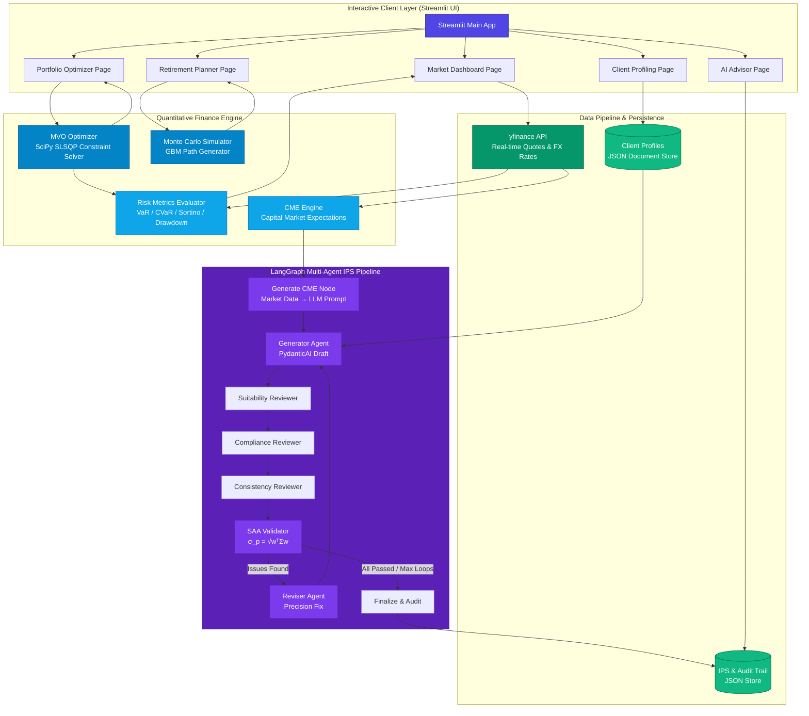

<p align="right">
  <strong>English</strong> | <a href="./README.zh-CN.md">简体中文</a>
</p>

<div align="center">
  

  # AI WealthPilot

  *A CFA® L3-Inspired Wealth Management Prototype & Quantitative Portfolio Engine*

  [](https://www.python.org)
  [](https://streamlit.io)
  [](https://langchain-ai.github.io/langgraph/)
  [](https://ai.pydantic.dev/)
  [](https://www.cfainstitute.org)
  [](LICENSE)
  [](https://github.com/Michelia-L/AI-WealthPilot/actions)

  ⭐ If you like this project, star it on GitHub — it helps a lot!

  [Overview](#overview) • [Key Features](#key-features) • [System Architecture](#system-architecture) • [Financial Mathematics](#financial-mathematics) • [Directory Structure](#directory-structure) • [Getting Started](#getting-started) • [Running Tests](#running-tests) • [Running Demos](#running-demos) • [Disclaimer](#disclaimer)

</div>

---

## Overview

**AI WealthPilot** is a research-oriented asset allocation and decision-support prototype designed for private wealth management. It bridges financial academic theories and modern software engineering by instantiating the core syllabus of **CFA® Level III (Private Wealth Management)** into a functional quantitative engine. 

The system couples a **Modern Portfolio Theory (MPT)** optimization solver with a **Geometric Brownian Motion (GBM)** life-cycle Monte Carlo simulator, and overlays an **AI Advisor Agent** to generate behavioral-finance-aware client recommendations.

> [!TIP]
> You can run the entire quantitative optimization and market dashboard offline using standard public data. Configuring a DeepSeek API key enables the AI Advisor Agent to generate streaming advisory proposals.

---

## Key Features

- 🎓 **CFA® Level III Framework Alignment**  
  Implements the dual-track client profiling methodology, evaluating objective financial **Ability** and subjective psychological **Willingness** to take risk, defaulting to the conservative lower-of-the-two score to protect the client.
- 🧮 **Rigorous Portfolio Optimization & Regularization**  
  Uses the `SciPy` SLSQP solver for Mean-Variance Optimization (MVO) to compute the Efficient Frontier, find the Tangency Portfolio (maximizing Sharpe ratio), and plot the Capital Allocation Line (CAL). Integrates condition number checking and automatic diagonal loading or eigenvalue clipping to maintain robust numerical stability.
- 💎 **Covariance Shrinkage Estimators**  
  Supports Ledoit-Wolf and Oracle Approximating Shrinkage (OAS) estimators (utilizing `scikit-learn`) alongside traditional sample covariance. This mitigates MVO's high sensitivity to input estimation errors and noise expansion.
- 📈 **Capital Market Expectations (CME) Engine**  
  Computes per-asset-class expected returns, annualized volatility, Sharpe ratio, maximum drawdown, VaR/CVaR, and cross-asset correlation matrices from real-time market data via `yfinance`. Features a three-tier risk-free rate cascade — FRED API (3-month Treasury DGS3MO) → yfinance (`^IRX` 13-week T-Bill) → static fallback at $4.5\%$ — with automatic static JSON fallback when all dynamic sources fail. **New: Forward-looking implied volatility** is fetched from VIX (`^VIX`) and MOVE (`^MOVE`) indices and fused with historical volatility via **Bayesian blending** ($\sigma_{\text{blended}} = \tau \cdot \sigma_{\text{IV}} + (1-\tau) \cdot \sigma_{\text{hist}}$), with graceful degradation for asset classes lacking reliable IV proxies. CME data is formatted and injected directly into LLM prompts to ground AI-generated investment strategies in real market conditions.
- 🔄 **Resampled Efficient Frontier (Michaud Method)**  
  Addresses MVO's "garbage in, garbage out" sensitivity by simulating $N$ sets of expected returns from a multivariate normal distribution $\mu_i \sim \mathcal{N}(\hat{\mu}, \Sigma/T)$, computing the efficient frontier for each simulation, then interpolating onto a unified return axis and averaging across all frontiers. Produces more diversified, stable portfolio weights than traditional single-sample MVO.
- 📐 **Asset Class Constraints**  
  Supports injection of minimum/maximum weight constraints at the group level (e.g., equities, bonds, alternatives) rather than just single-asset level, supporting group-level tactical asset allocation guidelines.
- 🎲 **Life-Cycle Monte Carlo Simulation**  
  Simulates 10,000 asset paths using discrete-time **Geometric Brownian Motion (GBM)** with a **Jensen's Inequality Volatility Drag Adjustment** across two phases: Accumulation (savings injection) and Distribution (retirement withdrawals).
- 🛡️ **Tail Risk Assessment**  
  Computes downside risk metrics, including **Sortino Ratio** (penalizing only downside volatility), daily **Value at Risk (VaR)**, and **Conditional VaR (CVaR / Expected Shortfall)** via historical simulation.
- 👥 **Multi-Client Profile Comparison**  
  Allows side-by-side comparison of different client portfolios and profiles, generating structured JSON comparative reports with automated behavioral finance and financial metrics insights.
- 🕸️ **LangGraph Multi-Agent IPS Pipeline (Generate-Review-Revise)**  
  Implements a multi-agent automated workflow powered by `LangGraph` and `PydanticAI`. The system instantiates an automated refinement loop where a **CME Engine** first computes capital market expectations, then an **IPS Generator Agent** drafts the strategy (including **CurrencyPolicy** for multi-currency hedging and **FeeSchedule** with TER calculation), followed by three independent expert verification agents cross-examining **Suitability** (client fit), **Compliance** (regulatory boundary), and **Consistency** (internal logic mathematical proofing). A quantitative **SAA Validation** node then verifies portfolio volatility ($\sigma_p = \sqrt{w^T \Sigma w}$) against risk-tolerance bands before finalization, producing structured audit trails.
- ⧉ **Bayesian Black-Litterman Optimization Engine**  
  Combines market-implied equilibrium returns (derived via reverse CAPM based on asset capitalization weights) with subjective investor views (supporting both absolute and relative directional views). This Bayesian combination effectively mitigates traditional MVO's severe sensitivity to historical parameter estimation errors.
- 🤖 **AI Advisor Agent**  
  Employs LLMs (`DeepSeek V4 Pro`) to analyze client metrics, identify behavioral finance biases — including **loss aversion**, **overconfidence**, **ability-willingness mismatch**, **leverage risk**, and **inadequate safety net** — and generate personalized wealth advisor proposals.
- 📄 **Enhanced Multi-Format Document Export**  
  Supports seamless export of AI advisor recommendations to standalone HTML (styled with inline CSS), Markdown, and raw JSON documents.
- 📊 **Obsidian & Gold Glassmorphic UI**  
  Custom-styled terminal with Obsidian & Gold Glassmorphic financial aesthetics built with Streamlit and powered by custom multi-dimensional Plotly charts.

---

## System Architecture

The following diagram illustrates the data flow and communication protocols between the visual layer, quantitative solvers, persistence store, and the AI agent core:



---

## Financial Mathematics

The system utilizes standard mathematical formulations in quantitative finance and private wealth management.

### 1. Modern Portfolio Theory & Mean-Variance Optimization (MVO)
Given a covariance matrix and the expected returns of $N$ assets, the system solves the following constrained optimization problem using the `SLSQP` algorithm:

*   **Objective Function (Minimize Portfolio Variance)**:
    $$\min_{w} \sigma_p^2 = w^T \Sigma w$$
*   **Constraints**:
    $$\sum_{i=1}^N w_i = 1 \quad (\text{Fully Invested Constraint})$$
    $$w_i \in [0, 1] \quad (\text{Long-Only Constraint})$$
    $$w^T \mu = R_{\text{target}} \quad (\text{Target Return Constraint})$$
    $$\min_{c} \le \sum_{i \in \mathcal{C}_c} w_i \le \max_{c} \quad (\text{Asset Class Constraints})$$

Where $w \in \mathbb{R}^N$ represents asset allocation weights, $\Sigma \in \mathbb{R}^{N \times N}$ is the annualized asset covariance matrix, $\mu \in \mathbb{R}^N$ is the annualized expected return vector, and $\mathcal{C}_c$ is the set of asset indices belonging to asset class group $c$.

*Note: In the portfolio optimization stage (MVO), we use standard **arithmetic returns** since portfolio expected returns are cross-sectionally additive ($R_p = w^T \mu$).*

### 2. Covariance Shrinkage & Regularization
To address estimation error and noise, the covariance matrix $\Sigma$ can be estimated using shrinkage estimators or regularized when the condition number is too large:

*   **Ledoit-Wolf & OAS Shrinkage**: Combines the sample covariance matrix $S$ with a highly structured target matrix $F$ (e.g., constant correlation model):
    $$\Sigma_{\text{shrunk}} = (1 - \rho) S + \rho F$$
    where $\rho \in (0, 1)$ is the optimal shrinkage intensity computed analytically by Ledoit-Wolf or OAS algorithms.
*   **Condition Number Check & Diagonal Loading**: If $\text{cond}(\Sigma) > 10^{10}$, the matrix is near-singular and regularized via diagonal loading:
    $$\Sigma_{\text{reg}} = \Sigma + \epsilon I$$
    where $\epsilon = 10^{-6}$ and $I$ is the identity matrix.
*   **Eigenvalue Clipping**: Clips small or negative eigenvalues to preserve positive definiteness:
    $$\Sigma_{\text{reg}} = V \max(\Lambda, \epsilon) V^T$$
    where $\Lambda$ is the diagonal matrix of eigenvalues and $V$ represents the eigenvectors.

### 3. Capital Allocation Line (CAL) & Tangency Portfolio
The Tangency Portfolio represents the combination of risky assets that maximizes the Sharpe Ratio:

$$\max_{w} \text{Sharpe} = \frac{w^T \mu - R_f}{\sqrt{w^T \Sigma w}}$$

Where $R_f$ is the annualized risk-free rate, obtained via a three-tier cascade: FRED API (3-month Treasury DGS3MO) → yfinance (`^IRX` 13-week T-Bill) → static fallback at $4.5\%$.

### 4. Geometric Brownian Motion (GBM) & Volatility Drag
To compound returns realistically over long horizons, we simulate wealth paths using discrete-time Geometric Brownian Motion with a Jensen's Inequality correction (Volatility Drag Adjustment):

$$S_{t+\Delta t} = S_t \exp \left( \left(\mu - \frac{1}{2}\sigma^2\right)\Delta t + \sigma \sqrt{\Delta t} Z_t \right)$$

- **Accumulation Phase**:
  $$V_{t+1} = V_t \exp \left( \left(\mu_{\text{acc}} - \frac{1}{2}\sigma_{\text{acc}}^2\right) + \sigma_{\text{acc}} Z_t \right) + \text{Annual Savings}$$
- **Distribution (Retirement) Phase**:
  $$V_{t+1} = V_t \exp \left( \left(\mu_{\text{dist}} - \frac{1}{2}\sigma_{\text{dist}}^2\right) + \sigma_{\text{dist}} Z_t \right) - \text{Nominal Withdrawal}_t$$
  Where the nominal retirement income adjusts dynamically for inflation over time:
  $$\text{Nominal Withdrawal}_t = \text{Desired Real Income} \times (1 + \gamma)^{T_{\text{accum}} + t}$$
  Here, $\gamma$ represents the assumed annualized inflation rate and $T_{\text{accum}}$ is the number of accumulation years. This ensures the model accurately preserves purchasing power, aligning with the CFA syllabus framework on longevity risk and inflation drag.

*Note: For long-horizon, multi-period simulations, log-normal modeling (geometric/compound returns) is required because returns are time-additive. The $-\frac{1}{2}\sigma^2$ drift adjustment is the Jensen's Inequality correction, preventing systematic overestimation of long-term accumulated wealth.*

### 5. Downside Risk & Tail Risk Metrics
- **Downside Deviation ($\sigma_{\text{downside}}$)**: penalizes only returns falling below zero or the risk-free rate:
  $$\sigma_{\text{downside}} = \sqrt{\frac{252}{T} \sum_{t=1}^T \left(\min(R_{p,t}, 0)\right)^2}$$
- **Sortino Ratio**:
  $$\text{Sortino Ratio} = \frac{R_p - R_f}{\sigma_{\text{downside}}}$$
- **Value at Risk (VaR)** & **Conditional VaR (CVaR)**: calculated at the $\alpha = 95\%$ confidence level via historical simulation to account for non-normal asset distribution skewness and kurtosis.

---

## Directory Structure

```
AI-WealthPilot/
├── src/
│   ├── app.py                    # Streamlit main entrypoint & navigation
│   ├── config.py                 # Core assets (13 classes), hyperparameters & configs
│   ├── utils.py                  # Filename sanitization utility
│   ├── portfolio/                # [Quantitative Engine]
│   │   ├── optimizer.py          # MVO solver, Tangency finder, Dirichlet weight simulator
│   │   ├── simulator.py          # GBM simulator & retirement life-cycle generator
│   │   ├── risk_metrics.py       # Risk calculators (Sharpe, Sortino, VaR, CVaR)
│   │   ├── views.py              # Black-Litterman view encoding (P/Q/Omega, Idzorek confidence)
│   │   ├── cme_engine.py         # Capital Market Expectations engine & risk-free rate cascade
│   │   └── cme_models.py         # CME Pydantic data models (CMEReport, SAAValidationResult)
│   ├── data/                     # [Data Pipeline]
│   │   ├── market_data.py        # yfinance pipeline, multi-currency FX conversion & correlation calculations
│   │   └── implied_volatility.py # VIX/MOVE implied volatility fetcher & Bayesian blending proxy mapper
│   ├── visualization/            # [Chart Renderer]
│   │   └── charts.py             # Plotly interactive chart components
│   ├── views/                    # [Streamlit Pages]
│   │   ├── styles.py             # Obsidian & Gold visual styling and premium CSS injections
│   │   ├── market_dashboard.py   # Cross-asset quotes & correlation visualizers
│   │   ├── portfolio_optimizer.py# MVO & Black-Litterman allocations
│   │   ├── retirement_planner.py # Monte Carlo simulation planner
│   │   ├── client_profiling.py   # CFA IPS questionnaire & profiles registry
│   │   ├── ai_advisor.py         # AI advisor proposal interface (streaming)
│   │   └── compliance.py         # Compliance & suitability disclaimer UI components
│   ├── agents/                   # [AI Agent Core]
│   │   ├── profiler.py           # Client profile parser agent & behavioral bias identification
│   │   ├── advisor.py            # DeepSeek V4 Pro report generator agent (streaming)
│   │   ├── portfolio_recommender.py # Personalized asset allocator agent
│   │   ├── report_storage.py     # Multi-format (HTML/Markdown/JSON) report serializer & storage
│   │   ├── ips_models.py         # CFA-aligned IPS Pydantic schemas (18 models incl. CurrencyPolicy, FeeSchedule)
│   │   ├── ips_agents.py         # PydanticAI agent definitions for generator, reviewer, reviser
│   │   ├── ips_workflow.py       # LangGraph state machine orchestrating Generate-Review-Revise
│   │   └── ips_storage.py        # Persistence and exports for IPS and audit trail reports
├── tests/                        # [Automated Test Suite]
│   ├── conftest.py               # Pytest fixtures and mock API configurations
│   ├── test_portfolio.py         # Core quant engine validations
│   ├── test_profiler.py          # Client profiling scoring models (31 cases)
│   ├── test_black_litterman.py   # Black-Litterman model validations
│   ├── test_advanced_portfolio.py# Resampled frontier & regularization tests
│   ├── test_advisor.py           # DeepSeek advisor integration tests
│   ├── test_market_data.py       # Async data fetching, currency conversion & cache testing
│   ├── test_cme_engine.py        # CME computation, IV blending, fallback & risk-free rate cascade tests
│   ├── test_implied_volatility.py # Implied volatility fetching, proxy mapping & degradation tests
│   ├── test_ips_models.py        # IPS data structures schemas tests
│   ├── test_ips_workflow.py      # LangGraph Generate-Review-Revise loop execution tests
│   ├── test_portfolio_recommender.py # Portfolio recommendation logic consistency tests
│   ├── test_comparison_export.py # Profile comparison data exports tests
│   ├── test_views.py             # Streamlit page rendering smoke tests
│   └── test_phase3_features.py   # End-to-end features integration tests
├── examples/                     # [Demo & Showcase Scripts]
│   ├── demo_quick.py             # Simple quick demo (MVO + BL + Monte Carlo)
│   ├── demo_interview.py         # CFA-aligned core interview demo (MVO + MC + Risk)
│   ├── demo_comprehensive.py     # Complete visual demo with Plotly charts opening in browser
│   ├── demo_advanced_optimization.py # Advanced regularization & Resampled MVO demo
│   └── demo_ips_generator.py     # Multi-Agent LangGraph workflow execution terminal demo
└── data/
    ├── profiles/                 # Client profiles (JSON document store)
    ├── reports/                  # Generated AI proposals (JSON)
    ├── ips/                      # Standardized IPS and audit trail storage folder
    └── sample/                   # Offline benchmark caches
```

---

## Getting Started

### Prerequisites

- **Python 3.11+**
- Git

### Installation

1. **Clone the Repository**
   ```bash
   git clone https://github.com/Michelia-L/AI-WealthPilot.git
   cd AI-WealthPilot
   ```

2. **Set up Virtual Environment**
   ```bash
   # Windows
   python -m venv .venv
   .venv\Scripts\activate

   # macOS / Linux
   python3 -m venv .venv
   source .venv/bin/activate
   ```

3. **Install Dependencies**
   ```bash
   pip install -r requirements.txt
   ```

4. **Environment Configuration**
   ```bash
   cp .env.example .env
   # Add your DEEPSEEK_API_KEY in the .env file to enable the AI Advisor.
   # Get your key at: https://platform.deepseek.com
   ```

5. **Launch App**
   ```bash
   streamlit run src/app.py
   ```
   The app will run locally at `http://localhost:8501`.

---

## Running Tests

To run the automated tests covering portfolio mathematics, client profiling scoring, and agent integration:

```bash
pytest -v
```

---

## Running Demos

We provide standalone scripts inside the `examples/` directory to run the quantitative engine offline and showcase core functionalities:

```bash
# Run the core interview demo (MVO, Monte Carlo, Sharpe/VaR/CVaR)
python examples/demo_interview.py

# Run the quick demo (MVO, Black-Litterman, Monte Carlo)
python examples/demo_quick.py

# Run the advanced optimization features demo (OAS, Resampled MVO)
python examples/demo_advanced_optimization.py

# Run the comprehensive demo with interactive Plotly browser charts
python examples/demo_comprehensive.py

# Run the multi-agent LangGraph workflow demo (Generate-Review-Revise pipeline for IPS)
python examples/demo_ips_generator.py
```

---

## Disclaimer

> [!WARNING]
> **Compliance & Professional Disclaimer**:
> 
> 1. **AI WealthPilot** is developed as an educational portfolio project demonstrating quantitative programming, CFA® syllabus implementation, and AI Agent architecture.
> 2. All generated weights, optimized frontiers, wealth survival rates, and AI recommendations are **simulations based on historical values and mathematical assumptions. They do not constitute formal investment advice or a professional financial plan**.
> 3. Financial markets carry extreme risk. Quantitative models are subject to structural model drift and systemic tail events. The author and project hold no liability for any financial losses incurred.
