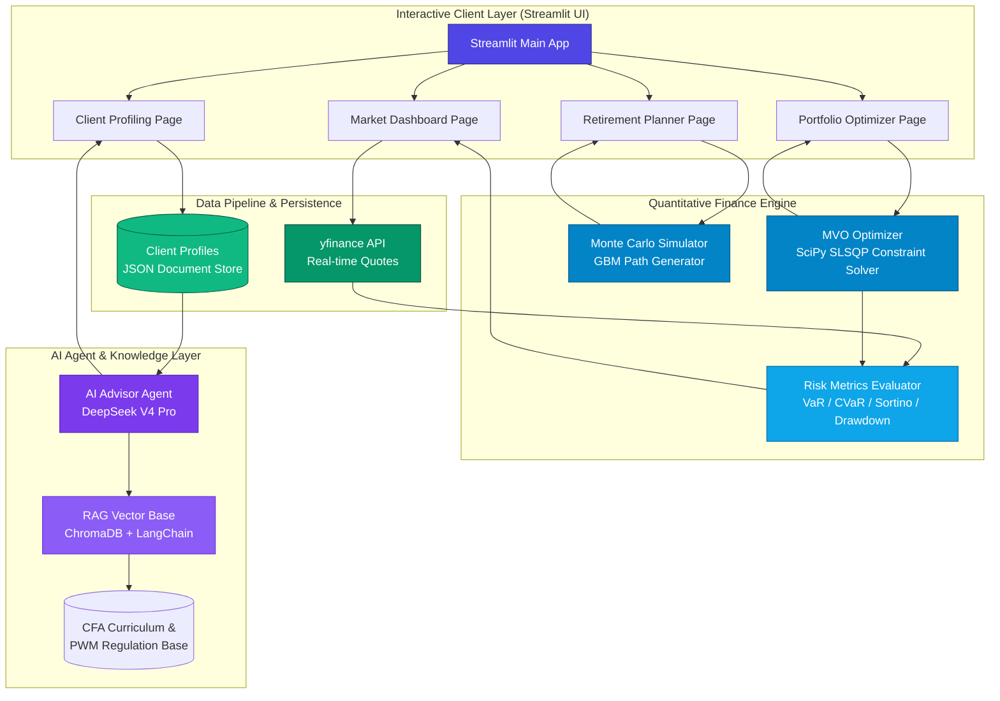

<p align="right">
  <strong>English</strong> | <a href="./README.zh-CN.md">简体中文</a>
</p>

<div align="center">
  

  # AI WealthPilot

  *CFA®-Aligned Intelligent Wealth Management & Portfolio Quant Engine*

  [](https://www.python.org)
  [](https://streamlit.io)
  [](https://www.cfainstitute.org)
  [](LICENSE)
  [](https://github.com/Michelia-L/AI-WealthPilot/actions)

  ⭐ If you like this project, star it on GitHub — it helps a lot!

  [Overview](#overview) • [Key Features](#key-features) • [System Architecture](#system-architecture) • [Financial Mathematics](#financial-mathematics) • [Directory Structure](#directory-structure) • [Getting Started](#getting-started) • [Running Tests](#running-tests) • [Disclaimer](#disclaimer)

</div>

---

## Overview

**AI WealthPilot** is a professional-grade asset allocation and decision-support system designed for private wealth management. It bridges rigorous financial academic theories and modern software engineering by instantiating the core syllabus of **CFA® Level III (Private Wealth Management)** into a highly reliable, production-ready quantitative engine. 

The system couples a **Modern Portfolio Theory (MPT)** optimization solver with a **Geometric Brownian Motion (GBM)** life-cycle Monte Carlo simulator, and overlays an **AI Advisor Agent** to generate behavioral-finance-aware client recommendations.

> [!TIP]
> You can run the entire quantitative optimization and market dashboard offline using standard public data. Configuring a DeepSeek API key enables the AI Advisor Agent to generate streaming advisory proposals.

---

## Key Features

- 🎓 **CFA® Level III Framework Alignment**  
  Implements the dual-track client profiling methodology, evaluating objective financial **Ability** and subjective psychological **Willingness** to take risk, defaulting to the conservative lower-of-the-two score to protect the client.
- 🧮 **Rigorous Portfolio Optimization**  
  Uses the `SciPy` SLSQP solver for Mean-Variance Optimization (MVO) to compute the Efficient Frontier, find the Tangency Portfolio (maximizing Sharpe ratio), and plot the Capital Allocation Line (CAL).
- 🎲 **Life-Cycle Monte Carlo Simulation**  
  Simulates 10,000 asset paths using discrete-time **Geometric Brownian Motion (GBM)** with a **Jensen's Inequality Volatility Drag Adjustment** across two phases: Accumulation (savings injection) and Distribution (retirement withdrawals).
- 🛡️ **Tail Risk Assessment**  
  Computes downside risk metrics, including **Sortino Ratio** (penalizing only downside volatility), daily **Value at Risk (VaR)**, and **Conditional VaR (CVaR / Expected Shortfall)** via historical simulation.
- 🤖 **AI Advisor Agent**  
  Employs LLMs (`DeepSeek V4 Pro`) to analyze client metrics, identify behavioral finance biases (e.g., loss aversion, overconfidence), and generate personalized wealth advisor proposals.
- 📊 **Institutional-Grade UI**  
  Interactive dark-themed client terminal built with Streamlit and powered by custom multi-dimensional Plotly charts.

---

## System Architecture

The following diagram illustrates the data flow and communication protocols between the visual layer, quantitative solvers, persistence store, and the AI agent core:



---

## Financial Mathematics

The system utilizes standard mathematical formulations in quantitative finance and private wealth management.

### 1. Modern Portfolio Theory & Mean-Variance Optimization (MVO)
Given a covariance matrix and the expected returns of $N$ assets, the system solves the following constrained optimization problem using the `SLSQP` algorithm:

*   **Objective Function (Minimize Portfolio Variance)**:
    $$\min_{w} \sigma_p^2 = w^T \Sigma w$$
*   **Constraints**:
    $$\sum_{i=1}^N w_i = 1 \quad (\text{Fully Invested Constraint})$$
    $$w_i \in [0, 1] \quad (\text{Long-Only Constraint})$$
    $$w^T \mu = R_{\text{target}} \quad (\text{Target Return Constraint})$$

Where $w \in \mathbb{R}^N$ represents asset allocation weights, $\Sigma \in \mathbb{R}^{N \times N}$ is the annualized asset covariance matrix, and $\mu \in \mathbb{R}^N$ is the annualized expected return vector.

### 2. Capital Allocation Line (CAL) & Tangency Portfolio
The Tangency Portfolio represents the combination of risky assets that maximizes the Sharpe Ratio:

$$\max_{w} \text{Sharpe} = \frac{w^T \mu - R_f}{\sqrt{w^T \Sigma w}}$$

Where $R_f$ is the annualized risk-free rate (defaults to U.S. Treasury benchmark at $4.5\%$).

### 3. Geometric Brownian Motion (GBM) & Volatility Drag
To compound returns realistically over long horizons, we simulate wealth paths using discrete-time Geometric Brownian Motion with a Jensen's Inequality correction (Volatility Drag Adjustment):

$$S_{t+\Delta t} = S_t \exp \left( \left(\mu - \frac{1}{2}\sigma^2\right)\Delta t + \sigma \sqrt{\Delta t} Z_t \right)$$

- **Accumulation Phase**: $V_{t+1} = V_t e^{(\mu - \frac{1}{2}\sigma^2) + \sigma Z_t} + \text{Annual Savings}$
- **Distribution Phase**: $V_{t+1} = V_t e^{(\mu_{new} - \frac{1}{2}\sigma^2_{new}) + \sigma_{new} Z_t} - \text{Annual Outflow}$

### 4. Downside Risk & Tail Risk Metrics
- **Downside Deviation ($\sigma_{\text{downside}}$)**: penalizes only returns falling below zero or the risk-free rate:
  $$\sigma_{\text{downside}} = \sqrt{\frac{252}{T} \sum_{t=1}^T \left(\min(R_{p,t}, 0)\right)^2}$$
- **Sortino Ratio**:
  $$\text{Sortino Ratio} = \frac{R_p - R_f}{\sigma_{\text{downside}}}$$
- **Value at Risk (VaR)** & **Conditional VaR (CVaR)**: calculated at the $\alpha = 95\%$ confidence level via historical simulation to account for non-normal asset distribution skewness and kurtosis.

---

## Directory Structure

```
AI-WealthPilot/
├── src/
│   ├── app.py                    # Streamlit main entrypoint & navigation
│   ├── config.py                 # Core assets (13 classes), hyperparameters & configs
│   ├── portfolio/                # [Quantitative Engine]
│   │   ├── optimizer.py          # MVO solver, Tangency finder, Dirichlet weight simulator
│   │   ├── simulator.py          # GBM simulator & retirement life-cycle generator
│   │   ├── risk_metrics.py       # Risk calculators (Sharpe, Sortino, VaR, CVaR)
│   │   └── views.py              # Black-Litterman model view processors
│   ├── data/                     # [Data Pipeline]
│   │   └── market_data.py        # yfinance pipeline & correlation calculations
│   ├── visualization/            # [Chart Renderer]
│   │   └── charts.py             # Plotly interactive chart components
│   ├── views/                    # [Streamlit Pages]
│   │   ├── market_dashboard.py   # Cross-asset quotes & correlation visualizers
│   │   ├── portfolio_optimizer.py# MVO & Black-Litterman allocations
│   │   ├── retirement_planner.py # Monte Carlo simulation planner
│   │   ├── client_profiling.py   # CFA IPS questionnaire & profiles registry
│   │   └── ai_advisor.py         # AI advisor proposal interface (streaming)
│   ├── agents/                   # [AI Agent Core]
│   │   ├── profiler.py           # Client profile parser agent
│   │   ├── advisor.py            # DeepSeek V4 Pro report generator agent
│   │   ├── portfolio_recommender.py # Personalized asset allocator agent
│   │   └── report_storage.py     # JSON proposal serializer
│   └── rag/                      # [RAG Knowledge Base] (Planned)
├── tests/                        # [Automated Test Suite]
│   ├── test_portfolio.py         # Core quant engine validations
│   ├── test_profiler.py          # Client profiling scoring models (22 cases)
│   ├── test_black_litterman.py   # Black-Litterman model validations
│   ├── test_advanced_portfolio.py# Resampled frontier & regularization tests
│   ├── test_advisor.py           # DeepSeek advisor integration tests
│   └── test_phase3_features.py   # End-to-end features integration tests
└── data/
    ├── profiles/                 # Client profiles (JSON document store)
    ├── reports/                  # Generated AI proposals (JSON)
    └── sample/                   # Offline benchmark caches
```

---

## Getting Started

### Prerequisites

- **Python 3.11+**
- Git

### Installation

1. **Clone the Repository**
   ```bash
   git clone https://github.com/Michelia-L/AI-WealthPilot.git
   cd AI-WealthPilot
   ```

2. **Set up Virtual Environment**
   ```bash
   # Windows
   python -m venv .venv
   .venv\Scripts\activate

   # macOS / Linux
   python3 -m venv .venv
   source .venv/bin/activate
   ```

3. **Install Dependencies**
   ```bash
   pip install -r requirements.txt
   ```

4. **Environment Configuration**
   ```bash
   cp .env.example .env
   # Add your DEEPSEEK_API_KEY in the .env file to enable the AI Advisor.
   # Get your key at: https://platform.deepseek.com
   ```

5. **Launch App**
   ```bash
   streamlit run src/app.py
   ```
   The app will run locally at `http://localhost:8501`.

---

## Running Tests

To run the automated tests covering portfolio mathematics, client profiling scoring, and agent integration:

```bash
pytest -v
```

---

## Disclaimer

> [!WARNING]
> **Compliance & Professional Disclaimer**:
> 
> 1. **AI WealthPilot** is developed as a professional portfolio project demonstrating quantitative programming, CFA® syllabus implementation, and AI Agent architecture.
> 2. All generated weights, optimized frontiers, wealth survival rates, and AI recommendations are **simulations based on historical values and mathematical assumptions. They do not constitute formal investment advice or a professional financial plan**.
> 3. Financial markets carry extreme risk. Quantitative models are subject to structural model drift and systemic tail events. The author and project hold no liability for any financial losses incurred.
