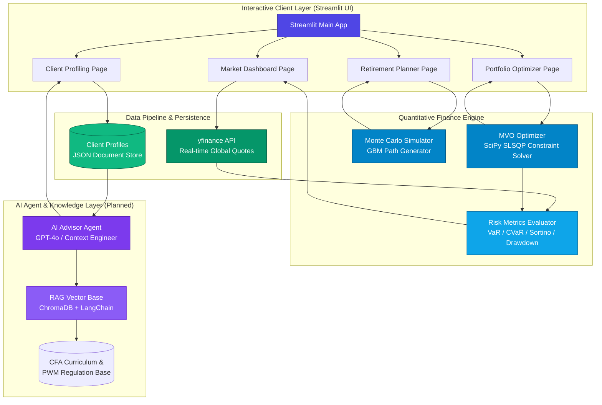

<p align="right">
  <strong>English</strong> | <a href="./README.zh-CN.md">简体中文</a> | <a href="./README.ja.md">日本語</a>
</p>

# 🏦 AI WealthPilot

> **CFA®-Aligned Intelligent Wealth Management & Portfolio Quant Engine**
>
> An advanced wealth management planning system powered by **AI Agent + RAG**, integrating **CFA® Institute's Private Wealth Management (PWM) Framework** with cutting-edge **Quantitative Finance Engines** and **Large Language Models**.

<p align="center">
  
  
  
  
  
</p>

---

## 🌟 Project Vision & Highlights

**AI WealthPilot** is not a typical financial analysis toy project. It is a **professional-grade asset allocation and decision support system designed for institutional Private Wealth Management (PWM)**. It instantiates complex CFA® curricula into highly reliable, production-ready code, bridging rigorous financial academic theories and modern software engineering best practices:

1. **Theoretical Authority (Aligned with CFA L3 PWM)**: Fully implements the core syllabus of **CFA® Level III (Private Wealth Management Pathway)**. From the dual-track client profiling (prudent evaluation of financial **Ability** and psychological **Willingness** to take risk) to **Goal-Based Wealth Planning**, every line of business logic is backed by standard CFA textbooks.
2. **Rigorous Foundation (Quantitative Finance Engine)**: Builds a Modern Portfolio Theory (MPT) optimizer based on the `SciPy` scientific computing library. Employs a `Dirichlet` distribution to generate uniformly distributed random weight sets for the efficient frontier, and simulates 10,000 asset value paths using discrete-time **Geometric Brownian Motion (GBM)** with a **Jensen's Inequality Volatility Drag Adjustment**.
3. **Comprehensive Risk Measurement**: In addition to the standard Sharpe Ratio, the system calculates the **Sortino Ratio** using downside deviation to penalize only harmful volatility (crucial for asymmetric, fat-tailed assets like Bitcoin). It also provides high-performance **Value at Risk (VaR)** and **Conditional VaR (CVaR / Expected Shortfall)** calculations via historical simulation.
4. **Institutional-Grade Visualization**: Features a deeply customized dark-themed terminal UI powered by Streamlit, paired with high-performance, interactive **Plotly multi-dimensional charts** that perfectly render the Efficient Frontier, asset correlation heatmaps, retirement survival curves, and Monte Carlo path distributions.

---

## 📈 System Core Modules

| Module Name | Financial Methodology | Engineering Implementation & Stack | Status |
| :--- | :--- | :--- | :---: |
| 📊 **Portfolio Engine** | Modern Portfolio Theory (MPT), Mean-Variance Optimization (MVO), Tangency Portfolio, Capital Allocation Line (CAL) | `SciPy (SLSQP)` constrained solver, `NumPy` annualized matrix algebra, `Dirichlet` weight simulation | **✅ Done** |
| 🎯 **Retirement Planner** | Human & Financial Capital Transition, Longevity Risk Management, Survival Rate Analysis | **Geometric Brownian Motion (GBM)** path-dependent simulation, asset-liability lifecycle modeling | **✅ Done** |
| 🧠 **Client Profiling** | Investment Policy Statement (IPS) framework, Ability & Willingness dual-track risk tolerance scoring model | `dataclasses` strong typing, interactive slider questionnaires, `JSON` local persistence & versioning | **✅ Done** |
| 📈 **Market Dashboard** | Multi-asset class configuration, cross-asset correlation matrix, multi-dimensional historical risk analysis | `yfinance` real-time API pipeline, `Plotly` technical chart lines, correlation heatmap rendering | **✅ Done** |
| 🤖 **AI Advisor Agent** | Behavioral Finance bias identification, personalized asset allocation & advisor proposal generation | `DeepSeek V4 Pro` (OpenAI-compatible SDK), professional wealth advisor prompt templates, context engineering | **✅ Done** |
| 📝 **IPS Generator** | Classical IPS framework (7 elements: Objectives & Constraints) automated drafting | `ChromaDB` vector store, `LangChain` framework, precise RAG retrieval based on CFA PWM curriculum | **📋 Planned** |
| 🔄 **Rebalancing Monitor** | Calendar & Percentage-of-Portfolio rebalancing, tax-loss harvesting, friction cost controls | Drift analysis, transaction slippage emulation, smart rebalancing alert triggers | **📋 Planned** |

---

## 🏗️ System Architecture & Data Flow



---

## 🧮 Financial Mathematics & Methodologies

This project implements rigorous mathematical formulations standard in quantitative portfolio management and private wealth management.

### 1. Modern Portfolio Theory & Mean-Variance Optimization (MVO)
Based on the classic model by **Harry Markowitz**, given the covariance matrix and the expected returns of the assets, the system uses the `SciPy` `SLSQP` algorithm to solve the following constrained non-linear optimization problem:

*   **Objective Function (Minimize Portfolio Variance)**:
    $$\min_{w} \sigma_p^2 = w^T \Sigma w$$
*   **Constraints**:
    $$\sum_{i=1}^N w_i = 1 \quad (\text{Fully Invested Constraint})$$
    $$w_i \in [0, 1] \quad (\text{Long-Only Constraint, configurable})$$
    $$w^T \mu = R_{\text{target}} \quad (\text{Target Return Constraint})$$

Where:
*   $w \in \mathbb{R}^N$ represents the vector of asset allocation weights.
*   $\Sigma \in \mathbb{R}^{N \times N}$ is the annualized asset covariance matrix (daily covariance matrix $\times 252$).
*   $\mu \in \mathbb{R}^N$ is the annualized expected return vector (daily average return $\times 252$).

### 2. Capital Allocation Line (CAL) & Tangency Portfolio
The Tangency Portfolio is the unique point on the efficient frontier of risky assets where the Capital Allocation Line (CAL) is tangent. It represents the **portfolio that maximizes the Sharpe Ratio for a given risk-free rate**:

$$\max_{w} \text{Sharpe} = \frac{R_p - R_f}{\sigma_p} = \frac{w^T \mu - R_f}{\sqrt{w^T \Sigma w}}$$

Where:
*   $R_f$ is the annualized risk-free rate (defaults to a high-yield U.S. Treasury benchmark of $4.5\%$).
*   **Tobin's Separation Theorem** states that any rational investor's risky portfolio is the Tangency Portfolio, and individual risk preferences are accommodated solely by blending it with the risk-free asset.

### 3. Geometric Brownian Motion (GBM) & Volatility Drag Adjustment
To avoid the misleading linear compounding of expected returns over long-term wealth projections, the system utilizes **Geometric Brownian Motion (GBM)** stochastic processes to generate 10,000 simulated wealth paths. The Stochastic Differential Equation (SDE) is defined as:

$$dS_t = \mu S_t dt + \sigma S_t dW_t$$

In a discrete-time setting with step size $\Delta t$ ($\Delta t = 1$ year in this system), the **Jensen's Inequality log-normal correction (Volatility Drag Adjustment)** must be applied to prevent systematic overestimation in compounding:

$$S_{t+\Delta t} = S_t \exp \left( \left(\mu - \frac{1}{2}\sigma^2\right)\Delta t + \sigma \sqrt{\Delta t} Z_t \right)$$

In our two-phase (Accumulation vs. Distribution) lifecycle model:
*   **Accumulation Phase**: $V_{t+1} = V_t e^{(\mu - \frac{1}{2}\sigma^2) + \sigma Z_t} + \text{Annual Savings}$ (High human capital, periodic savings injections).
*   **Distribution Phase**: $V_{t+1} = V_t e^{(\mu_{new} - \frac{1}{2}\sigma^2_{new}) + \sigma_{new} Z_t} - \text{Annual Outflow}$ (Human capital exhausted, asset allocation shifts to conservative parameters, rigid annual withdrawals; $V \le 0$ registers as plan failure).

### 4. Downside Risk Metrics & Tail Risk Assessment
Because volatile assets like cryptocurrencies (BTC) exhibit significant **Skewness** and **Excess Kurtosis (Fat Tails)**, the standard mean-variance framework may severely underestimate tail risk. The system incorporates:

*   **Downside Deviation ($\sigma_{\text{downside}}$)**: Penalizes only returns falling below the risk-free rate or zero. This serves as the denominator for the **Sortino Ratio**:
    $$\sigma_{\text{downside}} = \sqrt{\frac{252}{T} \sum_{t=1}^T \left(\min(R_{p,t}, 0)\right)^2}$$
    $$\text{Sortino Ratio} = \frac{R_p - R_f}{\sigma_{\text{downside}}}$$
*   **Value at Risk ($\text{VaR}_\alpha$)**: The maximum expected loss bound over a specific horizon at confidence level $\alpha$ (defaults to $95\%$):
    *   *Historical Simulation Method*: $\text{VaR}_{0.95} = -\text{Percentile}(R_{p, \text{daily}}, 5\%)$.
*   **Conditional VaR ($\text{CVaR}_\alpha$ / Expected Shortfall)**: Addresses the limitation of VaR by measuring the **expected loss given that the loss exceeds the VaR threshold**:
    $$\text{CVaR}_\alpha = \mathbb{E}[-R_p \mid -R_p > \text{VaR}_\alpha]$$

### 5. CFA IPS Client Profiling Guidelines
In private wealth management, a client's overall risk tolerance is governed by their financial **Ability** and psychological **Willingness** to take risk:
*   **Ability Score ($Score_{\text{ability}}$)**: Measured using objective financial metrics (income stability, investable assets relative to net worth, emergency fund coverage, investment horizon, debt-to-asset ratio).
*   **Willingness Score ($Score_{\text{willingness}}$)**: Evaluated using subjective psychological metrics (reaction to historical drawdowns, comfort level with volatility, gambling tendencies).
*   **Prudent Decision Protocol (CFA Compliance)**:
    $$\text{Final Risk Tolerance Score} = \min(Score_{\text{ability}}, Score_{\text{willingness}})$$
    *CFA Prudent Rule: When a conflict arises between objective financial ability and subjective willingness, the advisor must default to the conservative ("lower-of-the-two") profile to protect the client, followed by investor education.*

---

## 📂 Project Directory Structure

The repository complies with high cohesion and low coupling design principles:

```
AI-WealthPilot/
├── src/
│   ├── app.py                    # Streamlit main entrypoint, handles sidebar navigation & routing
│   ├── config.py                 # Central config (13 asset definitions, default hyperparams, paths)
│   ├── portfolio/                # [Quantitative Engine Core]
│   │   ├── optimizer.py          # MVO optimization solver, Tangency finder, Dirichlet simulation
│   │   ├── simulator.py          # Monte Carlo simulator (GBM paths & two-stage retirement lifecycle)
│   │   ├── risk_metrics.py       # Performance & risk metrics (Sharpe, Sortino, MaxDD, VaR, CVaR)
│   │   └── views.py              # Black-Litterman view processor (P, Q, Omega matrices)
│   ├── data/                     # [Data Pipeline]
│   │   └── market_data.py        # yfinance downloader, return processors, correlation calculations
│   ├── visualization/            # [Chart Renderer]
│   │   └── charts.py             # Plotly interactive chart renderers (MVO, MC, heatmaps)
│   ├── views/                    # [Streamlit Front-end Views]
│   │   ├── market_dashboard.py   # Quotes monitor, historical charts, correlations
│   │   ├── portfolio_optimizer.py# Interactive MVO & Black-Litterman asset allocator
│   │   ├── retirement_planner.py # Monte Carlo simulation planner
│   │   ├── client_profiling.py   # CFA IPS questionnaire & profile registry
│   │   └── ai_advisor.py         # AI advisory report generation (streaming)
│   ├── agents/                   # [AI Agent Layer]
│   │   ├── profiler.py           # Client profiling agent (CFA IPS framework)
│   │   ├── advisor.py            # DeepSeek V4 Pro advisory report generator
│   │   ├── portfolio_recommender.py # Personalized allocation recommendations
│   │   └── report_storage.py     # Advisory report persistence (JSON)
│   └── rag/                      # [RAG Knowledge Base] (Phase 4 development)
├── tests/                        # [Automated Test Suite]
│   ├── test_portfolio.py         # MVO solver, GBM simulator, and risk metrics tests
│   ├── test_profiler.py          # Client profiling logic (22 cases)
│   ├── test_advisor.py           # AI advisor agent tests
│   ├── test_black_litterman.py   # Black-Litterman model tests
│   ├── test_advanced_portfolio.py# Advanced portfolio optimization tests
│   ├── test_portfolio_recommender.py # Portfolio recommendation tests
│   ├── test_comparison_export.py # Multi-client comparison & export tests
│   └── test_phase3_features.py   # Phase 3 feature integration tests
├── data/
│   ├── profiles/                 # Client profiles stored as structured JSON documents
│   ├── reports/                  # Generated advisory reports (JSON)
│   └── sample/                   # Baseline and offline asset returns data caches
├── requirements.txt              # Production dependency lock list
└── README.md                     # Main English landing documentation
```

---

## 🛠️ Advanced Technology Stack

This system is built using modern quantitative finance and AI engineering architectures:

*   **Quantitative Computation Core**:
    *   `numpy` & `pandas`: High-performance vectorization, matrix algebra, and multi-dimensional financial timeseries operations.
    *   `scipy`: Handles constrained optimization via the **SLSQP (Sequential Least Squares Programming)** quadratic solver under `scipy.optimize.minimize`.
    *   `yfinance`: Asynchronously fetches real-time quote feeds and historical OHLCV data.
*   **Interactive Visualization UI**:
    *   `Streamlit`: Python-native framework for deploying highly responsive financial Web terminals.
    *   `Plotly`: JavaScript-driven interactive vector charting supporting zoom, pan, hover tooltips, and dynamic curve plotting.
*   **AI Agent & Knowledge Retrieval**:
    *   `DeepSeek V4 Pro` (via `openai` SDK): State-of-the-art LLM powering the AI Advisor Agent, generating personalized CFA-compliant advisory reports with streaming output.
    *   `LangChain` & `ChromaDB` / `FAISS` (Phase 4): Cognitive reasoning chains with local vector store indexing the CFA Curriculum for semantic search RAG retrieval.
*   **CI/CD & Testing**:
    *   `pytest`: Test runner managing high-speed, parallel test suites.
    *   `python-dotenv`: Environment variable encapsulation.

---

## 🚀 Step-by-Step Installation & Quick Start

Ensure you have **Python 3.11** or higher installed on your system. Run the following steps in your terminal:

### 1. Clone the Repository
```bash
git clone https://github.com/Michelia-L/AI-WealthPilot.git
cd AI-WealthPilot
```

### 2. Create and Activate Virtual Environment
```bash
# Windows
python -m venv .venv
.venv\Scripts\activate

# macOS / Linux
python3 -m venv .venv
source .venv/bin/activate
```

### 3. Install Dependencies
```bash
pip install -r requirements.txt
```

### 4. Setup Environment Variables
```bash
cp .env.example .env
# Open .env and set your DEEPSEEK_API_KEY (required for AI Advisor)
# Get your key at: https://platform.deepseek.com
# The quant engine and dashboard work without an API key
```

### 5. Launch the Streamlit Terminal
```bash
streamlit run src/app.py
```
Upon successful initialization, the dashboard will open automatically in your browser at `http://localhost:8501`.

---

## 🧑‍💻 Verification & Automated Tests

To run the unified test suite verifying mathematical consistency and business logic limits:

```bash
pytest -v
```

The test coverage includes:
*   **`tests/test_portfolio.py`**: Ensures the MVO solver converges on mathematical boundaries, the Tangency Portfolio matches theoretical maximum Sharpe outputs, the GBM simulation maintains the log-normal expectation with Jensen's drag, and tail calculations are correct.
*   **`tests/test_profiler.py`**: A 22-case validation suite spanning scoring algorithms, conflict default overrides, and JSON serialization.
*   **`tests/test_black_litterman.py`**: Validates the Black-Litterman model implementation including equilibrium returns, view processing, and posterior computation.
*   **`tests/test_advanced_portfolio.py`**: Tests for resampled efficient frontier, asset class constraints, and covariance matrix regularization.
*   **`tests/test_advisor.py`**: Integration tests for the AI Advisor Agent (DeepSeek V4 Pro).
*   **`tests/test_portfolio_recommender.py`**: Validates risk-score-to-allocation mapping logic.
*   **`tests/test_comparison_export.py`**: Multi-client comparison report generation and export tests.
*   **`tests/test_phase3_features.py`**: End-to-end integration tests for Phase 3 features.

---

## 📜 Compliance & Professional Disclaimer

> ⚠️ **IMPORTANT COMPLIANCE NOTICE**:
>
> 1. This project (**AI WealthPilot**) is developed solely as the author's **professional portfolio project demonstrating quantitative programming, CFA® syllabus implementation, and AI Agent architecture design**.
> 2. All generated weights, optimized frontiers, wealth survival rates, and AI-generated outputs are **theoretical simulations based on historical values and strict mathematical assumptions. Under no circumstances do they constitute formal investment advice or a professional financial plan**.
> 3. Financial markets carry extreme risk. Past performance does not guarantee future results. Quantitative models are subject to structural model drift and systemic tail events. The author and project hold no liability for any financial losses incurred from trading decisions based on this codebase.

---
<p align="center">
  <b>Designed with 💡 and 📈 by Michelia-L</b><br>
  <i>Empowering Private Wealth Management with Artificial Intelligence and Advanced Quant Systems.</i>
</p>
