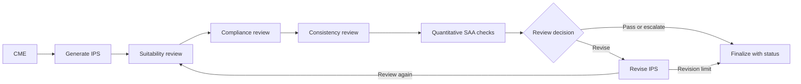

<div align="center">
  
</div>

# AI WealthPilot

**An open-source private wealth management workstation for research and decision support.**

AI WealthPilot brings client goals, portfolio calculations, AI-assisted investment policy statements (IPS), and ongoing allocation reviews into one application. Use it to explore how return assumptions and client constraints affect a portfolio, inspect how an investment policy was generated and reviewed, and compare retirement scenarios.

The quantitative engine runs in Python; LangGraph coordinates IPS generation and review; a Next.js interface provides charts, reports, and English/Chinese language switching. Outputs are for research, education, and technical evaluation, not investment advice or trade execution.

[](https://github.com/Michelia-L/AI-WealthPilot/actions/workflows/ci.yml)
[](https://michelia-l.github.io/AI-WealthPilot/)
[](LICENSE)

**English** | [简体中文](README.zh-CN.md)

[Quick start](#quick-start) · [Workflow](#wealth-management-workflow) · [Example](#walk-through-a-fictional-client-case) · [Model boundaries](#model-assumptions-and-limitations) · [Development](#local-development-and-testing)

## Interface

<table>
  <tr>
    <td width="50%"><b>Client and portfolio overview</b><br /></td>
    <td width="50%"><b>Market analytics</b><br /></td>
  </tr>
  <tr>
    <td width="50%"><b>Client profiles</b><br /></td>
    <td width="50%"><b>Portfolio monitoring</b><br /></td>
  </tr>
</table>

## Quick start

### Run the demo with Docker Compose

Requires Docker with the Compose plugin. Run these commands for a new checkout:

```bash
git clone https://github.com/Michelia-L/AI-WealthPilot.git
cd AI-WealthPilot
test -f .env || cp .env.example .env
```

In `.env`, uncomment `DEMO_MODE=1`, then start the application:

```bash
docker compose up --build
```

Open the [workstation](http://localhost:3000) or [interactive API documentation](http://localhost:8000/docs). Compose binds both services to localhost and stores application data in the host's `data/` directory. For an existing checkout, edit your current `.env` instead of replacing it.

Demo mode needs no LLM key. If the profiles table is empty, startup adds the fictional client **林晓兰**. The sidebar switches the interface between English and Chinese.

| Mode | Market inputs | AI outputs |
| --- | --- | --- |
| Demo (`DEMO_MODE=1`) | Synthetic price history and quotes; demo risk-free rates | Bilingual fixtures replayed for advisor reports, IPS, and rebalance advice, with selected profile fields substituted |
| Live (`DEMO_MODE=0` or unset) | Provider data, with caching and fallbacks | Requests sent to the configured LLM endpoint |

**Demo boundaries.** Reports and IPS review events are fixture replays, not fresh LLM evaluations. Synthetic prices are stable for the same ticker and date anchor; they change as the date rolls forward. Some auxiliary inputs, including CME forward-return yields, fund AUM, and LDI yield curves, can still attempt provider requests. Demo mode is not a network-isolation switch; image builds and dependency installation also require downloads.

### Use live data and an LLM

Disable demo mode and restart the backend (`docker compose up -d --force-recreate api` for Compose). In **Settings** (`/settings`), configure an OpenAI-compatible base URL, model, and API key. Saved nonempty fields override environment defaults. Alternatively, set `DEEPSEEK_API_KEY` in `.env` before starting the backend.

Quantitative features can run without an LLM key; live AI endpoints return HTTP 503 when no key is configured. Replace the placeholder key in `.env` with a real key, or leave it empty when using only quantitative features. Optional `FRED_API_KEY` and `TUSHARE_TOKEN` enable additional data sources. See [.env.example](.env.example) for configuration entries and [data internals](guide/internals/03-data-pipeline-cme.md) for provider routing.

Client records are stored locally by default. **Live AI requests send the profile and report context needed for that task to your configured model provider**, and the key is used to authenticate those requests. See [data and deployment boundaries](#data-and-deployment-boundaries).

## Wealth management workflow

Start with the client's goals and constraints, then choose the analysis needed for a decision. These are connected workspaces; they can also be used independently.

| Workspace | Input | Processing | Output |
| --- | --- | --- | --- |
| Client profiles (`/profiles`) | Assets, income, liabilities, goals, questionnaire answers | Separate ability and willingness scores; the lower score determines overall risk tolerance | Profile, risk assessment, and goal context |
| Market & CME (`/market`, `/api/cme/report`) | Proxy prices, yields, growth and inflation assumptions | Historical estimates blended with building-block return assumptions and available implied volatility | Capital Market Expectations (CME), correlations, and source/cache information |
| Portfolio construction (`/optimizer`) | Asset universe, return source, method-specific views or constraints | Six optimization methods | Candidate weights, return/risk metrics, and method-specific comparisons |
| Advisor & IPS (`/advisor`, `/ips`) | Profile; CME and reference documents for IPS | LLM advisory report, or IPS generation with review and quantitative checks | Reports, IPS documents, revision history, and exports |
| Monitoring (`/monitoring`) | Saved IPS allocation and proxy prices since it was saved | Buy-and-hold weight drift, policy-band checks, historical backtest and attribution | Drift diagnostics, rebalance amounts, and optional AI commentary |
| Retirement (`/retirement`) | Savings, contributions, spending, horizon, return and volatility assumptions | Accumulation/withdrawal Monte Carlo simulation; optional spending guardrails | Wealth percentiles, survival rate, and spending comparisons |

### How an IPS is produced

The live IPS graph follows this sequence. Its three reviewers run **sequentially** in the current implementation.


```mermaid
flowchart LR
    C[CME] --> G[Generate IPS]
    G --> S[Suitability review]
    S --> P[Compliance review]
    P --> K[Consistency review]
    K --> V[Quantitative SAA checks]
    V --> D{Review decision}
    D -->|Revise| R[Revise IPS]
    R -->|Review again| S
    D -->|Pass or escalate| F[Finalize with status]
    R -->|Revision limit| F
```

The graph allows up to three revision rounds by default and records review findings and revision metadata. Escalation is a status for human follow-up, not human approval. See [`build_ips_workflow`](src/agents/ips_workflow.py) for routing and stopping conditions.

The LLM proposes the IPS strategic asset allocation (SAA); the graph checks it against available CME inputs. It does **not** automatically run the portfolio optimizer first. Optimizer comparisons are a separate analysis, and retirement simulation can be run before or after an IPS review.

## Walk through a fictional client case

The demo seed describes a 38-year-old client with CNY 2.6 million in investable assets, CNY 800,000 annual income, CNY 420,000 annual expenses, and CNY 900,000 in liabilities. Goals are CNY 1.2 million for education in 10 years and CNY 4 million for retirement in 22 years. These inputs come from [`_demo_profile_data`](api/main.py).

1. Open **Profiles** and inspect the household balance sheet, goals, and ability/willingness scores. Open **Optimizer** to compare candidate allocations under the available methods and return assumptions.
2. In **IPS**, select the seed client and generate a document. Demo mode replays progress events and archives a sample allocation of 25% domestic equity, 20% international equity, 35% fixed income, 10% gold, and 10% cash. This is a fixture allocation, not the optimizer's result.
3. In **Monitoring**, select the saved IPS to inspect policy bands and its historical backtest. Drift needs price observations after the save date; a newly saved document may have insufficient history. Rebalance amounts are proposals, not submitted orders.
4. In **Retirement**, select the profile to prefill inputs, review the assumptions, and compare fixed spending with guardrails. The quantitative simulation runs on the supplied assumptions; its results need not match the fixture narrative. Saved reports and IPS documents are available in **Deliverables** (`/deliverables`).

This case demonstrates the interaction and document flow. It is not evidence of investment performance, calibrated financial forecasts, or live LLM quality. Sample content is in [`src/agents/demo_fixtures/`](src/agents/demo_fixtures/).

## Quantitative methods

| Method | What it computes |
| --- | --- |
| Mean-variance (MVO) | Maximum-Sharpe and minimum-volatility portfolios, efficient frontiers; asset-class group constraints for the selected MVO portfolio |
| Resampled MVO | Repeated simulated estimation and optimization, with averaged weights/frontiers to explore parameter uncertainty |
| Black-Litterman | Equilibrium or CME prior combined with absolute/relative views and confidence inputs |
| Mean-CVaR | Scenario-based tail-loss optimization through the Rockafellar–Uryasev linear program |
| Liability-driven investing (LDI) | Surplus-risk optimization using liability present value, duration, and asset-liability covariance estimates |
| Risk parity (ERC) | Weights targeting equal contributions to portfolio risk |

The optimizer defaults to historical sample expected returns. Selecting `expected_return_source="cme"` uses CME returns where mapped; uncovered assets retain sample means, or equilibrium returns in Black-Litterman. Covariance remains estimated from historical returns. The Python engine also exposes sample, Ledoit-Wolf, and OAS covariance estimators; these are not a web/API selector.

Supporting tools include historical VaR/CVaR and Sortino metrics, monthly-rebalanced backtests with an optional annual fee drag, Brinson-Fachler attribution with Carino linking, and two-phase GBM retirement simulation with optional Guyton-Klinger spending guardrails.

## Model assumptions and limitations

| Component | Current boundary |
| --- | --- |
| CME expected returns | Building blocks use yields plus configured growth assumptions, blended with historical means. Missing inputs fall back; this is not a macroeconomic forecasting model. Check source, date, and cache status. |
| Covariance & resampling | Estimates depend on the historical window and proxy universe. Ledoit-Wolf/OAS shrink toward a scaled identity matrix. Resampling uses a normal-return model and does not establish better out-of-sample performance. |
| Black-Litterman | Equilibrium weights resolve from custom inputs, ETF AUM proxies, or equal weights. Confidence calibration is simplified; results depend on those choices. The implementation uses total-return priors and views. |
| FX | Historical prices can be translated to the CNY base, including unhedged FX movements. The forward-return building blocks assume zero expected FX change; there is no separate forward FX process. |
| CVaR & LDI | CVaR uses available historical daily scenarios, which cannot represent unseen shocks. LDI uses first-order duration exposure to yield changes, with a duration-scaled bond proxy fallback. |
| Retirement | Annual GBM draws use fixed return/volatility parameters within each phase and an assumed inflation rate. Regime switching and stochastic volatility are not modeled. Survival rates are conditional simulation outputs. |
| Backtesting & monitoring | Backtests apply supplied target weights to history, not a walk-forward retraining strategy. Monitoring infers drift from IPS weights and proxy returns, not broker positions or actual cash flows. There is no order execution or tax-lot accounting. |
| LLM & IPS validation | Reviews can be wrong. Quantitative checks cover selected SAA properties, not every narrative claim. Volatility checks allow a 20% tolerance; low volatility produces a warning, high volatility a critical finding. Missing CME skips SAA validation. A passed review is not regulatory certification. |

The [quant engine](guide/internals/02-quant-engine.md), [data/CME](guide/internals/03-data-pipeline-cme.md), and [AI workflow](guide/internals/04-ai-agents.md) chapters explain implementation choices and additional boundaries. The Internals guide is currently written in Chinese.

## Architecture and repository

```text
Browser → Next.js web/
            ├─ Server Components → FastAPI api/
            └─ Browser mutations / streams → same-origin proxy → FastAPI api/
                                                                  ↓
                                               Python src/ computation
                                                  ├─ portfolio models
                                                  ├─ market data providers
                                                  └─ LLM / IPS workflows
```

| Path | Responsibility |
| --- | --- |
| [`src/`](src/) | Portfolio computation, data adapters, AI workflows, Plotly chart construction |
| [`api/`](api/) | FastAPI routes and schemas, localization, SQLite persistence, background tasks and SSE replay |
| [`web/`](web/) | Next.js/React interface, same-origin proxy routes, bilingual dictionaries, UI and end-to-end tests |
| [`guide/`](guide/) | MkDocs Internals site: architecture, methodology, implementation decisions |
| [`docs/`](docs/) | Engineering records, IPS reference material, and screenshot assets |
| [`examples/`](examples/) | Standalone quantitative and workflow examples |

Profiles, task/event records, and LLM settings use SQLite; reports, IPS documents, and CME caches use JSON file storage under `data/`. The [request journey](guide/internals/01-request-journey.md) traces browser-to-engine calls. The running API's [OpenAPI UI](http://localhost:8000/docs) provides endpoint schemas; the [API chapter](guide/internals/05-api-shell.md) explains transport and task persistence.

## Local development and testing

Requires **Python 3.12+** and **Node.js 22+** with npm. The commands below use Bash on Linux, macOS, or WSL and start from the repository root.

```bash
python3 -m venv .venv
source .venv/bin/activate
python -m pip install -r requirements-dev.txt
test -f .env || cp .env.example .env
```

For a demo, uncomment `DEMO_MODE=1` in `.env`; for live use, configure the credentials described above. Preserve an existing `.env`. Then start the backend:

```bash
python -m uvicorn api.main:app --reload --port 8000
```

In a second terminal, from the repository root:

```bash
cd web
npm ci
npm run dev
```

Open [localhost:3000](http://localhost:3000). CJK PDF exports require a supported Chinese font; on Ubuntu/Debian, install `fonts-wqy-microhei`. The Docker API image includes it.

Run the following checks from the repository root with the virtual environment active. Subshells keep each command's working directory independent:

```bash
python -m pytest -q
ruff check
ruff format --check
(cd web && npm test)
(cd web && npm run typecheck)
(cd web && npm run lint)
(cd web && npm run build)
(cd web && npm run test:e2e)
```

Playwright needs Chromium installed (`cd web && npx playwright install chromium`) and a completed web build. Its configuration starts a demo API on port 8300 and the production web server on 3300, using a temporary SQLite database. The backend command is `python`, so keep the virtual environment on `PATH`.

[CI](.github/workflows/ci.yml) runs Python lint/format, pytest with an **87% coverage threshold** over `src` and `api`, dependency auditing, frontend lint/type checks/tests/build, and Playwright end-to-end tests. These checks validate software behavior; they do not measure investment performance or live LLM accuracy.

For documentation edits, run `mkdocs build --strict`. To try the Python engine without starting the web application, run `python examples/demo_quick.py`; it uses synthetic returns for MVO, Black-Litterman, and retirement simulation.

## Data and deployment boundaries

- **Storage and credentials.** Profiles and settings are stored locally by default. LLM API keys are persisted in SQLite; do not treat the database as an encrypted secrets vault. Protect `.env`, `data/`, and their backups.
- **External calls.** Live model requests include task-specific client/report context and use the configured key for authentication. Market data requests go to their respective providers. A local model endpoint changes the model destination; it does not disable market-provider traffic.
- **Access control.** The API has no built-in authentication. The supplied Compose configuration binds ports to `127.0.0.1`; add authentication and access controls before exposing a deployment beyond your machine.
- **Model inputs.** Some prompts delimit client text with XML tags and instructions. This is a mitigation, not a guarantee against prompt injection or incorrect output. Review generated documents before relying on them.

The software is intended for educational, research, and technical evaluation purposes. Its calculations and generated documents do not constitute investment, tax, or legal advice, and do not replace professional review. No return, suitability determination, or regulatory approval is guaranteed.

## Contributing and license

See [open issues](https://github.com/Michelia-L/AI-WealthPilot/issues) for current discussions and [known issues](docs/known-issues.md) for engineering records. Submit changes through a feature branch and pull request; keep both README languages aligned and follow [AGENTS.md](AGENTS.md) for repository checks.

Released under the [MIT License](LICENSE).
