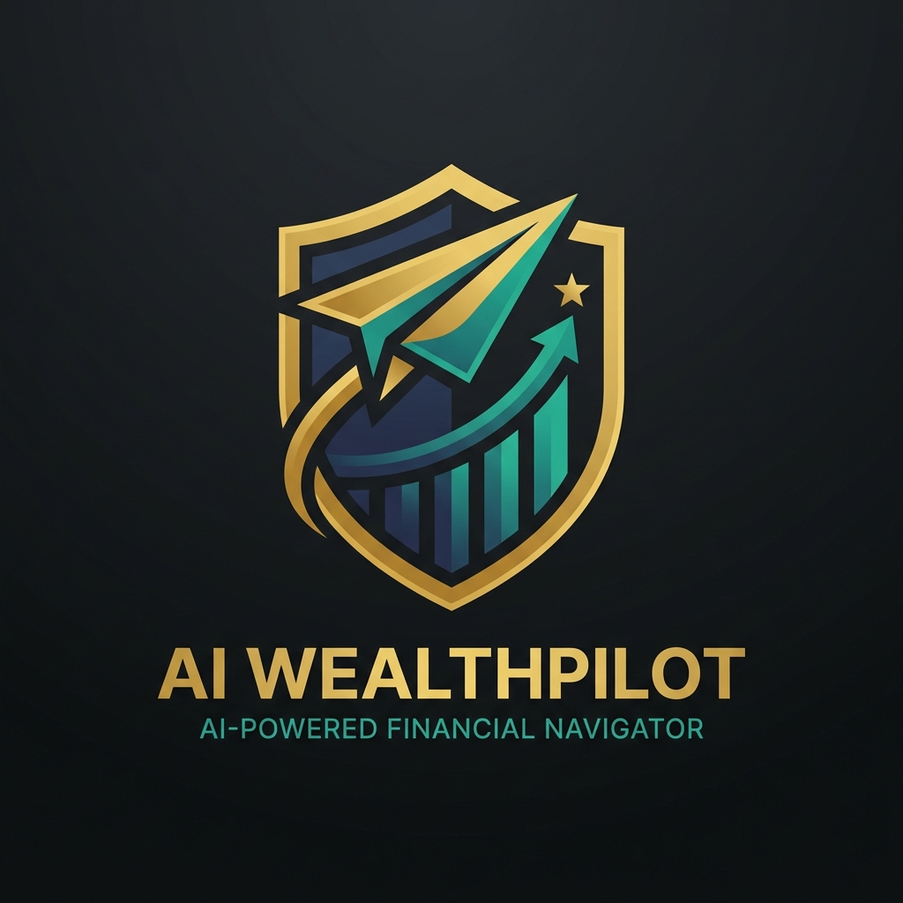
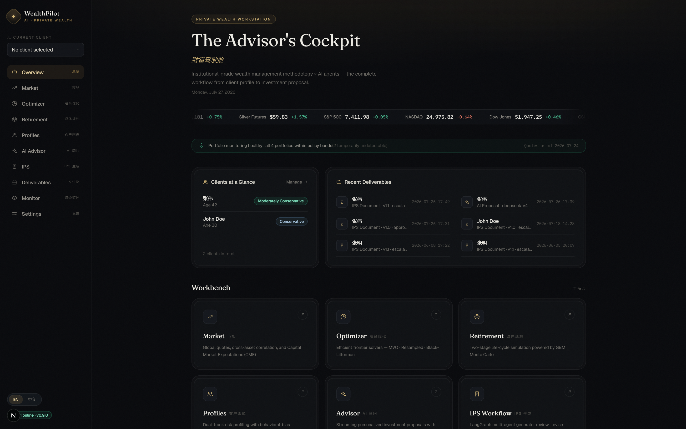
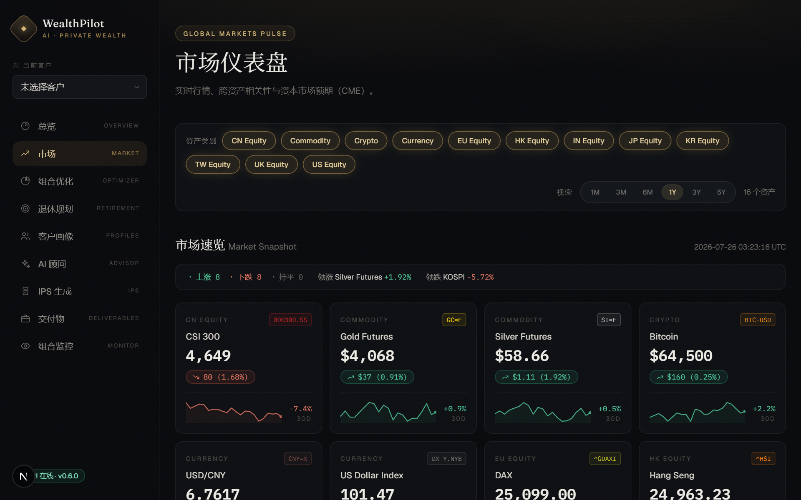
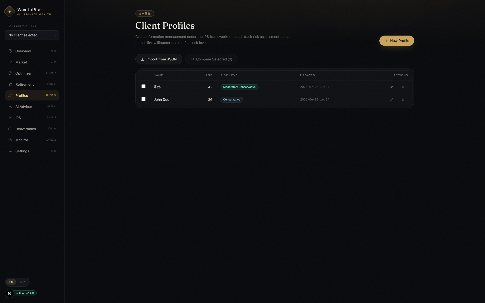
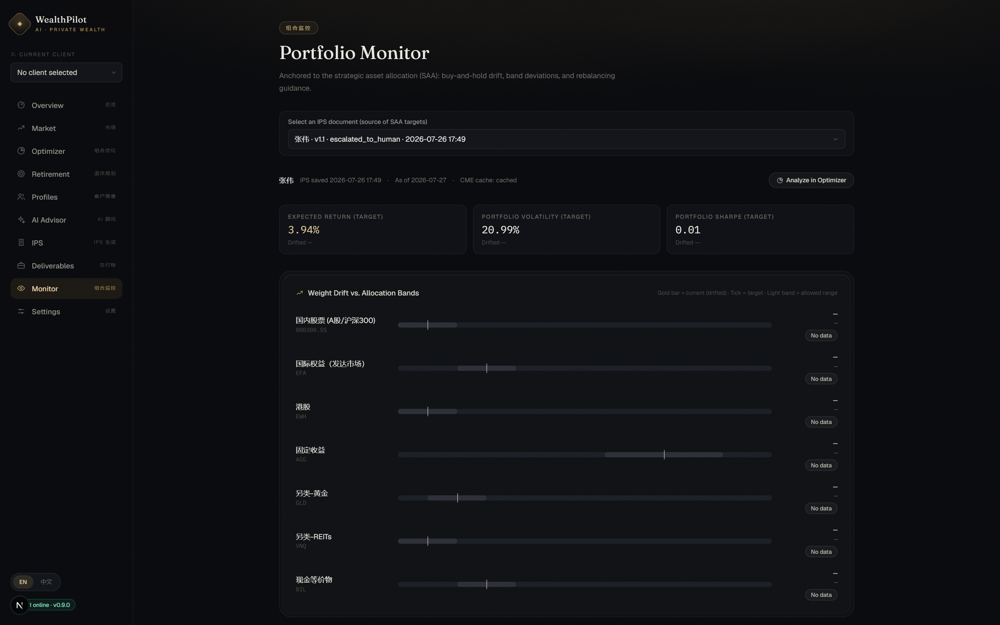
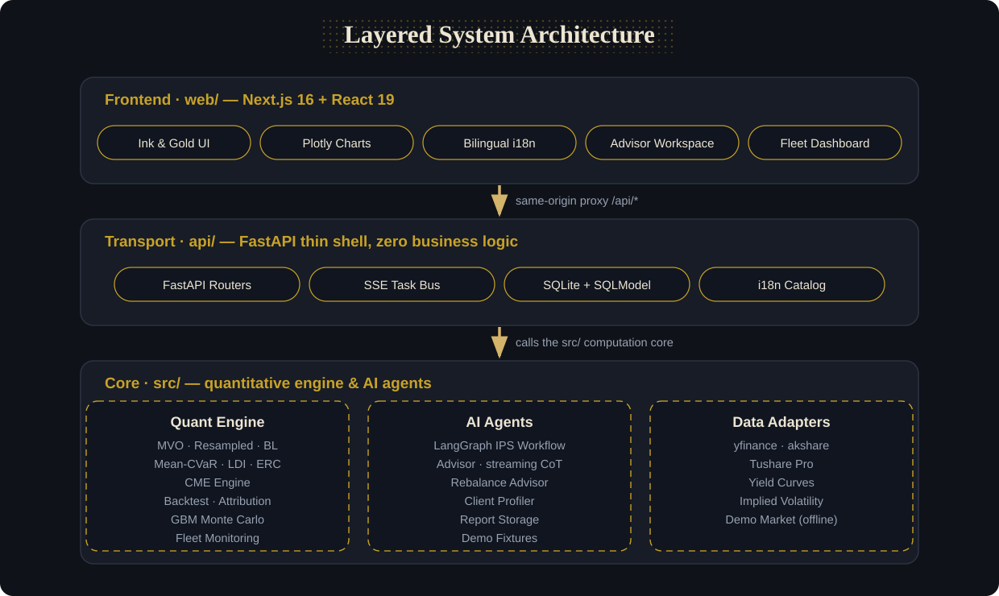
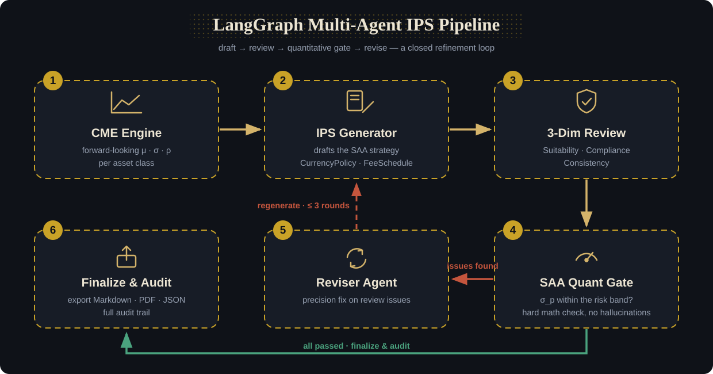

<div align="center">
  

  # AI WealthPilot

  ### AI Private Wealth Management Workstation · Quant Engine & Multi-Agent Intelligence

[](https://www.python.org/)
[](https://fastapi.tiangolo.com/)
[](https://nextjs.org/)
[](https://react.dev/)
[](https://github.com/langchain-ai/langgraph)
[](https://tailwindcss.com/)
[](https://www.docker.com/)
[](LICENSE)
[](https://github.com/Michelia-L/AI-WealthPilot/actions/workflows/ci.yml)
[](https://michelia-l.github.io/AI-WealthPilot/)
[]()

<p align="center">
  <b>English</b> | <a href="README.zh-CN.md">简体中文</a>
</p>

<p align="center">
  <b>AI WealthPilot</b> is an open-source, local-first workstation engineered for modern Private Wealth Management (PWM).<br/>
  It fuses <b>six quantitative portfolio optimization paradigms</b>, a <b>forward-looking Capital Market Expectations (CME) engine</b>, a <b>LangGraph-orchestrated multi-agent IPS generation pipeline</b>, and a <b>DeepSeek streaming reasoning advisor</b>, wrapped in an "Ink & Gold" private banking user experience. It provides wealth advisors with an end-to-end workflow: <i>Client 360° Profiling → CME Formulation → Portfolio Optimization → IPS Audit & Generation → Fleet Monitoring & Rebalancing → Retirement Planning</i>.
</p>

⭐ If you like this project, star it on GitHub — it helps a lot!

[Key Features](#-key-features) • [Architecture](#-system-architecture) • [Multi-Agent Workflow](#-multi-agent-ips-pipeline) • [Financial Models](#-quantitative--financial-engineering-models) • [Quick Start](#-quick-start) • [API Reference](#-api-endpoints-reference) • [Quality Assurance](#-quality-assurance--testing) • [📚 Internals Docs](https://michelia-l.github.io/AI-WealthPilot/)

</div>

---

## 📸 Interface Showcase

<div align="center">
  <table>
    <tr>
      <td width="50%">
        <p align="center"><b>Executive Overview & Monitoring Hub</b></p>
        
      </td>
      <td width="50%">
        <p align="center"><b>Global Market Station & Analytics</b></p>
        
      </td>
    </tr>
    <tr>
      <td width="50%">
        <p align="center"><b>Deliverables Hub & Report Center</b></p>
        
      </td>
      <td width="50%">
        <p align="center"><b>Fleet Monitoring & Policy Bands</b></p>
        
      </td>
    </tr>
  </table>
</div>

---

## ✨ Key Features

### 1. 🧮 Quantitative Portfolio Optimization (`src/portfolio/`)
* **Markowitz Mean-Variance Optimization (MVO)**: Powered by SciPy SLSQP solver; supports Max Sharpe, Min Volatility, Target Return optimization, complete Efficient Frontier generation, and asset-class-level min/max group constraints.
* **Michaud Resampled Efficient Frontier**: Uses Monte Carlo resampling over return distributions to mitigate parameter uncertainty, smoothing portfolio transitions and boosting out-of-sample robustness.
* **Black-Litterman Bayesian Asset Allocation**: Anchors to market equilibrium returns (or CME forward priors), integrating absolute/relative investor views with He-Litterman confidence calibration ($\Omega$).
* **Scenario-Based Mean-CVaR Optimization**: Formulates the Rockafellar-Uryasev conditional value-at-risk minimization as a linear program, solved via SciPy's HiGHS LP solver for fat-tailed risk management.
* **Sharpe-Tint Liability-Driven Investing (LDI)**: Minimizes surplus variance or maximizes surplus Sharpe relative to future liability cash flows, present-valued per-tenor on the ChinaBond treasury yield curve with duration-matched hedging.
* **Risk Parity (Equal Risk Contribution / ERC)**: Employs Spinu's convex formulation to compute equal risk contribution weights without heavy reliance on expected return forecasts.
* **Robust Covariance Estimation**: Sample covariance, Ledoit-Wolf shrinkage, and Oracle Approximating Shrinkage (OAS), plus condition-number checks with automatic diagonal loading / eigenvalue clipping.

### 2. 🔮 Forward-Looking Capital Market Expectations (CME) Engine (`src/portfolio/cme_engine.py`)
* **Multi-Asset Proxy Universe**: Domestic Equities (CSI 300), Developed Markets Equities (EFA), Hong Kong Equities (EWH), Fixed Income (AGG), Gold (GLD), REITs (VNQ), and Cash Equivalents (BIL).
* **Implied Volatility Blending**: Blends realized historical volatility with forward-looking option implied volatility (VIX / MOVE) via weighting factor $\tau$, with graceful degradation for asset classes lacking reliable IV proxies.
* **Building-Blocks Forward Return Model**: Combines current cash/dividend yields with long-term nominal GDP/earnings growth assumptions, weighted with historical means via parameter $\omega$ (default 0.5).
* **Base-Currency Risk-Free Rate Cascade**: CNY from akshare ChinaBond 1Y treasury yield; USD from FRED (DGS3MO) → yfinance (`^IRX`) → static fallback; all CME returns FX-translated to the CNY base.
* **Three-Tier Degradation Caching**: Valid persistent disk cache (90-day TTL) → stale cache with background refresh → static fallback dataset.
* **Multi-Provider Market Data Backbone**: Mapped CN tickers are routed through Tushare Pro → akshare → yfinance (first success wins), while US/global assets stay on yfinance; a staleness guard rejects silently outdated provider snapshots.

### 3. 🤖 LangGraph Multi-Agent IPS Generation Pipeline (`src/agents/`)
* **StateGraph Multi-Agent Orchestration**: Connects **CME Injection** → **IPS Generator Agent** → **Three Parallel Reviewers** (Suitability, Compliance, Consistency) → **Quantitative SAA Gatekeeper (Validate SAA)** → **Reviser Agent** (up to 3 iterative feedback rounds) → **Final Approval / Human Escalation**.
* **Quantitative SAA Feasibility Gate**: Hard mathematical check validating whether the generated SAA return and covariance volatility strictly fall within the client's risk budget band $[\sigma_{\min}, \sigma_{\max}]$, rejecting LLM hallucinations.
* **Complete Audit Trail & Token Governance**: Tracks SHA-256 version hashes, revision diffs, reviewer scores, and enforces hard token budget limits (`LLM_TASK_TOKEN_BUDGET=250k`).
* **Multi-Format Deliverables**: Exports structured JSON, formatted Markdown, and publication-grade CJK-aware PDFs with bilingual support.

### 4. 💡 AI Private Wealth Advisor Workstation (`src/agents/advisor.py`)
* **DeepSeek V4 Pro Powered**: Compatible with any standard OpenAI-compatible API endpoint (DeepSeek, Qwen, OpenAI, local vLLM/Ollama), configurable live via the in-app `/settings` page.
* **Streaming Chain-of-Thought (FR-001)**: Real-time separation and collapsible rendering of `reasoning_content` thinking tokens and final markdown advice.
* **PWM Standard 6-Section Advisory Report**: Client Overview → Investment Goals Analysis → Dual-Track Risk Tolerance Interpretation → Recommended Asset Allocation → Implementation & Tax Strategy → Regulatory Disclosures.
* **Dual-Track Risk Assessment Framework**: Evaluates objective financial **Ability** and subjective psychological **Willingness** to take risk, defaulting to the conservative lower-of-the-two score to protect the client.
* **Behavioral Bias Detection**: Identifies loss aversion, overconfidence, ability-willingness mismatch, leverage risk, and inadequate safety nets from client metrics.
* **Prompt Injection Containment**: Strict XML delimitation to isolate untrusted user data from execution instructions.

### 5. 📊 Portfolio Fleet Monitoring & Rebalance Advisor (`src/portfolio/monitoring.py`)
* **Global Fleet Monitoring**: Real-time status matrix across all managed client portfolios, flagging asset weights that breach IPS policy tolerance bands.
* **Intelligent Cash Plug & Proportional Rescaling**: Automatic handling of unallocated weights and missing market proxies.
* **AI-Driven Rebalance Trade Advice**: Generates concrete rebalancing orders with Tax-Loss Harvesting awareness and clear human-readable rationales.

### 6. 🏖️ Retirement & Wealth Decumulation Planning (`src/portfolio/simulator.py`)
* **Two-Phase Cash Flow Simulation**: Models accumulation (savings & contributions) and distribution (retirement withdrawals) under a life-cycle framework.
* **Personalized Inflation Assumptions**: Standard CPI, Elderly Healthcare-Tilted (+0.75% CPI-E premium), and Luxury Lifestyle (+2.4% CLEWI premium).
* **10,000-Path GBM Monte Carlo**: Quantifies terminal wealth percentiles (P5, P50, P95) and ruin probability / survival rates, with a Jensen's-inequality volatility drag adjustment.
* **Guyton-Klinger Guardrails**: Optional dynamic spending rules that cut or raise withdrawals when the current withdrawal rate breaches a band around the initial rate, with the rigid-spending survival rate reported as a same-draws baseline.

### 7. 📈 Historical Backtesting & Brinson Attribution (`src/portfolio/backtest.py`)
* **Rolling Monthly Rebalancing**: 1Y / 3Y / 5Y / 10Y backtest horizons with all-in management fee drag simulation (Net-of-Fee NAV, gross curve shown as a ghost trace).
* **Historical Crisis Stress Testing**: COVID-19 Liquidity Crash (2020), Global Rate Shock (2022), and Global Financial Crisis (2008).
* **Brinson-Fachler Attribution Decomposition**: Deconstructs active return into **Allocation Effect**, **Selection Effect**, and **Interaction Effect**, geometrically linked across time via Carino factors.
* **Downside Risk Metrics**: Sortino ratio, daily VaR, and CVaR (Expected Shortfall) via historical simulation.
* **Multi-Client Profile Comparison**: Side-by-side comparison of client portfolios and profiles with structured comparative reports.

### 8. 💎 "Ink & Gold" Private Banking Design System (`web/`)
* **Next.js 16 + React 19 + Tailwind CSS v4**: High-performance obsidian-black and champagne-gold design language tailored for wealth managers.
* **Interactive Plotly.js Visualizations**: Interactive efficient frontiers, Monte Carlo confidence cones, correlation heatmaps, and underwater drawdown curves.
* **Bilingual i18n**: Type-safe dictionary system (`wp_locale` cookie: English / Chinese) across UI components, API messages, and LLM-generated deliverables.
* **100% Offline Demo Mode (DEMO_MODE=1)**: Deterministic synthetic GBM market prices and rich fixture replay with zero network dependencies.

---

## 📐 System Architecture

AI WealthPilot follows a decoupled, layered architectural blueprint:

<div align="center">
  
</div>

### Architectural Guardrails
* **`src/` is the Computational Core**: All mathematical models, financial engineering algorithms, prompt graphs, and agent definitions reside here. No dependencies on web transport layers.
* **`api/` is a Thin Transport Shell**: Pure request validation, routing, SSE event publishing, and schema mapping. Zero business or financial logic.
* **`web/` is a Secure Same-Origin Client**: Server Components communicate directly with FastAPI; browser-side requests route through `/api/*` proxies to conceal internal infrastructure and headers.

---

## 🤖 Multi-Agent IPS Pipeline

The Investment Policy Statement (IPS) workflow is orchestrated using LangGraph state machines and PydanticAI structured agents:

<div align="center">
  
</div>

### Audit Dimensions & Quantitative Gates
1. **Suitability Review**: Checks client goal feasibility, time horizon alignment, liquidity reserves, and risk capacity.
2. **Compliance Review**: Verifies asset eligibility, maximum leverage caps, derivatives authorization, and foreign exchange allowances.
3. **Consistency Review**: Confirms nominal returns logically align with real inflation assumptions and cash flow constraints.
4. **Quantitative SAA Gate**: Computes portfolio expected return and covariance volatility from the CME matrix, ensuring it falls within the client's volatility target band $[ \sigma_{\min}, \sigma_{\max} ]$.

---

## 🧮 Quantitative & Financial Engineering Models

AI WealthPilot is built on mathematically rigorous financial foundations:

### 1. Markowitz Mean-Variance Optimization (MVO)
Solves the convex quadratic optimization problem:

$$\min_{w} \quad \frac{1}{2} w^T \Sigma w - \lambda w^T \mu \quad \text{s.t.} \quad \sum_{i=1}^n w_i = 1, \quad w_i \ge 0$$

For maximum Sharpe ratio:

$$\max_{w} \quad \frac{w^T \mu - R_f}{\sqrt{w^T \Sigma w}}$$

Asset-class group constraints are supported at the group level:

$$\min_{c} \le \sum_{i \in \mathcal{C}_c} w_i \le \max_{c}$$

*Note: in the MVO stage we use standard **arithmetic returns**, since portfolio expected returns are cross-sectionally additive* ($R_p = w^T \mu$).

### 2. Black-Litterman Bayesian Model
Market implied equilibrium excess return vector:

$$\Pi = \delta \Sigma w_{\text{mkt}}$$

Bayesian posterior expected return distribution $\mu_{BL}$:

$$\mu_{BL} = \left[ (\tau \Sigma)^{-1} + P^T \Omega^{-1} P \right]^{-1} \left[ (\tau \Sigma)^{-1} \Pi + P^T \Omega^{-1} Q \right]$$

View uncertainty matrix calibration (He & Litterman formulation):

$$\Omega = \text{diag}\left( P (\tau \Sigma) P^T \right) \cdot \frac{1 - c}{c}$$

### 3. Rockafellar-Uryasev Mean-CVaR LP Formulation
At confidence level $\alpha$ (e.g. 95%), Conditional Value-at-Risk minimization is formulated as a linear program over $S$ discrete return scenarios:

$$\min_{w, \gamma, z} \quad \gamma + \frac{1}{S(1-\alpha)} \sum_{s=1}^S z_s$$

$$\text{s.t.} \quad z_s \ge -w^T r_s - \gamma, \quad z_s \ge 0 \quad (\forall s \in \{1,\dots,S\}), \quad w^T \mathbf{1} = 1, \quad w \ge 0$$

### 4. Sharpe-Tint Liability-Driven Surplus Optimization (LDI)
For future liability cash stream $L$, portfolio surplus is $S = A - L$. Surplus variance is:

$$\sigma_{\text{surplus}}^2 = w^T \Sigma_A w - 2 w^T \Sigma_{AL} + \sigma_L^2$$

where liability returns are duration-scaled: $r_{L,t} \approx -D_L \cdot \Delta y_t(D_L)$. The optimization maximizes surplus Sharpe:

$$\max_{w} \quad \frac{w^T \mu_A - \mu_L}{\sigma_{\text{surplus}}(w)}$$

### 5. Spinu Equal Risk Contribution (Risk Parity ERC)
Marginal risk contribution of asset $i$ is $RC_i = w_i \frac{(\Sigma w)_i}{\sqrt{w^T \Sigma w}}$. Solved via the unconstrained convex dual problem:

$$\min_{x} \quad \frac{1}{2} x^T \Sigma x - \sum_{i=1}^n \ln(x_i) \quad \implies \quad w_i = \frac{x_i}{\sum_{j} x_j}$$

### 6. Covariance Shrinkage & Regularization
To address estimation error and noise, the covariance matrix $\Sigma$ can be estimated via shrinkage or regularized when ill-conditioned:
* **Ledoit-Wolf & OAS Shrinkage**: Combines the sample covariance $S$ with a structured target $F$ (constant correlation model):
  $$\Sigma_{\text{shrunk}} = (1 - \rho) S + \rho F$$
  where $\rho \in (0, 1)$ is the optimal shrinkage intensity computed analytically.
* **Diagonal Loading**: if $\text{cond}(\Sigma) > 10^{10}$, the near-singular matrix is regularized as $\Sigma_{\text{reg}} = \Sigma + \epsilon I$ with $\epsilon = 10^{-6}$.
* **Eigenvalue Clipping**: clips small or negative eigenvalues to preserve positive definiteness: $\Sigma_{\text{reg}} = V \max(\Lambda, \epsilon) V^T$.

### 7. Geometric Brownian Motion (GBM) & Volatility Drag
Long-horizon wealth paths are simulated with discrete-time GBM and a Jensen's-inequality correction:

$$S_{t+\Delta t} = S_t \exp \left( \left(\mu - \frac{1}{2}\sigma^2\right)\Delta t + \sigma \sqrt{\Delta t} Z_t \right)$$

- **Accumulation Phase**:

  $$V_{t+1} = V_t \exp \left( \left(\mu_{\text{acc}} - \frac{1}{2}\sigma_{\text{acc}}^2\right) + \sigma_{\text{acc}} Z_t \right) + \text{Annual Savings}$$

- **Distribution (Retirement) Phase**:

  $$V_{t+1} = V_t \exp \left( \left(\mu_{\text{dist}} - \frac{1}{2}\sigma_{\text{dist}}^2\right) + \sigma_{\text{dist}} Z_t \right) - \text{Nominal Withdrawal}_t$$

  where the nominal withdrawal preserves purchasing power via inflation escalation:

  $$\text{Desired Real Income} \times (1 + \gamma)^{T_{\text{accum}} + t} = \text{Nominal Withdrawal}_t$$

*Note: for multi-period simulations, log-normal modeling is required because returns are time-additive;* the $-\frac{1}{2}\sigma^2$ drift adjustment prevents systematic overestimation of long-term compounded wealth.

### 8. Downside Risk & Tail Risk Metrics
- **Downside Deviation**: penalizes only returns falling below zero or the risk-free rate:
  $$\sigma_{\text{downside}} = \sqrt{\frac{252}{T} \sum_{t=1}^T \left(\min(R_{p,t}, 0)\right)^2}$$
- **Sortino Ratio**: $\text{Sortino} = \dfrac{R_p - R_f}{\sigma_{\text{downside}}}$
- **VaR & CVaR (Expected Shortfall)**: computed at the $\alpha = 95\%$ confidence level via historical simulation, capturing non-normal skewness and kurtosis.

### 9. Brinson-Fachler Multi-Period Attribution with Carino Linking
Active excess return per period decomposed into Allocation ($A_g$), Selection ($S_g$), and Interaction ($I_g$):

$$A_g = (w_{p,g} - w_{b,g}) \cdot (R_{b,g} - R_b)$$

$$S_g = w_{b,g} \cdot (R_{p,g} - R_{b,g}), \quad I_g = (w_{p,g} - w_{b,g}) \cdot (R_{p,g} - R_{b,g})$$

Multi-period linking via Carino logarithmic scale factors:

$$k_m = \frac{\ln(1+R_{p,m}) - \ln(1+R_{b,m})}{R_{p,m} - R_{b,m}}, \quad K = \frac{R_p - R_b}{\ln(1+R_p) - \ln(1+R_b)}$$

$$E_{\text{total}} = K \sum_{m} \left( k_m \cdot E_m \right)$$

---

## 📁 Repository Structure

```text
AI-WealthPilot/
├── src/                          # Computational Core & Quant Engine
│   ├── config.py                 # Core assets, hyperparameters & configs
│   ├── agents/                   # Multi-Agent Systems & Prompts
│   │   ├── advisor.py            # AI Advisor (DeepSeek Streaming Reasoning)
│   │   ├── profiler.py           # Client 360° Profiling & Risk Matrix
│   │   ├── portfolio_recommender.py # Personalized Asset Allocator Agent
│   │   ├── rebalance_advisor.py  # Rebalance Trade Advisory Agent
│   │   ├── llm_config.py         # LLM Endpoint Resolution (DB overrides env)
│   │   ├── demo_mode.py          # DEMO_MODE Fixture Replay for LLM Endpoints
│   │   ├── demo_fixtures/        # Golden Offline Fixtures for Demo Mode
│   │   ├── report_storage.py     # Multi-Format Report Serializer & Storage
│   │   ├── ips_models.py         # Structured Pydantic IPS Contracts
│   │   ├── ips_agents.py         # PydanticAI Specialized Reviewer Agents
│   │   ├── ips_workflow.py       # LangGraph IPS Pipeline & State Graph
│   │   └── ips_storage.py        # IPS & Audit Trail Persistence
│   ├── portfolio/                # Quantitative Portfolio Mathematics
│   │   ├── optimizer.py          # MVO / Resampled / LDI Solvers / Dirichlet Simulator
│   │   ├── optimize_service.py   # Method Runner Dispatch (MVO/BL/CVaR/LDI/ERC)
│   │   ├── views.py              # Black-Litterman View Encoding (P/Q/Omega)
│   │   ├── cme_engine.py         # Capital Market Expectations (CME) Engine
│   │   ├── forward_returns.py    # Building-Blocks Forward Returns (ω-blended)
│   │   ├── cme_models.py         # CME Pydantic Data Models
│   │   ├── cme_cache.py          # CME Cache Management & Persistence
│   │   ├── backtest.py           # Historical Backtesting & Crisis Scenarios
│   │   ├── attribution.py        # Brinson-Fachler Attribution (Carino Linking)
│   │   ├── liabilities.py        # LDI Liability Cash-Flow Modeling
│   │   ├── inflation.py          # Personal Inflation Presets (CPI-E / CLEWI)
│   │   ├── simulator.py          # GBM Monte Carlo Wealth Simulation
│   │   ├── risk_metrics.py       # Sharpe / Sortino / VaR / CVaR Calculators
│   │   ├── risk_constraints.py   # Risk-Level → Group Weight Caps Mapping
│   │   └── monitoring.py         # Portfolio Fleet Drift & Tolerance Bands
│   ├── data/                     # Market Data Pipelines
│   │   ├── market_data.py        # Routed Multi-Provider Fetcher & FX Conversion
│   │   ├── tushare_provider.py   # Tushare Pro China Backbone
│   │   ├── akshare_provider.py   # AkShare ChinaBond Yield Curve
│   │   ├── yield_curve.py        # ChinaBond Yield Curve Cascade
│   │   ├── implied_volatility.py # VIX / MOVE Implied Volatility Fetcher
│   │   └── demo_market.py        # Deterministic Offline GBM Synthetic Market
│   └── visualization/            # Plotly JSON Figure Generators
├── api/                          # FastAPI Transport Shell
│   ├── main.py                   # App Entrypoint, CORS & Middleware
│   ├── schemas.py                # Pydantic API Request/Response Schemas
│   ├── tasks.py                  # SSE Task Runner & Event Replay Bus
│   ├── db.py                     # SQLite / SQLModel Database
│   ├── i18n.py                   # Bilingual Message Catalogs
│   └── routers/                  # Modular API Route Controllers
├── web/                          # Next.js 16 Web Application
│   ├── src/app/                  # App Router Pages (Market, Optimizer, IPS...)
│   ├── src/components/           # Ink & Gold UI System & Plotly Wrapper
│   ├── src/lib/                  # Proxy Utilities (proxy.ts), i18n Dictionaries
│   └── e2e/                      # Playwright Full-Stack End-to-End Suite
├── examples/                     # Offline Demo & Showcase Scripts
├── docs/                         # Architecture Specs, Reference Data & Screenshots
├── docker-compose.yml            # Local-First Docker Composition
└── pyproject.toml                # Python Metadata & Ruff Configuration
```

---

## 🚀 Quick Start

### Method 1: Docker Compose (Recommended)

Make sure you have Docker and Docker Compose installed:

```bash
# 1. Clone the repository
git clone https://github.com/Michelia-L/AI-WealthPilot.git
cd AI-WealthPilot

# 2. Setup environment file (optional; demo mode works out of the box)
cp .env.example .env

# 3. Build and launch services
docker compose up --build
```
Once healthy, access:
* **Web Workstation**: `http://localhost:3000`
* **API Interactive Docs**: `http://localhost:8000/docs`

### Method 2: Local Source Development

#### Prerequisites
* **Python**: `>= 3.12`
* **Node.js**: `>= 22.0.0`
* **Package Manager**: `npm` or `pnpm`

#### 1. Backend Service Setup
```bash
# Create and activate a Python virtual environment
python3 -m venv .venv
source .venv/bin/activate  # On Windows: .venv\Scripts\activate
pip install -r requirements.txt -r requirements-dev.txt

# Configure environment variables
cp .env.example .env
# Edit .env to add your DEEPSEEK_API_KEY if desired
# Optional: FRED_API_KEY (preferred risk-free rate source),
#           TUSHARE_TOKEN (paid CN index / yield-curve backbone)

# Start the FastAPI backend
python -m uvicorn api.main:app --reload --port 8000
```

#### 2. Frontend Application Setup
```bash
# Install frontend dependencies
cd web
npm install

# Start the Next.js development server
npm run dev
```
Open your browser at `http://localhost:3000`.

> [!TIP]
> After launch, you can configure any OpenAI-compatible endpoint (DeepSeek, Qwen, OpenAI, local vLLM/Ollama, …) from the in-app **Settings** page — it takes effect immediately and overrides the env defaults. Keys are stored in the local SQLite (`data/wealthpilot.db`) and never leave your machine.

### 💡 100% Offline Demo Mode (DEMO_MODE=1)

You can experience the complete application without configuring any API keys or network connections:

```bash
# Set in your .env file:
DEMO_MODE=1
```

In Demo Mode:
1. The market data layer switches to `src/data/demo_market.py`, generating **deterministic, realistic GBM asset price paths**.
2. Portfolio optimization, correlation analysis, backtesting, and stress testing run completely offline.
3. AI Advisory Reports, LangGraph IPS Workflows, and Rebalance Advice **replay high-fidelity bilingual golden expert fixtures**, and a fictional sample client is seeded on first boot.

---

## 🎬 Running Demos

Standalone scripts inside `examples/` run the quantitative engine offline and showcase core functionalities:

```bash
# Quick demo (MVO, Black-Litterman, Monte Carlo)
python examples/demo_quick.py

# Advanced optimization demo (OAS, Resampled MVO)
python examples/demo_advanced_optimization.py

# Comprehensive demo with interactive Plotly browser charts
python examples/demo_comprehensive.py

# Multi-agent LangGraph workflow terminal demo (Generate-Review-Revise)
python examples/demo_ips_generator.py
```

---

## 📖 API Endpoints Reference

FastAPI provides comprehensive OpenAPI documentation available at `/docs`:

| Domain | Route | Method | Description |
| :--- | :--- | :--- | :--- |
| **Market** | `/api/market/quotes` | `GET` | Real-time global quotes with sparkline history |
| | `/api/market/analytics` | `GET` | Historical prices, metrics & correlation heatmap |
| | `/api/market/yield-curve` | `GET` | Latest US & China Treasury yield curves |
| **CME** | `/api/cme/report` | `GET` | Multi-asset forward return/volatility CME report |
| **Profiles** | `/api/profiles` | `GET/POST` | Client 360° profile list & creation |
| | `/api/profiles/{id}` | `GET/PUT/DELETE` | Profile management & balance sheet details |
| | `/api/profiles/questionnaire`| `GET` | Bilingual risk ability & willingness questionnaire |
| **Portfolio** | `/api/portfolio/optimize` | `POST` | Run MVO/BL/CVaR/LDI/ERC optimization & frontiers |
| | `/api/portfolio/backtest` | `POST` | Monthly rebalanced backtest & Brinson attribution |
| | `/api/portfolio/simulate` | `POST` | 10,000-path GBM Monte Carlo wealth simulation |
| **IPS** | `/api/ips/generate` | `POST` | Start LangGraph multi-agent IPS workflow (202 Async) |
| | `/api/ips/tasks/{id}/events` | `GET` | SSE stream for real-time node progress & audit replay |
| | `/api/ips/{id}/export/{fmt}` | `GET` | Export IPS deliverables (Markdown, PDF, JSON) |
| **Advisor** | `/api/advisor/report` | `POST` | Stream AI Advisor Report with thinking chain |
| | `/api/advisor/rebalance` | `POST` | Generate intelligent rebalancing trade advice |
| **Monitoring**| `/api/monitoring/fleet` | `GET` | Fleet-wide portfolio tolerance band breach alerts |
| | `/api/monitoring/inspect/{id}`| `GET` | In-depth drift diagnostics & rebalance orders |
| **Settings** | `/api/settings/llm` | `GET/PUT` | Configure custom OpenAI-compatible endpoint & model |

---

## 🧪 Quality Assurance & Testing

The codebase enforces strict quality gates in CI, including an **87%+ coverage floor**:

```bash
# 1. Run the Python backend test suite
pytest -q

# 2. Python linter & code formatting check
ruff check && ruff format --check

# 3. Frontend Vitest unit & component tests
cd web && npm test

# 4. Frontend full TypeScript type checking
cd web && npm run typecheck

# 5. Frontend ESLint & Next.js production build
cd web && npm run lint && npm run build

# 6. Playwright full-stack end-to-end testing
cd web && npm run test:e2e
```

> [!NOTE]
> The e2e suite launches the API with a bare `python` command (see `web/playwright.config.ts`), so `python` must resolve on `PATH` — on macOS/Linux/WSL, activate the repo venv first (`source .venv/bin/activate`). The suite boots a demo-mode API and a production web build on dedicated ports with an isolated temporary SQLite — no network or API key needed.

---

## 🛡️ Security, Privacy & Financial Disclaimer

1. **Financial Disclaimer**: The mathematical models, quantitative outputs, and AI-generated reports provided by this software are for educational, research, and technical evaluation purposes only. **They do not constitute regulated investment advice, financial planning, or fiduciary commitments**. Financial markets carry extreme risk, and quantitative models are subject to structural model drift and systemic tail events. Always consult a licensed wealth manager before making capital allocation decisions.
2. **Local-First Privacy**: Client financial profiles and confidential portfolio records remain stored inside your local SQLite database by default. No client data is exposed to external cloud infrastructure.
3. **Prompt Injection Containment**: All user inputs into AI workflows are sanitized and isolated inside strict XML semantic fences to prevent prompt override attempts.

---

## 📄 License

AI WealthPilot is licensed under the **[MIT License](LICENSE)**. Contributions, pull requests, and discussions are warmly welcomed!

<div align="center">
  <sub>Engineered with mathematical precision for modern private wealth management.</sub>
</div>
