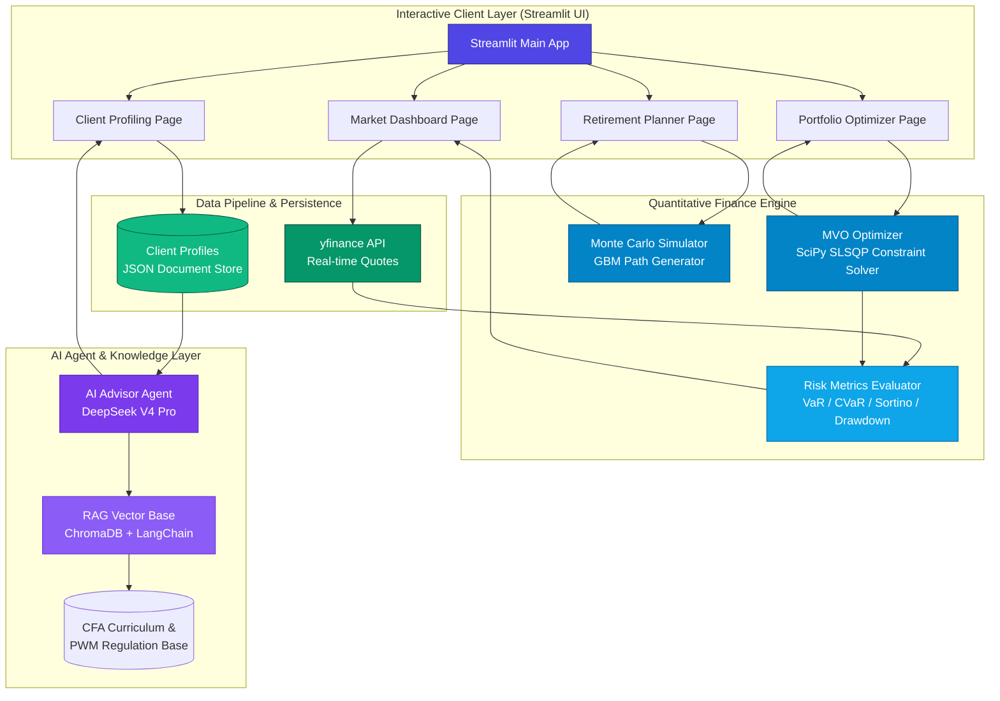

<p align="right">
  <a href="./README.md">English</a> | <strong>简体中文</strong> | <a href="./README.ja.md">日本語</a>
</p>

<div align="center">
  

  # AI WealthPilot

  *对标 CFA® 知识体系的智能财富管理与组合量化投资引擎*

  [](https://www.python.org)
  [](https://streamlit.io)
  [](https://www.cfainstitute.org)
  [](LICENSE)
  [](https://github.com/Michelia-L/AI-WealthPilot/actions)

  ⭐ 如果你喜欢这个项目，请在 GitHub 上点个 Star！这对我很有帮助！

  [项目概述](#项目概述) • [核心功能](#核心功能) • [系统架构](#系统架构) • [量化数学模型](#量化数学模型) • [目录结构](#目录结构) • [快速开始](#快速开始) • [运行测试](#运行测试) • [免责声明](#免责声明)

</div>

---

## 项目概述

**AI WealthPilot** 是一个面向私人财富管理场景的专业级资产配置与决策支持系统。它将 **CFA® 三级私人财富管理 (Private Wealth Management)** 的经典理论考纲具象化为高可靠性、生产就绪的量化代码，在学术严谨性与现代软件工程之间架起桥梁。

该系统深度融合了 **均值-方差优化 (MVO)** 与 **几何布朗运动 (GBM)** 财富生命周期蒙特卡洛路径模拟器，并搭载 **AI 顾问 Agent** 识别行为金融学偏差，生成个性化的配置建议书。

> [!TIP]
> 系统的量化优化引擎与行情看板支持完全离线使用。如果配置了 DeepSeek API Key，将能完整激活 AI 顾问的流式建议书生成服务。

---

## 核心功能

- 🎓 **对标 CFA® 三级私人财富管理框架**  
  实现客观财务**承受能力 (Ability)** 与主观心理**承担意愿 (Willingness)** 的双轨制风险承受度模型。严格执行 CFA 的审慎原则，当两者冲突时“就低不就高”，以最大化保护客户利益。
- 🧮 **现代投资组合理论与优化 (MPT/MVO)**  
  利用 `SciPy` 的 SLSQP 算法求解约束优化问题，绘制有效前沿 (Efficient Frontier)，求解切点组合 (Tangency Portfolio，即最大夏普比率组合) 以及资本配置线 (CAL)。
- 🎲 **生命周期蒙特卡洛模拟**  
  基于离散时间**几何布朗运动 (GBM)** 随机过程，并引入 **Jensen 不等式对数正态修正 (波动率拖累修正)** 进行 10,000 条财富路径模拟，真实还原“退休前积累”与“退休后提取”的双阶段演化。
- 🛡️ **精细化尾部风险度量**  
  提供只惩罚下行波动的 **Sortino Ratio (索提诺比率)**，并基于历史模拟法提供高精度的日度 **VaR (在险价值)** 与 **CVaR (条件在险价值/预期亏损)** 评估，特别适用于非对称、肥尾分布资产。
- 🤖 **AI 顾问 Agent**  
  基于先进大语言模型 (`DeepSeek V4 Pro`) 深度分析客户多维指标，识别其可能存在的行为金融偏差（如损失厌恶、过度自信），生成专业、合规的流式理财建议书。
- 📊 **金融终端级视觉交互**  
  基于 Streamlit 定制的深色调金融终端，搭载多维 Plotly 交互式图表，实现缩放、悬浮提示和多路径拟合曲线的高清渲染。

---

## 系统架构

下图展示了系统的前端交互、量化计算引擎、持久化存储以及 AI Agent 层的通信与数据流向：



---

## 量化数学模型

### 1. 均值-方差优化 (MVO)
已知多资产协方差矩阵与预期收益率，系统使用 `SLSQP` 算法求解以下受约束的非线性优化问题：

*   **目标函数（最小化组合方差）**：
    $$\min_{w} \sigma_p^2 = w^T \Sigma w$$
*   **约束条件**：
    $$\sum_{i=1}^N w_i = 1 \quad (\text{全额投资约束})$$
    $$w_i \in [0, 1] \quad (\text{仅做多约束})$$
    $$w^T \mu = R_{\text{target}} \quad (\text{目标收益率约束})$$

其中 $w \in \mathbb{R}^N$ 为投资资产权重向量，$\Sigma \in \mathbb{R}^{N \times N}$ 为年化资产协方差矩阵，$\mu \in \mathbb{R}^N$ 为年化资产预期收益率向量。

### 2. 资本配置线 (CAL) 与切点组合 (Tangency Portfolio)
切点组合代表了在无风险利率下最大化夏普比率 (Sharpe Ratio) 的最优投资组合组合：

$$\max_{w} \text{Sharpe} = \frac{w^T \mu - R_f}{\sqrt{w^T \Sigma w}}$$

其中 $R_f$ 为年化无风险利率（系统默认取美债基准 $4.5\%$）。

### 3. 几何布朗运动 (GBM) 与波动率拖累修正 (Volatility Drag)
为对长期财富变化做合理模拟，系统采用离散时间步长的几何布朗运动，引入了 Jensen 不等式对数正态修正（即波动率拖累修正），以防止多期累积产生的系统性高估：

$$S_{t+\Delta t} = S_t \exp \left( \left(\mu - \frac{1}{2}\sigma^2\right)\Delta t + \sigma \sqrt{\Delta t} Z_t \right)$$

- **积累阶段**：$V_{t+1} = V_t e^{(\mu - \frac{1}{2}\sigma^2) + \sigma Z_t} + \text{Annual Savings}$
- **分配阶段**：$V_{t+1} = V_t e^{(\mu_{new} - \frac{1}{2}\sigma^2_{new}) + \sigma_{new} Z_t} - \text{Annual Outflow}$

### 4. 尾部风险与下行偏差统计
- **下行偏差 ($\sigma_{\text{downside}}$)**：仅对低于零或无风险收益率的波动进行惩罚。
  $$\sigma_{\text{downside}} = \sqrt{\frac{252}{T} \sum_{t=1}^T \left(\min(R_{p,t}, 0)\right)^2}$$
- **Sortino 比率**：
  $$\text{Sortino Ratio} = \frac{R_p - R_f}{\sigma_{\text{downside}}}$$
- **在险价值 (VaR)** 和 **条件在险价值 (CVaR)**：基于历史模拟法在 $\alpha = 95\%$ 置信水平下进行非对称及肥尾分布计算。

---

## 目录结构

```
AI-WealthPilot/
├── src/
│   ├── app.py                    # Streamlit 主程序入口与导航
│   ├── config.py                 # 核心配置（13类资产配置）、超参数与系统设置
│   ├── portfolio/                # 【量化计算引擎】
│   │   ├── optimizer.py          # MVO 求解器、切点优化、狄利克雷随机散点生成
│   │   ├── simulator.py          # GBM 模拟器、退休两阶段生命周期生成器
│   │   ├── risk_metrics.py       # 风险指标计算（Sharpe, Sortino, VaR, CVaR）
│   │   └── views.py              # Black-Litterman 观点矩阵处理器
│   ├── data/                     # 【数据拉取模块】
│   │   └── market_data.py        # yfinance 异步行情拉取与相关性矩阵计算
│   ├── visualization/            # 【图表渲染组件】
│   │   └── charts.py             # Plotly 交互式专业图表
│   ├── views/                    # 【Streamlit 视图页面】
│   │   ├── market_dashboard.py   # 跨资产行情监控与相关性热力图
│   │   ├── portfolio_optimizer.py# MVO & Black-Litterman 配置界面
│   │   ├── retirement_planner.py # 蒙特卡洛财富寿命规划器
│   │   ├── client_profiling.py   # CFA IPS 问卷与客户档案库
│   │   └── ai_advisor.py         # AI 顾问流式建议书交互页面
│   ├── agents/                   # 【AI 顾问 Agent】
│   │   ├── profiler.py           # 客户档案解析 Agent
│   │   ├── advisor.py            # DeepSeek V4 Pro 建议书生成 Agent
│   │   ├── portfolio_recommender.py # 个性化配置匹配 Agent
│   │   └── report_storage.py     # JSON 格式建议书持久化存储
│   └── rag/                      # 【RAG 知识库】(开发规划中)
├── tests/                        # 【自动化测试套件】
│   ├── test_portfolio.py         # 核心量化引擎单元测试
│   ├── test_profiler.py          # 客户风险评估双轨制逻辑测试 (22个用例)
│   ├── test_black_litterman.py   # Black-Litterman 模型计算测试
│   ├── test_advanced_portfolio.py# 重抽样有效前沿与矩阵正则化测试
│   ├── test_advisor.py           # DeepSeek 顾问 Agent 集成测试
│   └── test_phase3_features.py   # 阶段3功能端到端集成测试
└── data/
    ├── profiles/                 # 客户画像 JSON 数据库
    ├── reports/                  # 生成的建议书 JSON 数据库
    └── sample/                   # 离线 benchmark 行情缓存
```

---

## 快速开始

### 运行环境

- **Python 3.11+**
- Git

### 安装部署

1. **克隆代码仓库**
   ```bash
   git clone https://github.com/Michelia-L/AI-WealthPilot.git
   cd AI-WealthPilot
   ```

2. **创建并激活虚拟环境**
   ```bash
   # Windows 平台
   python -m venv .venv
   .venv\Scripts\activate

   # macOS / Linux 平台
   python3 -m venv .venv
   source .venv/bin/activate
   ```

3. **安装项目依赖**
   ```bash
   pip install -r requirements.txt
   ```

4. **配置环境变量**
   ```bash
   cp .env.example .env
   # 用文本编辑器打开 .env，在其中配置您的 DEEPSEEK_API_KEY 以启用 AI 顾问。
   # 您可在 DeepSeek 开放平台获取：https://platform.deepseek.com
   ```

5. **启动仪表盘**
   ```bash
   streamlit run src/app.py
   ```
   启动成功后，浏览器会自动打开 `http://localhost:8501`。

---

## 运行测试

使用 `pytest` 运行涵盖量化引擎、画像评分及 Agent 流式交互的单元测试：

```bash
pytest -v
```

---

## 免责声明

> [!WARNING]
> **合规声明与专业免责条款**：
> 
> 1. **AI WealthPilot** 项目仅作为作者**展示金融编程实力、CFA® 知识理论体系落地和 AI Agent 工程设计的专业个人作品集**。
> 2. 系统输出的所有资产比重、优化曲线、财富存活率及 AI 顾问方案均为**基于历史数据及特定量化模型假设下的理论模拟结果，在任何情况下均不构成实质性投资建议或理财规划书**。
> 3. 金融市场波动巨大，量化模型存在结构性漂移和尾部黑天鹅风险。作者及项目不为任何因据此投资决策产生的资金损失承担法律责任。
