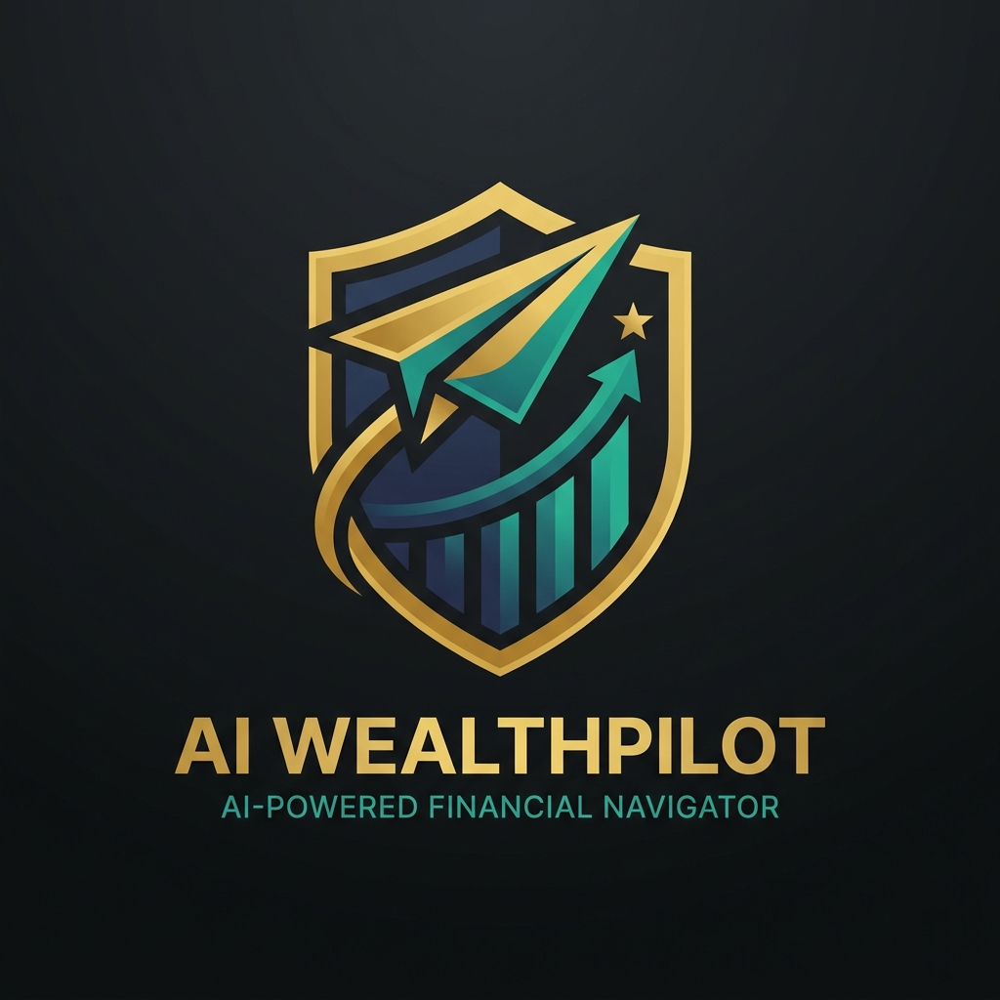
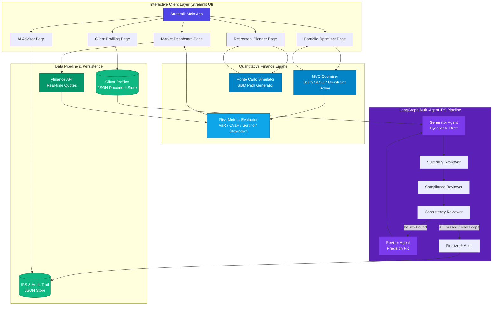

<p align="right">
  <a href="./README.md">English</a> | <strong>简体中文</strong>
</p>

<div align="center">
  

  # AI WealthPilot

  *对标 CFA® 知识体系的智能财富管理与组合量化投资引擎*

  [](https://www.python.org)
  [](https://streamlit.io)
  [](https://langchain-ai.github.io/langgraph/)
  [](https://ai.pydantic.dev/)
  [](https://www.cfainstitute.org)
  [](LICENSE)
  [](https://github.com/Michelia-L/AI-WealthPilot/actions)

  ⭐ 如果你喜欢这个项目，请在 GitHub 上点个 Star！这对我很有帮助！

  [项目概述](#项目概述) • [核心功能](#核心功能) • [系统架构](#系统架构) • [量化数学模型](#量化数学模型) • [目录结构](#目录结构) • [快速开始](#快速开始) • [运行测试](#运行测试) • [免责声明](#免责声明)

</div>

---

## 项目概述

**AI WealthPilot** 是一个面向私人财富管理场景的专业级资产配置与决策支持系统。它将 **CFA® 三级私人财富管理 (Private Wealth Management)** 的经典理论考纲具象化为高可靠性、生产就绪的量化代码，在学术严谨性与现代软件工程之间架起桥梁。

该系统深度融合了 **均值-方差优化 (MVO)** 与 **几何布朗运动 (GBM)** 财富生命周期蒙特卡洛路径模拟器，并搭载 **AI 顾问 Agent** 识别行为金融学偏差，生成个性化的配置建议书。

> [!TIP]
> 系统的量化优化引擎与行情看板支持完全离线使用。如果配置了 DeepSeek API Key，将能完整激活 AI 顾问的流式建议书生成服务。

---

## 核心功能

- 🎓 **对标 CFA® 三级私人财富管理框架**  
  实现客观财务**承受能力 (Ability)** 与主观心理**承担意愿 (Willingness)** 的双轨制风险承受度模型。严格执行 CFA 的审慎原则，当两者冲突时“就低不就高”，以最大化保护客户利益。
- 🧮 **现代投资组合理论与优化与正则化 (MPT/MVO)**  
  利用 `SciPy` 的 SLSQP 算法求解约束优化问题，绘制有效前沿 (Efficient Frontier)，求解切点组合 (Tangency Portfolio，即最大夏普比率组合) 以及资本配置线 (CAL)。实现自动条件数检测与对角加载（Diagonal Loading）或特征值裁剪（Eigenvalue Clipping）的数值正则化，确保生产级数值稳定性。
- 💎 **协方差矩阵收缩估计量**  
  支持 Ledoit-Wolf 和 OAS (Oracle Approximating Shrinkage) 估计量（依赖 `scikit-learn`），与传统样本协方差相比，能够显著降低 MVO 对输入参数估计误差的敏感度，解决噪声扩展问题。
- 📐 **资产类别层级的权重约束**  
  支持在群组层级（如股票类、债券类、另类资产类）注入最小/最大权重约束，而不仅限于单资产约束，契合机构级战略资产配置（SAA）指引。
- 🎲 **生命周期蒙特卡洛模拟**  
  基于离散时间**几何布朗运动 (GBM)** 随机过程，并引入 **Jensen 不等式对数正态修正 (波动率拖累修正)** 进行 10,000 条财富路径模拟，真实还原“退休前积累”与“退休后提取”的双阶段演化。
- 🛡️ **精细化尾部风险度量**  
  提供只惩罚下行波动的 **Sortino Ratio (索提诺比率)**，并基于历史模拟法提供高精度的日度 **VaR (在险价值)** 与 **CVaR (条件在险价值/预期亏损)** 评估，特别适用于非对称、肥尾分布资产。
- 👥 **多客户画像对比分析系统**  
  支持多客户画像的横向对比与全景洞察，自动计算风险偏好、储蓄率、行为偏差等维度的差异，并生成结构化的对比 JSON 报告与分析洞察。
- 🕸️ **LangGraph 多智能体闭环 IPS 工作流（生成-审查-修订）**  
  基于 `LangGraph` 与 `PydanticAI` 构建了生产级的多智能体自动化审批链。系统模拟真实的私人银行合规审查流程，由 **IPS 生成 Agent** 编排初稿，再经由三个独立专家 Agent 从**适配性**（客户需求错配）、**合规性**（法律条文准入与权重极值）和**一致性**（前后章节数学逻辑闭环）三个维度进行多轮严苛的辩论与流式自我纠偏，并留存完备的合规审计追踪（Audit Trail）。
- ⧉ **Black-Litterman 观点集成优化引擎**  
  支持基于反向 CAPM 原理从资产市值权重中剥离出市场隐含均衡收益率（Prior），并允许用户注入个性化的绝对观点或相对观点（含自定义置信度矩阵）。通过贝叶斯推断将均衡 Baseline 与投资者观点无缝融合，有效解决传统均值-方差优化（MVO）对历史数据估计误差高敏感、容易产生极端资产配比的痛点。
- 🤖 **AI 顾问 Agent**  
  基于先进大语言模型 (`DeepSeek V4 Pro`) 深度分析客户多维指标，识别其可能存在的行为金融偏差（如损失厌恶、过度自信），生成专业、合规的流式理财建议书。
- 📄 **多格式高级文档导出**  
  支持将 AI 顾问建议书无缝转换为独立的、带有精美内嵌 CSS 样式的 HTML 文档、Markdown 以及原生 JSON，便于跨平台分发和打印。
- 📊 **黑曜石黄金玻璃微凸金融终端 (Obsidian & Gold Glassmorphic UI)**  
  基于 Streamlit 深度定制，融合高端黑曜石底色与黄金磨砂玻璃微凸起视觉设计语言，搭载多维 Plotly 交互式图表，实现缩放、悬浮提示和多路径拟合曲线的高清渲染，完美还原顶级金融机构终端的品质感。

---

## 系统架构

下图展示了系统的前端交互、量化计算引擎、持久化存储以及 AI Agent 层的通信与数据流向：



---

## 量化数学模型

### 1. 均值-方差优化 (MVO)
已知多资产协方差矩阵与预期收益率，系统使用 `SLSQP` 算法求解以下受约束的非线性优化问题：

*   **目标函数（最小化组合方差）**：
    $$\min_{w} \sigma_p^2 = w^T \Sigma w$$
*   **约束条件**：
    $$\sum_{i=1}^N w_i = 1 \quad (\text{全额投资约束})$$
    $$w_i \in [0, 1] \quad (\text{仅做多约束})$$
    $$w^T \mu = R_{\text{target}} \quad (\text{目标收益率约束})$$
    $$\min_{c} \le \sum_{i \in \mathcal{C}_c} w_i \le \max_{c} \quad (\text{资产类别群组约束})$$

其中 $w \in \mathbb{R}^N$ 为投资资产权重向量，$\Sigma \in \mathbb{R}^{N \times N}$ 为年化资产协方差矩阵，$\mu \in \mathbb{R}^N$ 为年化资产预期收益率向量，$\mathcal{C}_c$ 为属于资产类别群组 $c$ 的资产索引集合。

*注：在资产配置优化（MVO）中，我们采用传统的**算术收益率**，因为资产组合的预期收益具有横截面可加性（即 $R_p = w^T \mu$）。*

### 2. 协方差收缩与数值正则化
为了降低估计误差和噪声，多资产协方差矩阵 $\Sigma$ 可以使用收缩估计量进行估计，或在条件数过大时进行正则化：

*   **Ledoit-Wolf 与 OAS 收缩**：将样本协方差矩阵 $S$ 与高度结构化的目标矩阵 $F$（如常相关模型）进行线性组合：
    $$\Sigma_{\text{shrunk}} = (1 - \rho) S + \rho F$$
    其中 $\rho \in (0, 1)$ 是通过 Ledoit-Wolf 或 OAS 算法解析计算出的最优收缩强度。
*   **条件数检测与对角加载**：如果条件数 $\text{cond}(\Sigma) > 10^{10}$（表示矩阵接近奇异且极其病态），则通过对角加载进行正则化：
    $$\Sigma_{\text{reg}} = \Sigma + \epsilon I$$
    其中 $\epsilon = 10^{-6}$，$I$ 为单位矩阵。
*   **特征值裁剪**：将小特征值或负特征值裁剪为正值门限，以确保矩阵的半正定性：
    $$\Sigma_{\text{reg}} = V \max(\Lambda, \epsilon) V^T$$
    其中 $\Lambda$ 是特征值对角矩阵，$V$ 是对应的特征向量矩阵。

### 3. 资本配置线 (CAL) 与切点组合 (Tangency Portfolio)
切点组合代表了在无风险利率下最大化夏普比率 (Sharpe Ratio) 的最优投资组合组合：

$$\max_{w} \text{Sharpe} = \frac{w^T \mu - R_f}{\sqrt{w^T \Sigma w}}$$

其中 $R_f$ 为年化无风险利率（系统默认取美债基准 $4.5\%$）。

### 4. 几何布朗运动 (GBM) 与波动率拖累修正 (Volatility Drag)
为对长期财富变化做合理模拟，系统采用离散时间步长的几何布朗运动，引入了 Jensen 不等式对数正态修正（即波动率拖累修正），以防止多期累计产生的系统性高估：

$$S_{t+\Delta t} = S_t \exp \left( \left(\mu - \frac{1}{2}\sigma^2\right)\Delta t + \sigma \sqrt{\Delta t} Z_t \right)$$

- **积累阶段（Accumulation Phase）**：
  $$V_{t+1} = V_t \exp \left( \left(\mu_{\text{acc}} - \frac{1}{2}\sigma_{\text{acc}}^2\right) + \sigma_{\text{acc}} Z_t \right) + \text{Annual Savings}$$
- **分配阶段（Distribution/Retirement Phase）**：
  $$V_{t+1} = V_t \exp \left( \left(\mu_{\text{dist}} - \frac{1}{2}\sigma_{\text{dist}}^2\right) + \sigma_{\text{dist}} Z_t \right) - \text{Nominal Withdrawal}_t$$
  其中，名义提取额名义值会随通胀逐年进行动态修正：
  $$\text{Nominal Withdrawal}_t = \text{Desired Real Income} \times (1 + \gamma)^{T_{\text{accum}} + t}$$
  其中 $\gamma$ 代表年化通货膨胀率假设，$T_{\text{accum}}$ 为工作积累期年数，以确保模型精确维护退休后的实际购买力支出需求，完全契合 CFA 考纲对长寿风险与通胀侵蚀的定量度量。

*注：在进行长周期、多期的资产路径模拟中，由于单期收益率的复利效应和波动率拖累（Volatility Drag），我们必须采用对数收益率（几何均值收益率），它具有时间可加性。引入的 $-\frac{1}{2}\sigma^2$ 项为 Jensen 不等式修正，能够消除对多期累计财富的系统性高估。*

### 5. 尾部风险与下行偏差统计
- **下行偏差 ($\sigma_{\text{downside}}$)**：仅对低于零或无风险收益率的波动进行惩罚。
  $$\sigma_{\text{downside}} = \sqrt{\frac{252}{T} \sum_{t=1}^T \left(\min(R_{p,t}, 0)\right)^2}$$
- **Sortino 比率**：
  $$\text{Sortino Ratio} = \frac{R_p - R_f}{\sigma_{\text{downside}}}$$
- **在险价值 (VaR)** 和 **条件在险价值 (CVaR)**：基于历史模拟法在 $\alpha = 95\%$ 置信水平下进行非对称及肥尾分布计算。

---

## 目录结构

```
AI-WealthPilot/
├── src/
│   ├── app.py                    # Streamlit 主程序入口与导航
│   ├── config.py                 # 核心配置（13类资产配置）、超参数与系统设置
│   ├── utils.py                  # 通用工具函数（文件名清洗等）
│   ├── portfolio/                # 【量化计算引擎】
│   │   ├── optimizer.py          # MVO 求解器、切点优化、狄利克雷随机散点生成
│   │   ├── simulator.py          # GBM 模拟器、退休两阶段生命周期生成器
│   │   ├── risk_metrics.py       # 风险指标计算（Sharpe, Sortino, VaR, CVaR）
│   │   └── views.py              # Black-Litterman 观点矩阵处理器
│   ├── data/                     # 【数据拉取模块】
│   │   └── market_data.py        # yfinance 异步行情拉取与相关性矩阵计算
│   ├── visualization/            # 【图表渲染组件】
│   │   └── charts.py             # Plotly 交互式专业图表
│   ├── views/                    # 【Streamlit 视图页面】
│   │   ├── styles.py             # 黑色黄金微凸起视觉效果 CSS 注入模块
│   │   ├── market_dashboard.py   # 跨资产行情监控与相关性热力图
│   │   ├── portfolio_optimizer.py# MVO & Black-Litterman 配置界面
│   │   ├── retirement_planner.py # 蒙特卡洛财富寿命规划器
│   │   ├── client_profiling.py   # CFA IPS 问卷与客户档案库
│   │   └── ai_advisor.py         # AI 顾问流式建议书交互页面
│   ├── agents/                   # 【AI 决策与智能体层】
│   │   ├── profiler.py           # 客户档案解析与行为金融偏差检测 Agent
│   │   ├── advisor.py            # DeepSeek V4 Pro 建议书生成 Agent（流式）
│   │   ├── portfolio_recommender.py # 客户画像-资产类别风险匹配 Agent
│   │   ├── report_storage.py     # 建议书 PDF/JSON 格式持久化存储
│   │   ├── ips_models.py         # CFA-IPS 核心七要素 Pydantic 强类型数据模型
│   │   ├── ips_agents.py         # 基于 PydanticAI 的生成/多审查员/修订 Agent 定义
│   │   ├── ips_workflow.py       # 基于 LangGraph 的多智能体闭环工作流状态机
│   │   └── ips_storage.py        # 投资政策声明书及审计历史的本地存储与 MD 导出器
│   └── rag/                      # 【RAG 知识库】(开发规划中)
├── tests/                        # 【自动化测试套件】
│   ├── conftest.py               # Pytest 全局共享 Mock 夹具与配置
│   ├── test_portfolio.py         # MVO/BL 核心量化引擎单元测试
│   ├── test_profiler.py          # 客户风险评估双轨制逻辑测试 (22个用例)
│   ├── test_black_litterman.py   # Black-Litterman 计算矩阵测试
│   ├── test_advanced_portfolio.py# 重抽样有效前沿与矩阵正则化测试
│   ├── test_advisor.py           # DeepSeek 顾问 Agent 集成测试
│   ├── test_market_data.py       # 异步行情接口及缓存加载测试
│   ├── test_ips_models.py        # IPS Pydantic 模型的严格约束边界测试
│   ├── test_ips_workflow.py      # LangGraph 状态机生成-审查-修订循环测试
│   ├── test_portfolio_recommender.py # 资产配置推荐建议一致性测试
│   ├── test_comparison_export.py # 画像对比数据导出与格式化测试
│   ├── test_views.py             # Streamlit 界面路由与风格注入安全性测试
│   └── test_phase3_features.py   # 阶段3功能端到端集成测试
├── examples/                     # 【示例与演示脚本】
│   ├── demo_quick.py             # 快速入门演示（MVO + BL + 蒙特卡洛）
│   ├── demo_interview.py         # 对标 CFA 核心演示（MVO + 蒙特卡洛 + 风险指标）
│   ├── demo_comprehensive.py     # 完整可视化演示（在浏览器中打开交互式 Plotly 图表）
│   ├── demo_advanced_optimization.py # 高级优化特性演示（矩阵正则化与重抽样 MVO）
│   └── demo_ips_generator.py     # LangGraph 驱动的 AI 编排 IPS 多轮迭代生成终端演示
└── data/
    ├── profiles/                 # 客户画像 JSON 数据库
    ├── reports/                  # 生成的理财建议书数据库
    ├── ips/                      # 生成的标准化 IPS 建议书及审计追踪文件
    └── sample/                   # 离线 benchmark 行情缓存
```

---

## 快速开始

### 运行环境

- **Python 3.11+**
- Git

### 安装部署

1. **克隆代码仓库**
   ```bash
   git clone https://github.com/Michelia-L/AI-WealthPilot.git
   cd AI-WealthPilot
   ```

2. **创建并激活虚拟环境**
   ```bash
   # Windows 平台
   python -m venv .venv
   .venv\Scripts\activate

   # macOS / Linux 平台
   python3 -m venv .venv
   source .venv/bin/activate
   ```

3. **安装项目依赖**
   ```bash
   pip install -r requirements.txt
   ```

4. **配置环境变量**
   ```bash
   cp .env.example .env
   # 用文本编辑器打开 .env，在其中配置您的 DEEPSEEK_API_KEY 以启用 AI 顾问。
   # 您可在 DeepSeek 开放平台获取：https://platform.deepseek.com
   ```

5. **启动仪表盘**
   ```bash
   streamlit run src/app.py
   ```
   启动成功后，浏览器会自动打开 `http://localhost:8501`。

---

## 运行测试

使用 `pytest` 运行涵盖量化引擎、画像评分及 Agent 流式交互的单元测试：

```bash
pytest -v
```

---

## 运行演示脚本

我们在 `examples/` 目录下提供了几个独立的演示脚本，用于离线运行量化引擎并展示核心功能：

```bash
# 运行对标 CFA 的核心面试演示（包含 MVO、蒙特卡洛、夏普比率/VaR/CVaR 风险指标）
python examples/demo_interview.py

# 运行快速入门演示（包含 MVO、Black-Litterman、蒙特卡洛模拟）
python examples/demo_quick.py

# 运行高级优化特性演示（包含协方差收缩、重抽样 MVO）
python examples/demo_advanced_optimization.py

# 运行完整可视化演示（会在浏览器中自动打开交互式 Plotly 图表）
python examples/demo_comprehensive.py

# 运行多智能体 IPS 生成器演示（包含 PydanticAI + LangGraph 的生成-审查-修订工作流）
python examples/demo_ips_generator.py
```

---

## 免责声明

> [!WARNING]
> **合规声明与专业免责条款**：
> 
> 1. **AI WealthPilot** 项目仅作为作者**展示金融编程实力、CFA® 知识理论体系落地和 AI Agent 工程设计的专业个人作品集**。
> 2. 系统输出的所有资产比重、优化曲线、财富存活率及 AI 顾问方案均为**基于历史数据及特定量化模型假设下的理论模拟结果，在任何情况下均不构成实质性投资建议或理财规划书**。
> 3. 金融市场波动巨大，量化模型存在结构性漂移和尾部黑天鹅风险。作者及项目不为任何因据此投资决策产生的资金损失承担法律责任。
