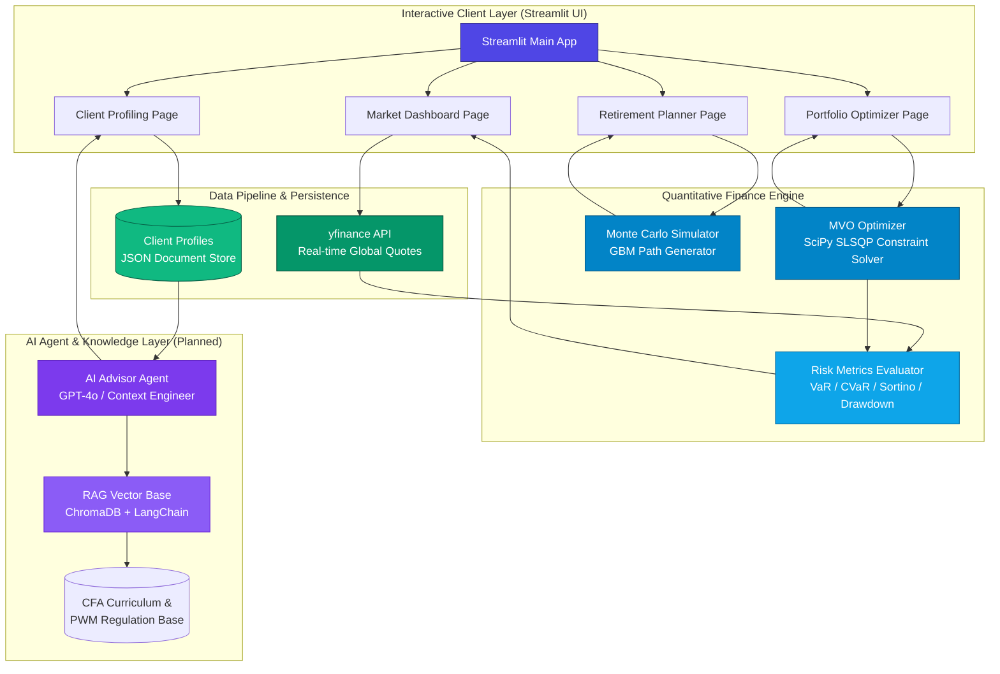

<p align="right">
  <a href="./README.md">English</a> | <strong>简体中文</strong> | <a href="./README.ja.md">日本語</a>
</p>

# 🏦 AI WealthPilot

> **对标 CFA® 知识体系的智能财富管理与组合量化投资引擎**
>
> 基于 **AI Agent + RAG** 构建的高阶私人财富管理规划系统。深度融合 **CFA® 三级私人财富管理 (Private Wealth Management)** 的经典理论架构，并结合现代**量化金融计算引擎**与**大语言模型**技术。

<p align="center">
  
  
  
  
  
</p>

---

## 🌟 项目愿景与亮点

**AI WealthPilot** 不是一个普通的金融分析玩具项目，而是一个**面向机构级私人财富管理场景的专业资产配置与决策支持系统**。它将高深复杂的 CFA 理论体系具象化为高可用性的代码，兼具严谨的金融学术底蕴与现代软件工程的最佳实践：

1. **理论权威，对标 CFA L3 框架**：全面贯彻 **CFA® Level III (Private Wealth Management Pathway)** 核心考纲。从客户画像的客观承受能力 (Ability) 与主观意愿 (Willingness) 双轨评估，到基于目标的财富规划 (Goal-Based Wealth Planning)，每行逻辑均有 CFA 教材作为理论支撑。
2. **严谨底座，量化金融计算引擎**：基于 `SciPy` 科学计算库构建现代投资组合理论 (MPT) 优化器。利用 `Dirichlet` 狄利克雷分布模拟高效散点，并采用离散时间**几何布朗运动 (GBM)** 算法结合 **Jensen 不等式对数正态修正**（波动率拖累修正）进行 10,000 条路径的超大规模蒙特卡洛模拟。
3. **全面覆盖，精细化风险计量**：不仅提供常规夏普比率 (Sharpe Ratio)，还针对非对称和肥尾分布（如数字货币 BTC 等）实现下行风险偏差的**索提诺比率 (Sortino Ratio)**，并提供基于历史模拟法的高级 **VaR (在险价值)** 与 **CVaR (条件在险价值/预期亏损)** 风险分析。
4. **精美交互，金融终端级视觉体验**：采用 Streamlit 深度定制暗色调视觉系统，搭配高性能交互式 **Plotly 多维动态图表**，完美呈现有效前沿 (Efficient Frontier)、收益相关性热力图、财富存活率曲线及蒙特卡洛路径分布。

---

## 📈 系统核心模块

| 模块名称 | 金融核心理论 | 工程实现 / 技术栈 | 开发状态 |
| :--- | :--- | :--- | :---: |
| 📊 **Portfolio Engine<br/>投资组合优化引擎** | 现代投资组合理论 (MPT)、均值-方差优化 (MVO)、切点组合与资本配置线 (CAL) | `SciPy (SLSQP)` 约束求解器、`NumPy` 矩阵年化、`Dirichlet` 均匀权散点云 | **✅ 已上线** |
| 🎯 **Retirement Planner<br/>两阶段退休规划器** | 人力资本 (Human Capital) 与金融资本转换、长寿风险 (Longevity Risk)、存活率分析 | **Geometric Brownian Motion (GBM)** 路径依赖模拟、资产负债生命周期模拟 | **✅ 已上线** |
| 🧠 **Client Profiling<br/>客户画像与评估系统** | 投资政策声明 (IPS) 框架、Ability & Willingness 双轨风险容忍度模型 | `dataclasses` 强类型数据模型、双轨制滑块问卷、`JSON` 本地持久化与版本回溯 | **✅ 已上线** |
| 📈 **Market Dashboard<br/>市场实时监控系统** | 跨资产大类配置、多资产相关性矩阵、多维历史风险统计分析 | `yfinance` 实时 API 动态拉取、`Plotly` 移动平均线、相关性热力图 | **✅ 已上线** |
| 🤖 **AI Advisor Agent<br/>AI 顾问 Agent** | 行为金融学 (Behavioral Finance) 偏差识别、个性化客户资产配置建议书生成 | `OpenAI GPT-4o` 接口接入、理财顾问专业 Prompt 模版构建与上下文工程 | **📋 规划中** |
| 📝 **IPS Generator<br/>RAG 驱动的 IPS 生成器** | 经典 IPS 的 7 大核心要素 (Objectives & Constraints) 自动化生成 | `ChromaDB` 向量数据库、`LangChain` 链式框架、CFA 官方知识库精准 RAG 召回 | **📋 规划中** |
| 🔄 **Rebalancing Monitor<br/>动态再平衡模块** | 日历再平衡 (Calendar) 与区间再平衡 (Percentage)、考虑税收与摩擦成本的再平衡 | 资产权重漂移 (Drift) 分析、交易滑点仿真、智能再平衡警报触发 | **📋 规划中** |

---

## 🏗️ 系统架构与数据流向



---

## 🧮 量化金融数学理论与方法论

本项目代码严格实现了现代量化投资与私人财富管理的核心数学模型。为了保证学术的严谨性与工业级计算的准确度，核心公式及逻辑披露如下：

### 1. 现代投资组合理论与均值-方差优化 (MVO)
根据 **Harry Markowitz** 经典模型，系统在协方差矩阵和资产预期收益率已知的前提下，通过 `SciPy` 的 `SLSQP` 算法求解如下非线性约束优化问题：

*   **目标函数（最小化组合方差）**：
    $$\min_{w} \sigma_p^2 = w^T \Sigma w$$
*   **约束条件**：
    $$\sum_{i=1}^N w_i = 1 \quad (\text{全额投资约束})$$
    $$w_i \in [0, 1] \quad (\text{禁止做空约束，可配置})$$
    $$w^T \mu = R_{\text{target}} \quad (\text{目标收益率约束})$$

其中：
*   $w \in \mathbb{R}^N$ 为资产投资权重向量。
*   $\Sigma \in \mathbb{R}^{N \times N}$ 为年化资产协方差矩阵（日协方差矩阵 $\times 252$）。
*   $\mu \in \mathbb{R}^N$ 为年化资产预期收益率向量（日均收益率 $\times 252$）。

### 2. 资本配置线与切点组合 (Tangency Portfolio)
切点组合（Tangency Portfolio）是资本配置线 (CAL) 与风险资产有效前沿的唯一切点，代表了**无风险利率给定时的最大夏普比率（Sharpe Ratio）组合**：

$$\max_{w} \text{Sharpe} = \frac{R_p - R_f}{\sigma_p} = \frac{w^T \mu - R_f}{\sqrt{w^T \Sigma w}}$$

其中：
*   $R_f$ 为年化无风险利率（系统默认取高美债基准 $4.5\%$）。
*   **两基金分离定理 (Tobin's Separation Theorem)** 表明：任何理性投资者的风险组合都应是该切点组合，仅需通过无风险资产的配置比例来调节整体风险敞口。

### 3. 几何布朗运动 (GBM) 与波动率拖累修正 (Volatility Drag)
为对客户未来的财富进行多期预测，系统放弃了具有高误导性的“确定性年化收益线性增长”模型，采用**几何布朗运动 (GBM)** 随机过程生成 10,000 条投资价值路径。其随机微分方程 (SDE) 为：

$$dS_t = \mu S_t dt + \sigma S_t dW_t$$

在离散时间步长 $\Delta t$（本系统取 $\Delta t = 1$ 年）下，为避免多期复合累积产生的系统性高估风险，必须引入 **Jensen 不等式对数正态修正（即波动率拖累修正 / Volatility Drag Adjustment）**。离散递推公式为：

$$S_{t+\Delta t} = S_t \exp \left( \left(\mu - \frac{1}{2}\sigma^2\right)\Delta t + \sigma \sqrt{\Delta t} Z_t \right)$$

在两阶段（退休前积累阶段与退休后分配阶段）生命周期模拟中：
*   **积累期 (Accumulation Phase)**：$V_{t+1} = V_t e^{(\mu - \frac{1}{2}\sigma^2) + \sigma Z_t} + \text{Annual Savings}$（人力资本高，定期强制储蓄注入）。
*   **分配期 (Distribution Phase)**：$V_{t+1} = V_t e^{(\mu_{new} - \frac{1}{2}\sigma^2_{new}) + \sigma_{new} Z_t} - \text{Annual Outflow}$（人力资本耗尽归零，资产组合降维为保守配置，按年刚性取出生活费，若组合价值归零则视为计划失败）。

### 4. 尾部风险度量与下行偏差 (Downside Risk Metrics)
由于加密货币 (BTC) 等数字资产的收益率分布具有显著的**非对称性 (Skewness)** 和 **超额峰度 (Fat Tails)**，常规的均值-方差框架可能严重低估尾部风险。因此系统引入了以下高级指标：

*   **下行偏差 (Downside Deviation, $\sigma_{\text{downside}}$)**：仅惩罚低于无风险利率或负的收益率波动，是**索提诺比率 (Sortino Ratio)** 的分母：
    $$\sigma_{\text{downside}} = \sqrt{\frac{252}{T} \sum_{t=1}^T \left(\min(R_{p,t}, 0)\right)^2}$$
    $$\text{Sortino Ratio} = \frac{R_p - R_f}{\sigma_{\text{downside}}}$$
*   **在险价值 (Value at Risk, $\text{VaR}_\alpha$)**：给定置信水平 $\alpha$（本系统取 $95\%$），在特定持有期内可能发生的最大损失上限：
    *   *历史模拟法*：$\text{VaR}_{0.95} = -\text{Percentile}(R_{p, \text{daily}}, 5\%)$。
*   **条件在险价值 (Conditional VaR / Expected Shortfall, $\text{CVaR}_\alpha$)**：弥补了 VaR 无法衡量尾部极端损失深度的缺陷，计算**损失超出 VaR 阈值情况下的期望亏损均值**：
    $$\text{CVaR}_\alpha = \mathbb{E}[-R_p \mid -R_p > \text{VaR}_\alpha]$$

### 5. CFA IPS 客户画像风险评估准则
在私人财富管理中，客户的最终风险承受能力由**承受能力 (Ability)** 和 **承担意愿 (Willingness)** 共同决定。
*   **承受能力评分 ($Score_{\text{ability}}$)**：客观财务事实度量（年收入稳定性、投资资产占净资产比、应急基金月数、投资期限、负债率等）。
*   **承担意愿评分 ($Score_{\text{willingness}}$)**：主观心理承受度量（历史回撤反应、波动舒适度偏好、博弈倾向等）。
*   **最终风险决策准则 (CFA Compliance)**：
    $$\text{Final Risk Tolerance Score} = \min(Score_{\text{ability}}, Score_{\text{willingness}})$$
    *CFA 执业原则：当客观承受能力与主观承担意愿发生冲突时，投资顾问必须遵循“就低不就高”的审慎原则进行配置，并对客户进行投资者教育。*

---

## 📂 项目目录结构

系统代码目录严格遵循模块化、高凝聚力、低耦合度的工业级工程规范：

```
AI-WealthPilot/
├── src/
│   ├── app.py                    # Streamlit 主程序入口，处理路由与侧栏导航
│   ├── config.py                 # 全局统一配置中心（包含 13 项大类资产定义、参数默认值、路径等）
│   ├── portfolio/                # 【核心量化计算引擎】
│   │   ├── optimizer.py          # 均值-方差优化器（包含 SLSQP 求解、切点求解、随机 Dir 模拟）
│   │   ├── simulator.py          # 蒙特卡洛模拟器（GBM 随机路径、两阶段退休生命周期模拟）
│   │   └── risk_metrics.py       # 风险统计指标库（Sharpe, Sortino, MaxDrawdown, VaR, CVaR）
│   ├── data/                     # 【数据采集与处理模块】
│   │   └── market_data.py        # yfinance 实时数据管线（多线程下载、收益率转换、相关性热力图输入）
│   ├── visualization/            # 【图表渲染中心】
│   │   └── charts.py             # 基于 Plotly 的多维交互式专业级精美图表画板
│   ├── pages/                    # 【Streamlit 前端页面模块】
│   │   ├── market_dashboard.py   # 市场实时走势、多资产行情监控看板
│   │   ├── portfolio_optimizer.py# MVO 有效前沿动态优化配置交互页面
│   │   ├── retirement_planner.py # 蒙特卡洛两阶段财富生命周期规划页面
│   │   └── client_profiling.py   # CFA IPS 规范下的风险评估问卷与客户画像档案库
│   └── rag/                      # 【RAG 知识库模块】 (Phase 4 规划中)
├── tests/                        # 【单元测试与自动化验证套件】
│   ├── test_portfolio.py         # 量化引擎的测试用例（覆盖 MVO 边界值、GBM 极限值与风险指标）
│   └── test_profiler.py          # 客户画像评估逻辑自动化测试（内置 22 个严格测试用例）
├── data/
│   ├── profiles/                 # 客户画像 JSON 强类型持久化本地数据库
│   └── sample/                   # 离线缓存与基准测试数据集
├── requirements.txt              # 严格版本锁定的第三方依赖声明清单
└── README.md                     # 项目主视觉展示说明书
```

---

## 🛠️ 先端技术栈与工程实现

本项目采用高标准的数据科学与 AI 工程体系进行全链路搭建：

*   **数据科学与量化底座**：
    *   `numpy` & `pandas`：高效矩阵运算与异构高维金融时间序列处理。
    *   `scipy`：使用 `scipy.optimize.minimize` 的 **SLSQP (Sequential Least Squares Programming)** 二次规划求解算法，执行具有非线性等式/不等式约束的极值求解。
    *   `yfinance`：高频异步拉取 Yahoo Finance 实时交易行情与历史 OHLCV 数据。
*   **前端展现与可视化**：
    *   `Streamlit`：基于 Python 快速构建的高级响应式金融交互 Web 系统。
    *   `Plotly`：基于 JS 引擎的金融终端级高交互图表渲染，支持缩放、悬浮提示 (Hover) 与动态路径显示。
*   **AI Agent & 知识检索 (Phase 3.5 & 4 演进中)**：
    *   `OpenAI` & `LangChain`：集成大型语言模型，搭建具备记忆体 (Memory) 与推理链 (Chain of Thought) 的财富顾问 Agent。
    *   `ChromaDB` / `FAISS`：低延迟本地向量数据库，用于 CFA Curriculum 与国家金融监管法规文本的 Embedding 编码与精准语义检索。
*   **测试与工程规范**：
    *   `pytest`：自动化单元测试框架，多测试集并联运行。
    *   `python-dotenv`：生产与开发环境变量解耦管理。

---

## 🚀 快速安装与本地部署

请确保您的本地计算机已安装 **Python 3.11** 或更高版本，并在命令行控制台中执行以下步骤：

### 1. 克隆代码仓库
```bash
git clone https://github.com/Michelia-L/AI-WealthPilot.git
cd AI-WealthPilot
```

### 2. 创建并激活 Python 虚拟环境
```bash
# Windows 平台下创建并激活
python -m venv .venv
.venv\Scripts\activate

# macOS / Linux 平台下创建并激活
python3 -m venv .venv
source .venv/bin/activate
```

### 3. 安装项目依赖项
```bash
pip install -r requirements.txt
```

### 4. 配置环境变量
```bash
cp .env.example .env
# 使用文本编辑器打开 .env，在其中配置您的 OPENAI_API_KEY（若仅使用量化引擎与仪表盘，可暂不配置）
```

### 5. 启动系统仪表盘
```bash
streamlit run src/app.py
```
启动成功后，浏览器会自动打开 `http://localhost:8501`。您即可在精美的深色金融终端主题下，交互式体验系统的完整功能！

---

## 🧑‍💻 自动化单元测试验证

系统高度重视代码的健壮性与数学计算的绝对精确。项目配备了完整的 `pytest` 自动化测试集，覆盖核心计算函数与边界条件：

```bash
# 在项目根目录下运行所有自动化测试用例
pytest -v
```

测试集包括：
*   **`tests/test_portfolio.py`**：验证 MVO 优化器在各种资产规模下的收敛性、最大夏普比率权重的合理性、蒙特卡洛模拟 GBM 漂移项 Jensen 调整的精确度，以及 VaR/CVaR 对非对称尾部损失计算的正确性。
*   **`tests/test_profiler.py`**：涵盖 22 个细分测试用例，从能力评分、意愿评分、就低原则冲突解决，到 JSON 序列化持久化与本地加载，保证客户画像数据的无损读取。

---

## 📜 合规与专业免责声明

> ⚠️ **重要合规声明**：
>
> 1. 本项目（AI WealthPilot）仅作为作者**展示量化金融编程能力、CFA® 知识理论落地与 AI Agent 架构设计的个人专业作品集（Portfolio Project）**使用。
> 2. 系统中产生的所有资产配置权重、组合优化曲线、蒙特卡洛模拟财富存活概率及 AI 顾问输出，均为**基于历史数据和特定数学假设的理论仿真结果，在任何情况下均不构成实质性的投资建议或理财规划方案**。
> 3. 金融市场具有极高的不确定性，历史表现不代表未来收益。量化模型可能面临模型漂移 (Model Drift)、黑天鹅尾部事件等系统性失效风险。投资者据此进行投资交易产生的所有资产损失，作者及项目均不承担任何法律责任。

---
<p align="center">
  <b>Designed with 💡 and 📈 by Michelia-L</b><br>
  <i>Empowering Private Wealth Management with Artificial Intelligence and Advanced Quant Systems.</i>
</p>
