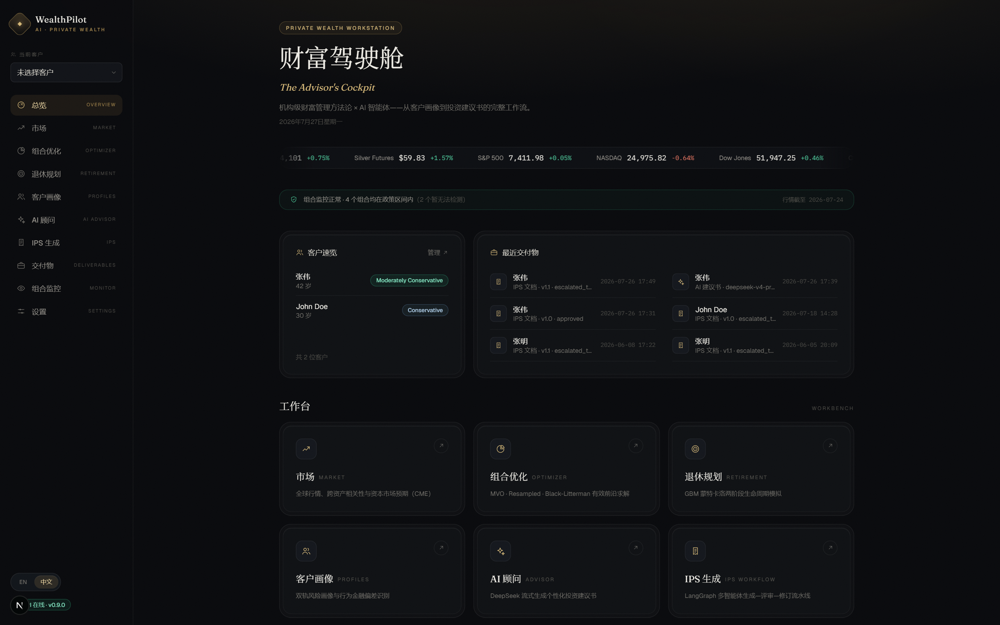
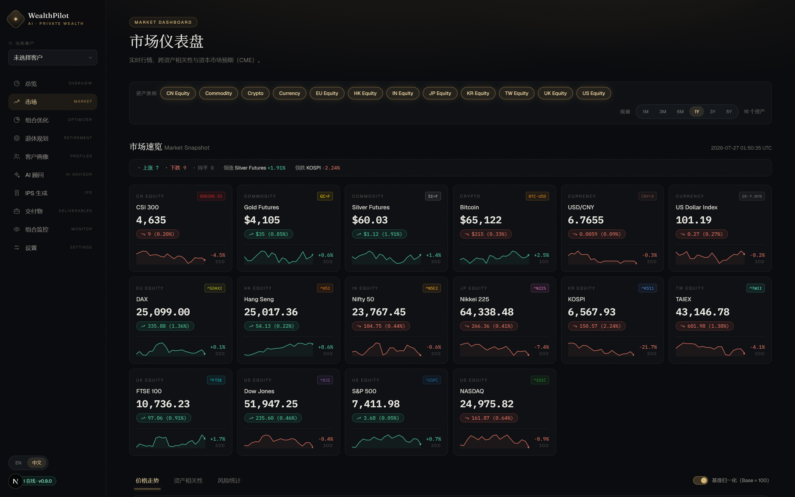
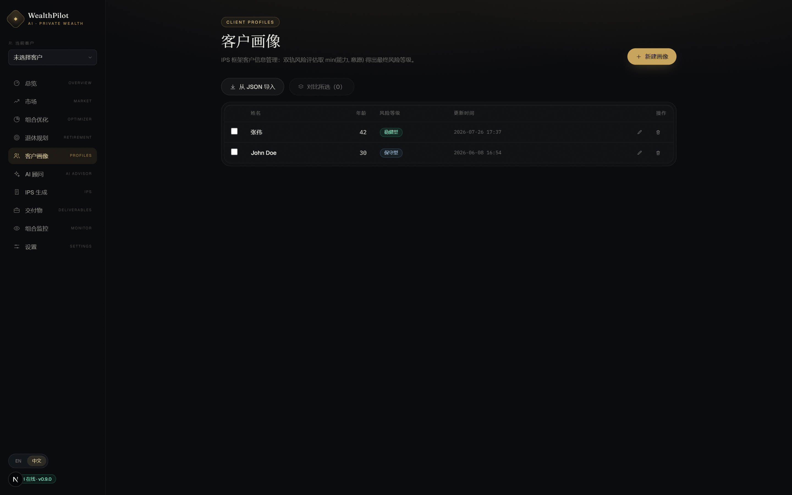
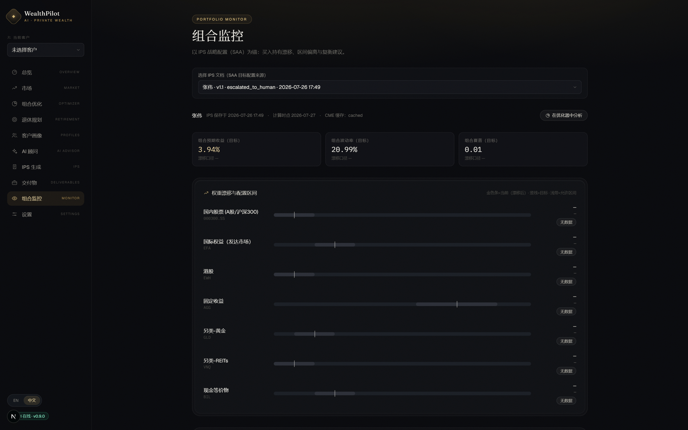
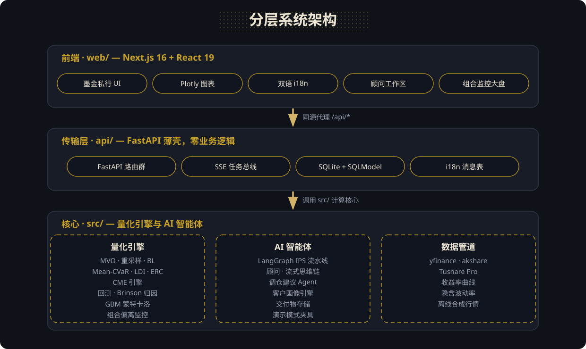
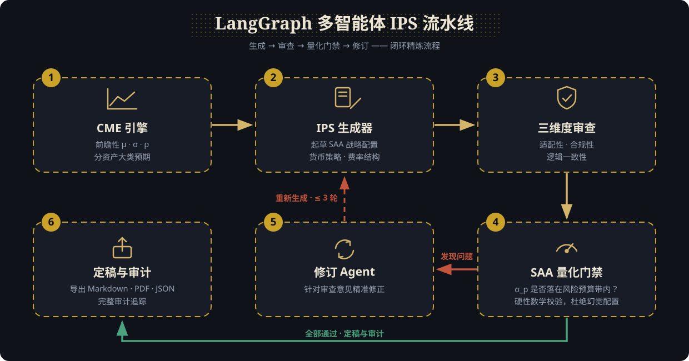

<div align="center">
  

  # AI WealthPilot

  ### 智能私人财富管理顾问工作站 · 全栈量化组合引擎与多智能体 AI 协同平台

[](https://www.python.org/)
[](https://fastapi.tiangolo.com/)
[](https://nextjs.org/)
[](https://react.dev/)
[](https://github.com/langchain-ai/langgraph)
[](https://tailwindcss.com/)
[](https://www.docker.com/)
[](LICENSE)
[](https://github.com/Michelia-L/AI-WealthPilot/actions/workflows/ci.yml)
[](https://michelia-l.github.io/AI-WealthPilot/)
[]()

<p align="center">
  <a href="README.md">English</a> | <b>简体中文</b>
</p>

<p align="center">
  <b>AI WealthPilot</b> 是一套面向现代私人财富管理（Private Wealth Management, PWM）的开源工作站。<br/>
  融合<b>六大量化资产配置算法</b>、<b>前瞻性资本市场预期（CME）引擎</b>、<b>LangGraph 驱动的多智能体 IPS 生成流水线</b>与 <b>DeepSeek 实时流式思考顾问</b>，搭配「墨金私行」暗黑金融视觉交互，覆盖「客户画像 360° → 预期制定 → 组合优化 → IPS 审计落地 → 投后监控再平衡 → 退休养老规划」的完整工作流程。
</p>

⭐ 如果这个项目对你有帮助，欢迎在 GitHub 上点个 Star！

[✨ 功能特性](#-核心功能亮点) • [📐 架构设计](#-系统架构) • [🤖 多智能体工作流](#-多智能体-ips-流水线) • [🧮 数学与金融模型](#-量化与金融工程模型) • [🚀 快速开始](#-快速开始) • [📖 API 文档](#-api-端点概览) • [🧪 测试与质量](#-质量保障与测试体系) • [📚 Internals 文档](https://michelia-l.github.io/AI-WealthPilot/)

</div>

---

## 📸 界面预览

<div align="center">
  <table>
    <tr>
      <td width="50%">
        <p align="center"><b>资产概览与监控总览 (Overview Hub)</b></p>
        
      </td>
      <td width="50%">
        <p align="center"><b>全球市场行情工作站 (Market Station)</b></p>
        
      </td>
    </tr>
    <tr>
      <td width="50%">
        <p align="center"><b>交付物中心与报告管理 (Deliverables Hub)</b></p>
        
      </td>
      <td width="50%">
        <p align="center"><b>组合偏离度监控与再平衡 (Fleet Monitoring)</b></p>
        
      </td>
    </tr>
  </table>
</div>

---

## ✨ 核心功能亮点

### 1. 🧮 量化投资组合优化引擎 (`src/portfolio/`)
* **均值-方差优化 (Markowitz MVO)**：基于 SciPy SLSQP 求解器，支持最大化夏普比率、最小化波动率、给定目标收益最优化、有效前沿完整扫描及资产大类级别的权重上下限约束。
* **Michaud 重采样有效前沿 (Resampled MVO)**：通过蒙特卡洛重抽样消除参数不确定性，平滑传统 MVO 在小样本下的权重跳变，极大提升样本外稳健性。
* **Black-Litterman 贝叶斯配置模型**：将市场隐含均衡收益作为中性先验（支持联动 CME 前瞻预期），融合投资人绝对观点与相对跨资产观点（含置信度矩阵 $\Omega$ 标定），输出后验收益分布。
* **基于 LP 的条件风险价值模型 (Mean-CVaR)**：基于 Rockafellar-Uryasev 场景线性规划，采用 SciPy HiGHS LP 求解器精准把控厚尾尾部下行风险。
* **负债驱动投资盈余优化 (Sharpe-Tint LDI)**：针对私人养老金及未来确定性支出，以资产-负债盈余方差最小化与盈余夏普最大化为目标，负债现金流按中债国债收益率曲线分期限折现并久期匹配对冲。
* **风险平价 (Equal Risk Contribution / ERC)**：采用 Spinu 凸表述算法快速求解等风险贡献权重，摆脱对收益率预测的高敏感依赖。
* **稳健协方差估计**：支持样本协方差、Ledoit-Wolf 收缩估计与 Oracle Approximating Shrinkage (OAS)，并内置条件数检查、自动对角加载与特征值截断。

### 2. 🔮 前瞻性资本市场预期 (CME) 引擎 (`src/portfolio/cme_engine.py`)
* **跨资产大类代理覆盖**：覆盖国内权益 (沪深300)、发达市场股票 (EFA)、港股 (EWH)、核心固收 (AGG)、黄金 (GLD)、REITs (VNQ) 与现金等价物 (BIL)。
* **隐含波动率贝叶斯混合**：融合历史实现波动率与前瞻性期权隐含波动率（VIX / MOVE），通过权重 $\tau$ 平滑突发宏观波动，对缺乏可靠 IV 代理的资产自动降级。
* **积木法 (Building-Blocks) 预期收益模型**：拆解「当前股息率/当期收益率 + 长期名义 GDP / 盈利增长预期」，结合权重 $\omega$（默认 0.5）与历史均值加权。
* **本币无风险利率级联**：人民币取 akshare 中债 1 年期国债收益率；美元按 FRED（DGS3MO）→ yfinance（`^IRX`）→ 静态兜底逐级降级；CME 各资产收益统一折算人民币口径。
* **三级缓存架构**：90 天持久化磁盘缓存 → 过期尝试后台刷新 → 静态兜底数据保障，全链路零不可用风险。
* **多源行情路由主干**：映射的 A 股/中国标的按 Tushare Pro → akshare → yfinance 顺序取数（首个成功生效），美股与全球资产走 yfinance；内置陈旧数据守卫，拒绝静默过期的行情快照。

### 3. 🤖 LangGraph 多智能体 IPS 流水线 (`src/agents/`)
* **多角色状态图编排**：由 **CME 注入节点** → **IPS 规划生成 Agent** → **三维度独立审查 Agents**（适配性 Suitability、合规性 Compliance、逻辑一致性 Consistency）→ **SAA 量化硬校验门禁 (Validate SAA)** → **修订 Agent (Reviser，至多 3 轮反馈迭代)** → **终审出件/人工升级** 构成闭环状态机。
* **SAA 严格量化门禁**：在进入人工审核前，由量化引擎直接核算生成组合的理论预期收益与组合方差，对照客户风险预算区间 $[\sigma_{\min}, \sigma_{\max}]$ 实施硬性越界拦截与自动返工，杜绝 LLM 幻觉配置。
* **全生命周期审计追踪 (Audit Trail)**：记录每轮生成 SHA-256 版本哈希、修改记录、评审专家扣分项与详细 Token 消耗审计（`LLM_TASK_TOKEN_BUDGET=250k` 硬上限）。
* **完备交付物输出**：支持结构化 JSON、专业排版 Markdown 以及中英双语版高保真 CJK 矢量 PDF 导出。

### 4. 💡 AI 私人财富顾问工作站 (`src/agents/advisor.py`)
* **DeepSeek V4 Pro 驱动**：对接大语言模型，并原生兼容任何 OpenAI 兼容规范接口（DeepSeek、Qwen、OpenAI、本地 vLLM/Ollama），可在系统设置页动态切换模型与端点。
* **实时流式思维链展示 (FR-001)**：独创 `reasoning_content` 推理流式分离技术，实时折叠/展开呈现 AI 顾问在资产配置时的底层分析逻辑。
* **PWM 标准 6 大模块顾问报告**：客户画像概括 → 目标可行性度量 → 风险承受意愿/能力双轨判定 → 建议资产配置方案 → 落地实施与税优路径 → 审慎合规风险揭示。
* **双轨风险评估框架**：并行评估客观财务风险承受能力 (Ability) 与主观心理风险承受意愿 (Willingness)，默认取两者较低分以保护客户。
* **行为金融学偏差识别**：自动识别损失厌恶、过度自信、能力-意愿错配、杠杆风险与安全垫不足等典型行为偏差。
* **防 Prompt 注入安全边界**：严格 XML 语义数据隔离，确保客户备注等不可信输入无法越权篡改顾问决策。

### 5. 📊 组合监控、偏离度诊断与智能调仓 (`src/portfolio/monitoring.py`)
* **全局资产监控大盘 (Fleet Monitoring)**：多客户组合状态一览，毫秒级检测全量客户资产当前是否突破 IPS 设定的政策浮动容差带（Tolerance Bands）。
* **智能现金补齐与权重归一化 (Cash Plug / Rescaling)**：自动处理资产缺失与非满仓现金流补齐。
* **AI 驱动的再平衡建议 (Rebalance Advisor)**：自动计算最优调仓交易清单，结合税收损耗收割（Tax-Loss Harvesting）生成可操作的人性化指令解析。

### 6. 🏖️ 退休与全生命周期财富规划 (`src/portfolio/simulator.py`)
* **两阶段现金流仿真 (Accumulation → Distribution)**：全面刻画工作期储蓄积累与退休期资产提领过程。
* **个性化通胀假设体系**：内置标准 CPI 基准、老龄人口专属医疗倾斜（+0.75% CPI-E 增量）及超高净值专属奢华生活篮子（+2.4% CLEWI 增量）。
* **几何布朗运动 (GBM) 万次蒙特卡洛模拟**：万条独立路径推演，经 Jensen 不等式波动率拖累修正，计算终值分布分位数（P5, P50, P95）及破产概率（Ruin Probability / Survival Rate）。
* **Guyton-Klinger 动态提领护栏**：当期提领率突破初始提领率上下带宽时自动削减或上调支出，并以刚性提领存活率作为同路径基准对照。

### 7. 📈 历史回测与 Brinson 绩效归因 (`src/portfolio/backtest.py`)
* **历史多周期滚动再平衡**：支持 1Y / 3Y / 5Y / 10Y 自定义区间与全口径管理费率拖曳模拟（Net-of-Fee 净值，费前曲线以幽灵线对照）。
* **极端历史黑天鹅压力测试**：预置 2020 新冠流动性危机、2022 全球激进加息冲击、2008 全球金融危机压力测试窗口。
* **Brinson-Fachler 经典多期归因**：精确拆解**资产配置超额 (Allocation Effect)**、**个券/标的选择超额 (Selection Effect)** 与**交互效应 (Interaction Effect)**，并使用 Carino 因子实现时间跨度的几何严格级联。
* **下行风险度量**：Sortino 比率、日度 VaR 与 CVaR（预期损失）历史模拟。
* **多客户画像对比**：支持不同客户组合与画像的并排对比，自动生成结构化对比报告。

### 8. 💎 「墨金私行」设计系统 (`web/`)
* **Next.js 16 + React 19 + Tailwind CSS v4**：基于现代前端架构，采用 OLED 墨黑底色与香槟金配色的私行业务视觉（Ink & Gold）。
* **Plotly.js 动态交互图表**：呈现有效前沿曲线、蒙特卡洛置信区间扇形图、资产相关性热力图与回测净值/水下回撤图。
* **全站中英双语国际化 (i18n)**：全量 UI 词典编译期类型约束（`wp_locale` cookie），后端计算文案、API 消息与 LLM 交付物均随语言切换。
* **全脱网离线演示模式 (DEMO_MODE=1)**：提供确定性合成资产行情与预置金融专家报告，零 API Key 零网络即可体验全功能。

---

## 📐 系统架构

AI WealthPilot 采用分层解耦的现代化全栈架构设计：

<div align="center">
  
</div>

### 架构分工守则
* **`src/` 是纯粹计算核心**：所有量化数学、金融公式、AI Prompt 与 LangGraph 编排均收敛在此，禁止依赖上层 Web 或 API 传输协议。
* **`api/` 是轻量传输外壳**：只负责参数校验、任务队列调度与 HTTP/SSE 组装，严禁内嵌业务与金融计算逻辑。
* **`web/` 是同源安全客户端**：服务端组件直连后端，浏览器端请求强制经同源 `/api/*` 代理，安全封装 API Key 与请求头。

---

## 🤖 多智能体 IPS 流水线

投资政策声明（IPS）的生成采用 LangGraph 状态图与 PydanticAI 构建的多智能体流水线，通过量化硬门禁与多角度审查确保合规与数理严谨：

<div align="center">
  
</div>

### 审查与门禁要点
1. **适配性审查 (Suitability)**：客户投资目标、期限、流动性需求与风险承受力是否相称。
2. **合规性审查 (Compliance)**：各资产类型准入、杠杆限制、衍生品策略与跨境投资额度是否符合监管法规。
3. **逻辑一致性审查 (Consistency)**：名义收益要求与扣除通胀后的实际收益是否存在逻辑矛盾。
4. **量化 SAA 硬门禁 (Validate SAA)**：计算 SAA 组合加权收益与协方差波动率，严格核对是否落在客户风险等级的允许波动带 $[ \sigma_{\min}, \sigma_{\max} ]$ 之内，杜绝 LLM 幻觉配置。

---

## 🧮 量化与金融工程模型

AI WealthPilot 严格遵循学术与业界成熟金融工程规范，内置核心数学模型推导与实现：

### 1. Markowitz 均值-方差优化 (MVO)
求解凸二次规划问题：

$$\min_{w} \quad \frac{1}{2} w^T \Sigma w - \lambda w^T \mu \quad \text{s.t.} \quad \sum_{i=1}^n w_i = 1, \quad w_i \ge 0$$

在最大夏普比率模式下，优化目标为：

$$\max_{w} \quad \frac{w^T \mu - R_f}{\sqrt{w^T \Sigma w}}$$

支持资产大类级别的组约束：

$$\min_{c} \le \sum_{i \in \mathcal{C}_c} w_i \le \max_{c}$$

*注：MVO 阶段使用标准**算术收益率**，因为组合预期收益在截面上可加*（ $R_p = w^T \mu$ ）。

### 2. Black-Litterman 贝叶斯后验模型
市场隐含均衡收益向量：

$$\Pi = \delta \Sigma w_{\text{mkt}}$$

融合主观观点矩阵 $P$ 与观点收益向量 $Q$ 后的贝叶斯后验收益期望 $\mu_{BL}$：

$$\mu_{BL} = \left[ (\tau \Sigma)^{-1} + P^T \Omega^{-1} P \right]^{-1} \left[ (\tau \Sigma)^{-1} \Pi + P^T \Omega^{-1} Q \right]$$

其中观点不确定性协方差矩阵采用 He & Litterman 比例标定法：

$$\Omega = \text{diag}\left( P (\tau \Sigma) P^T \right) \cdot \frac{1 - c}{c}$$

### 3. Rockafellar-Uryasev Mean-CVaR 线性规划
在置信水平 $\alpha$（如 95%）下，将条件风险价值最小化转化为离散场景 $S$ 的大规模线性规划（LP）：

$$\min_{w, \gamma, z} \quad \gamma + \frac{1}{S(1-\alpha)} \sum_{s=1}^S z_s$$

$$\text{s.t.} \quad z_s \ge -w^T r_s - \gamma, \quad z_s \ge 0 \quad (\forall s \in \{1,\dots,S\}), \quad w^T \mathbf{1} = 1, \quad w \ge 0$$

### 4. Sharpe-Tint 负债驱动盈余优化 (LDI)
针对未来负债现金流 $L$，定义资产 $A$ 的盈余 $S = A - L$。盈余方差表示为：

$$\sigma_{\text{surplus}}^2 = w^T \Sigma_A w - 2 w^T \Sigma_{AL} + \sigma_L^2$$

其中负债收益波动率由久期敏感性模型拟合： $r_{L,t} \approx -D_L \cdot \Delta y_t(D_L)$。优化目标为最大化盈余夏普比率：

$$\max_{w} \quad \frac{w^T \mu_A - \mu_L}{\sigma_{\text{surplus}}(w)}$$

### 5. Spinu 等风险贡献 (Risk Parity ERC)
资产 $i$ 对组合总波动率的边际风险贡献为 $RC_i = w_i \frac{(\Sigma w)_i}{\sqrt{w^T \Sigma w}}$。通过求解凸对偶目标函数：

$$\min_{x} \quad \frac{1}{2} x^T \Sigma x - \sum_{i=1}^n \ln(x_i) \quad \implies \quad w_i = \frac{x_i}{\sum_{j} x_j}$$

### 6. 协方差收缩与正则化
为应对估计误差与噪声，协方差矩阵 $\Sigma$ 可采用收缩估计或在病态时正则化：
* **Ledoit-Wolf 与 OAS 收缩**：将样本协方差 $S$ 与结构化目标矩阵 $F$（常相关模型）组合：
  $$\Sigma_{\text{shrunk}} = (1 - \rho) S + \rho F$$
  其中 $\rho \in (0, 1)$ 为解析求解的最优收缩强度。
* **对角加载**：当 $\text{cond}(\Sigma) > 10^{10}$ 时矩阵接近奇异，按 $\Sigma_{\text{reg}} = \Sigma + \epsilon I$ 正则化（ $\epsilon = 10^{-6}$ ）。
* **特征值截断**：截断过小或为负的特征值以保持正定性： $\Sigma_{\text{reg}} = V \max(\Lambda, \epsilon) V^T$。

### 7. 几何布朗运动 (GBM) 与波动率拖累
长周期财富路径采用离散时间 GBM 模拟，并施加 Jensen 不等式修正：

$$S_{t+\Delta t} = S_t \exp \left( \left(\mu - \frac{1}{2}\sigma^2\right)\Delta t + \sigma \sqrt{\Delta t} Z_t \right)$$

- **积累期 (Accumulation)**：

  $$V_{t+1} = V_t \exp \left( \left(\mu_{\text{acc}} - \frac{1}{2}\sigma_{\text{acc}}^2\right) + \sigma_{\text{acc}} Z_t \right) + \text{年度储蓄}$$

- **提取期 (Distribution / 退休)**：

  $$V_{t+1} = V_t \exp \left( \left(\mu_{\text{dist}} - \frac{1}{2}\sigma_{\text{dist}}^2\right) + \sigma_{\text{dist}} Z_t \right) - \text{名义提取额}_t$$

  其中名义提取额按通胀递增以保持购买力：

  $$\text{期望实际收入} \times (1 + \gamma)^{T_{\text{accum}} + t} = \text{名义提取额}_t$$

*注：多期仿真必须采用对数正态建模，因为收益率在时间上可加；* $-\frac{1}{2}\sigma^2$ 漂移修正可避免对长期复利财富的系统性高估。

### 8. 下行风险与尾部风险度量
- **下行偏差 (Downside Deviation)**：仅惩罚跌破零或无风险利率的收益：
  $$\sigma_{\text{downside}} = \sqrt{\frac{252}{T} \sum_{t=1}^T \left(\min(R_{p,t}, 0)\right)^2}$$
- **Sortino 比率**： $\text{Sortino} = \dfrac{R_p - R_f}{\sigma_{\text{downside}}}$
- **VaR 与 CVaR（预期损失）**：在 $\alpha = 95\%$ 置信水平下经历史模拟计算，刻画非正态分布的偏度与峰度。

### 9. Brinson-Fachler 绩效归因与 Carino 级联
单期超额收益分解为配置效应 $A_g$、选券效应 $S_g$ 与交互效应 $I_g$：

$$A_g = (w_{p,g} - w_{b,g}) \cdot (R_{b,g} - R_b)$$

$$S_g = w_{b,g} \cdot (R_{p,g} - R_{b,g}), \quad I_g = (w_{p,g} - w_{b,g}) \cdot (R_{p,g} - R_{b,g})$$

多期几何级联采用 Carino 修正因子：

$$k_m = \frac{\ln(1+R_{p,m}) - \ln(1+R_{b,m})}{R_{p,m} - R_{b,m}}, \quad K = \frac{R_p - R_b}{\ln(1+R_p) - \ln(1+R_b)}$$

$$E_{\text{total}} = K \sum_{m} \left( k_m \cdot E_m \right)$$

---

## 📁 目录结构导览

```text
AI-WealthPilot/
├── src/                          # 核心业务与量化工程库
│   ├── config.py                 # 核心资产、超参数与配置
│   ├── agents/                   # AI 智能体与工作流
│   │   ├── advisor.py            # AI 顾问主生成器 (DeepSeek 流式思维链)
│   │   ├── profiler.py           # 客户 360° 画像引擎与风险评测矩阵
│   │   ├── portfolio_recommender.py # 个性化资产配置 Agent
│   │   ├── rebalance_advisor.py  # 智能调仓解析 Agent
│   │   ├── llm_config.py         # LLM 端点解析（DB 配置覆盖环境变量）
│   │   ├── demo_mode.py          # DEMO_MODE 演示模式夹具回放
│   │   ├── demo_fixtures/        # 离线演示模式静态黄金夹具
│   │   ├── report_storage.py     # 多格式报告序列化与存储
│   │   ├── ips_models.py         # IPS 结构化 Pydantic 数据契约
│   │   ├── ips_agents.py         # PydanticAI 提示词工程与审阅专家定义
│   │   ├── ips_workflow.py       # LangGraph IPS 编排流水线与状态机
│   │   └── ips_storage.py        # IPS 与审计追踪持久化
│   ├── portfolio/                # 量化组合数学引擎
│   │   ├── optimizer.py          # MVO / 重采样 / LDI 求解器 / Dirichlet 权重模拟
│   │   ├── optimize_service.py   # 优化方法调度层 (MVO/BL/CVaR/LDI/ERC)
│   │   ├── views.py              # Black-Litterman 观点编码 (P/Q/Omega)
│   │   ├── cme_engine.py         # 资本市场预期 (CME) 引擎
│   │   ├── forward_returns.py    # 积木法前瞻收益 (ω 加权混合)
│   │   ├── cme_models.py         # CME Pydantic 数据模型
│   │   ├── cme_cache.py          # CME 缓存管理与本地持久化
│   │   ├── backtest.py           # 历史滚动回测与极端压力测试
│   │   ├── attribution.py        # Brinson-Fachler 绩效归因 (Carino 连接)
│   │   ├── liabilities.py        # LDI 负债现金流建模
│   │   ├── inflation.py          # 个性化通胀预设 (CPI-E / CLEWI)
│   │   ├── simulator.py          # 几何布朗运动 (GBM) 蒙特卡洛模拟
│   │   ├── risk_metrics.py       # Sharpe / Sortino / VaR / CVaR 计算器
│   │   ├── risk_constraints.py   # 风险等级 → 大类权重上限映射
│   │   └── monitoring.py         # 组合偏离度监控与再平衡交易触发
│   ├── data/                     # 行情与宏观数据管道
│   │   ├── market_data.py        # 多源路由取数与汇率换算
│   │   ├── tushare_provider.py   # Tushare Pro A股主干源
│   │   ├── akshare_provider.py   # AkShare 中债收益率与指数源
│   │   ├── yield_curve.py        # 中债收益率曲线级联
│   │   ├── implied_volatility.py # VIX / MOVE 隐含波动率获取
│   │   └── demo_market.py        # 离线确定性 GBM 合成行情层
│   └── visualization/            # Plotly JSON 图表构建器
├── api/                          # FastAPI Web 服务壳
│   ├── main.py                   # 应用入口、中间件与路由挂载
│   ├── schemas.py                # 全局 API Pydantic 数据模式
│   ├── tasks.py                  # SSE 异步事件任务调度与断点续播
│   ├── db.py                     # SQLite / SQLModel 数据库
│   ├── i18n.py                   # 双语翻译字典与错误消息池
│   └── routers/                  # 业务路由群 (market, portfolio, ips...)
├── web/                          # Next.js 16 前端工程
│   ├── src/app/                  # App Router 页面 (市场/优化器/IPS/顾问...)
│   ├── src/components/           # 墨金私行 UI 组件与 Plotly 图表包装
│   ├── src/lib/                  # 客户端代理 (proxy.ts)、i18n 词典等
│   └── e2e/                      # Playwright 全栈端到端测试套件
├── examples/                     # 离线演示与示例脚本
├── docs/                         # 项目文档、架构规范与截图资源
├── docker-compose.yml            # Docker 本地一键编排配置
└── pyproject.toml                # Python 项目元数据与 Ruff 配置
```

---

## 🚀 快速开始

### 方式一：Docker Compose 一键部署（推荐）

确保本地已安装 Docker 与 Docker Compose：

```bash
# 1. 克隆仓库
git clone https://github.com/Michelia-L/AI-WealthPilot.git
cd AI-WealthPilot

# 2. 配置环境变量（可选，未配置可直接体验离线 Demo 模式）
cp .env.example .env

# 3. 构建并启动容器
docker compose up --build
```
启动成功后访问：
* **前端工作站**：`http://localhost:3000`
* **后端 API 文档**：`http://localhost:8000/docs`

### 方式二：本地源码运行开发环境

#### 前置环境要求
* **Python**：`>= 3.12`
* **Node.js**：`>= 22.0.0`
* **包管理器**：`npm` 或 `pnpm`

#### 1. 后端服务启动
```bash
# 1. 创建并激活 Python 虚拟环境
python3 -m venv .venv
source .venv/bin/activate  # Windows: .venv\Scripts\activate
pip install -r requirements.txt -r requirements-dev.txt

# 2. 配置环境变量
cp .env.example .env
# 编辑 .env 文件填入 DEEPSEEK_API_KEY（如需完整在线体验）
# 可选：FRED_API_KEY（无风险利率首选源）、
#       TUSHARE_TOKEN（A 股指数与中债收益率曲线付费主干源）

# 3. 启动 FastAPI 后端服务
python -m uvicorn api.main:app --reload --port 8000
```

#### 2. 前端服务启动
```bash
# 1. 进入 web 目录并安装依赖
cd web
npm install

# 2. 启动 Next.js 开发服务器
npm run dev
```
打开浏览器访问 `http://localhost:3000` 即可开始使用。

> [!TIP]
> 启动后可在应用内 **设置页** 配置任意 OpenAI 兼容端点（DeepSeek、Qwen、OpenAI、本地 vLLM/Ollama……），立即生效并覆盖环境变量默认值。密钥仅保存在本地 SQLite（`data/wealthpilot.db`），不会离开你的机器。

### 💡 极速体验模式 (DEMO_MODE=1)

无需申请任何 API Key，也无需外部网络连接，即可完整体验全套系统功能：

```bash
# 在 .env 文件中设置：
DEMO_MODE=1
```

在演示模式下：
1. 行情层自动切换为 `src/data/demo_market.py` 生成的**确定性真实 GBM 资产价格序列**。
2. 优化器、相关性矩阵、回测引擎与历史压力测试完全离线可算。
3. AI 顾问报告、LangGraph 多智能体 IPS 流水线与调仓建议将**无损回放高质量中/英文离线金标准专家数据**，首次启动还会自动种子一个虚构示例客户。

---

## 🎬 运行演示脚本

`examples/` 目录下的独立脚本可离线运行量化引擎并展示核心功能：

```bash
# 快速演示（MVO、Black-Litterman、蒙特卡洛）
python examples/demo_quick.py

# 高级优化特性演示（OAS、重采样 MVO）
python examples/demo_advanced_optimization.py

# 完整演示（浏览器中打开交互式 Plotly 图表）
python examples/demo_comprehensive.py

# 多智能体 LangGraph 工作流终端演示（生成-审查-修订流水线）
python examples/demo_ips_generator.py
```

---

## 📖 API 端点概览

FastAPI 后端提供详尽的 OpenAPI 契约（访问 `/docs` 可查看交互式 Swagger 文档）：

| 域分类 | 路径 | 方法 | 描述 |
| :--- | :--- | :--- | :--- |
| **Market** | `/api/market/quotes` | `GET` | 获取全球资产实时行情与走势火花线 |
| | `/api/market/analytics` | `GET` | 获取区间资产统计、走势图与相关性矩阵 |
| | `/api/market/yield-curve` | `GET` | 获取中美最新无风险国债收益率曲线 |
| **CME** | `/api/cme/report` | `GET` | 计算/获取资本市场预期 (CME) 报告及各资产收益波动假设 |
| **Profiles** | `/api/profiles` | `GET/POST` | 客户 360° 画像列表与新增 |
| | `/api/profiles/{id}` | `GET/PUT/DELETE` | 客户画像详情查看、编辑与删除 |
| | `/api/profiles/questionnaire`| `GET` | 获取中/英风险能力与意愿测评问卷结构 |
| **Portfolio** | `/api/portfolio/optimize` | `POST` | 执行 MVO/BL/CVaR/LDI/ERC 组合优化，产出有效前沿 |
| | `/api/portfolio/backtest` | `POST` | 运行历史月度滚动再平衡回测与 Brinson 归因 |
| | `/api/portfolio/simulate` | `POST` | 运行万次几何布朗运动蒙特卡洛模拟 |
| **IPS** | `/api/ips/generate` | `POST` | 触发 LangGraph 多智能体 IPS 生成流水线 (202 异步任务) |
| | `/api/ips/tasks/{id}/events` | `GET` | SSE 实时接收 IPS 节点流转事件、审计追踪与断点续传 |
| | `/api/ips/{id}/export/{fmt}` | `GET` | 导出 IPS 交付物（支持 Markdown, PDF, JSON） |
| **Advisor** | `/api/advisor/report` | `POST` | 触发 AI 顾问报告流式生成 (SSE 包含思维链与正文) |
| | `/api/advisor/rebalance` | `POST` | 触发组合偏离度分析与智能再平衡建议生成 |
| **Monitoring**| `/api/monitoring/fleet` | `GET` | 获取所有客户组合偏离度大盘预警状态 |
| | `/api/monitoring/inspect/{id}`| `GET` | 深度分析单个客户组合偏离度、再平衡交易清单 |
| **Settings** | `/api/settings/llm` | `GET/PUT` | 查看/更新自定义 OpenAI 兼容模型端点与 API Key |

---

## 🧪 质量保障与测试体系

本项目在 CI 中执行严格质量门禁，测试覆盖率不低于 **87%**：

```bash
# 1. 运行全量 Python 后端测试套件
pytest -q

# 2. Python 代码风格与静态检查门禁
ruff check && ruff format --check

# 3. 前端组件与逻辑单测 (Vitest)
cd web && npm test

# 4. 前端 TypeScript 全量类型检查
cd web && npm run typecheck

# 5. 前端 Lint 与 Next.js 生产打包构建
cd web && npm run lint && npm run build

# 6. Playwright 全栈真实 E2E 测试
cd web && npm run test:e2e
```

> [!NOTE]
> e2e 套件以裸 `python` 命令拉起后端（见 `web/playwright.config.ts`），因此 `python` 必须在 `PATH` 上——macOS/Linux/WSL 下请先激活仓库虚拟环境（`source .venv/bin/activate`）。该套件会在独立端口自动拉起 Demo 模式后端与生产构建前端，并使用隔离的临时 SQLite，无需网络与 API Key。

---

## 🛡️ 安全、合规与免责声明

1. **金融免责声明 (Financial Disclaimer)**：本项目所包含的算法模型、预期数据、AI 生成报告及投资组合建议仅供学术研究、技术验证与量化辅助参考，**不构成任何受监管的投资建议、财务建议或收益承诺**。金融市场存在极端风险，量化模型存在结构性漂移与系统性尾部事件风险。在实际投资前，请咨询具备正规执业资质的持牌金融顾问。
2. **数据与隐私保护 (Privacy & Local-First)**：系统采用 Local-First 设计原则，客户画像及投资记录默认仅存储于本地 SQLite 数据库中，不会上传至任何外部云端。
3. **模型输入防注入防护**：AI 顾问与 IPS 生成器均严格采用 XML 数据围栏封装用户输入，抵御潜在的 Prompt Injection 越权攻击。

---

## 📄 开源协议

本项目基于 **[MIT License](LICENSE)** 协议开源。欢迎提交 Issue、PR 或共同完善金融工程算法！

<div align="center">
  <sub>Built with precision for modern wealth management.</sub>
</div>
