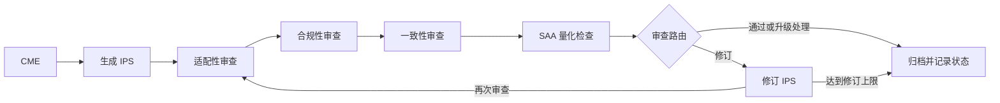

<div align="center">
  
</div>

# AI WealthPilot

**用于研究与决策支持的开源私人财富管理工作站。**

AI WealthPilot 将客户目标、组合计算、AI 辅助投资政策声明书（IPS）与后续配置复核放在同一个应用中。你可以比较收益假设与客户约束如何影响组合，查看配置政策的生成与审查过程，并分析不同退休情景。

Python 提供量化计算，LangGraph 编排 IPS 生成与审查，Next.js 界面展示图表、报告并支持中英文切换。输出用于研究、学习和技术验证，不构成投资建议，也不执行交易。

[](https://github.com/Michelia-L/AI-WealthPilot/actions/workflows/ci.yml)
[](https://michelia-l.github.io/AI-WealthPilot/)
[](LICENSE)

[English](README.md) | **简体中文**

[快速开始](#快速开始) · [业务流程](#财富管理工作流) · [操作案例](#走通一个虚构客户案例) · [模型边界](#模型假设与限制) · [本地开发](#本地开发与测试)

## 界面预览

<table>
  <tr>
    <td width="50%"><b>客户与组合概览</b><br /></td>
    <td width="50%"><b>市场分析</b><br /></td>
  </tr>
  <tr>
    <td width="50%"><b>客户画像</b><br /></td>
    <td width="50%"><b>组合监控</b><br /></td>
  </tr>
</table>

## 快速开始

### 用 Docker Compose 启动演示

需要安装 Docker 及 Compose 插件。以下命令适用于新克隆的仓库：

```bash
git clone https://github.com/Michelia-L/AI-WealthPilot.git
cd AI-WealthPilot
test -f .env || cp .env.example .env
```

在 `.env` 中取消 `DEMO_MODE=1` 的注释，然后启动应用：

```bash
docker compose up --build
```

打开[工作站](http://localhost:3000)或[交互式 API 文档](http://localhost:8000/docs)。Compose 将两个服务绑定到本机地址，应用数据保存在宿主机的 `data/` 目录中。已有仓库请编辑现有 `.env`，不要覆盖配置。

演示模式无需 LLM 密钥。如果客户表为空，启动时会添加虚构客户**林晓兰**。侧栏可切换中英文界面。

| 模式 | 行情输入 | AI 输出 |
| --- | --- | --- |
| 演示（`DEMO_MODE=1`） | 合成历史价格与报价，演示用无风险利率 | 顾问报告、IPS 与调仓建议回放中英文夹具，并替换部分所选客户字段 |
| 真实调用（`DEMO_MODE=0` 或未设置） | 数据源行情，含缓存与降级处理 | 请求发送至配置的 LLM 端点 |

**演示模式的边界。** 报告与 IPS 审查事件来自夹具回放，并非即时 LLM 评估。合成价格在相同 ticker 和日期锚点下保持一致，日期滚动后会变化。部分辅助输入，包括 CME 前视收益所需收益率、基金 AUM 和 LDI 收益率曲线，仍可能尝试请求外部数据源。演示模式不等于网络隔离，镜像构建与依赖安装也需要下载。

### 使用真实行情与 LLM

关闭演示模式并重启后端，Compose 部署可运行 `docker compose up -d --force-recreate api`。在**设置**页（`/settings`）配置 OpenAI 兼容服务的 base URL、模型和 API Key。保存的非空字段优先于环境变量默认值。也可以在后端启动前，在 `.env` 中设置 `DEEPSEEK_API_KEY`。

量化功能可在没有 LLM 密钥时运行；未配置密钥时，真实 AI 端点返回 HTTP 503。请将 `.env` 中的占位密钥替换为真实密钥，仅使用量化功能时则留空。可选的 `FRED_API_KEY` 和 `TUSHARE_TOKEN` 用于接入额外数据源。配置项见 [.env.example](.env.example)，路由与降级方式见[数据管道说明](guide/internals/03-data-pipeline-cme.md)。

客户记录默认本地存储。**真实 AI 请求会把任务所需的客户画像与报告上下文发送至你配置的模型服务商**，密钥用于请求认证。详见[数据与部署边界](#数据与部署边界)。

## 财富管理工作流

从客户目标与约束出发，选择当前决策需要的分析。各工作区之间有数据联系，也可以独立使用。

| 工作区 | 输入 | 处理方式 | 输出 |
| --- | --- | --- | --- |
| 客户画像（`/profiles`） | 资产、收入、负债、目标与问卷答案 | 分别计算风险承担能力与意愿，取较低分确定总体风险承受水平 | 客户画像、风险评估与目标背景 |
| 市场与 CME（`/market`、`/api/cme/report`） | 代理行情、收益率、增长与通胀假设 | 历史估计结合 building-blocks 收益假设及可用隐含波动率 | 资本市场预期（CME）、相关性及数据源/缓存信息 |
| 组合构建（`/optimizer`） | 资产范围、收益口径及方法所需观点或约束 | 六种组合优化方法 | 候选权重、收益风险指标及方法对应的比较结果 |
| 顾问与 IPS（`/advisor`、`/ips`） | 客户画像；IPS 另使用 CME 与参考文档 | LLM 顾问报告，或带审查与量化检查的 IPS 生成 | 报告、IPS 文档、修订历史与导出文件 |
| 组合监控（`/monitoring`） | 已保存 IPS 配置及保存以来的代理价格 | 买入持有权重漂移、政策区间检查、历史回测与归因 | 偏离诊断、建议调仓金额及可选 AI 解释 |
| 退休规划（`/retirement`） | 储蓄、投入、支出、期限及收益波动假设 | 积累/提取两阶段蒙特卡洛模拟，可选支出护栏 | 财富分位数、资金存活率与支出对比 |

### IPS 如何生成

真实 IPS 图按以下顺序执行。当前实现中，三个审查节点**依次运行**。


```mermaid
flowchart LR
    C[CME] --> G[生成 IPS]
    G --> S[适配性审查]
    S --> P[合规性审查]
    P --> K[一致性审查]
    K --> V[SAA 量化检查]
    V --> D{审查路由}
    D -->|修订| R[修订 IPS]
    R -->|再次审查| S
    D -->|通过或升级处理| F[归档并记录状态]
    R -->|达到修订上限| F
```

默认最多修订三轮，记录审查问题与修订元数据。升级处理表示需要人工跟进，并不代表已获人工批准。路由与终止条件见 [`build_ips_workflow`](src/agents/ips_workflow.py)。

IPS 中的战略资产配置（SAA）由 LLM 提出，再用可用 CME 输入检查。此流程**不会自动先运行组合优化器**。优化器对比是单独的分析，退休模拟也可以在 IPS 审查前后运行。

## 走通一个虚构客户案例

演示种子客户为 38 岁，可投资资产 260 万元，年收入 80 万元，年支出 42 万元，负债 90 万元。目标包括 10 年后的 120 万元教育金，以及 22 年后的 400 万元退休储备。输入定义见 [`_demo_profile_data`](api/main.py)。

1. 打开**客户画像**，查看家庭资产负债、目标与风险能力/意愿评分。进入**组合优化器**，比较可用方法与收益假设下的候选配置。
2. 在 **IPS** 中选择种子客户并生成文档。演示模式回放进度事件，归档的样例配置为国内权益 25%、国际权益 20%、固定收益 35%、黄金 10%、现金 10%。这是夹具配置，不是优化器的计算结果。
3. 在**组合监控**中选择已保存 IPS，查看政策区间与历史回测。漂移计算需要保存日期之后的价格观测，新保存的文档可能暂时缺少足够历史。调仓金额是建议，不会提交订单。
4. 在**退休规划**中选择客户预填参数，检查假设后比较固定支出与护栏策略。量化模拟按输入假设计算，结果不必与夹具叙述一致。已保存报告与 IPS 可在**交付中心**（`/deliverables`）查看。

此案例用于展示交互与文档流转，不用于证明投资表现、金融预测校准效果或真实 LLM 质量。样例内容位于 [`src/agents/demo_fixtures/`](src/agents/demo_fixtures/)。

## 量化方法

| 方法 | 计算内容 |
| --- | --- |
| 均值-方差（MVO） | 最大夏普、最小波动组合与有效前沿；所选 MVO 组合支持资产类别组约束 |
| 重采样 MVO | 重复模拟估计与优化，平均权重/前沿，用于探索参数不确定性 |
| Black-Litterman | 将均衡或 CME 先验与绝对/相对观点及置信度输入结合 |
| Mean-CVaR | 通过 Rockafellar–Uryasev 线性规划进行基于场景的尾部损失优化 |
| 负债驱动投资（LDI） | 使用负债现值、久期与资产负债协方差估计进行盈余风险优化 |
| 风险平价（ERC） | 求解各资产风险贡献相等的组合权重 |

优化器默认使用历史样本预期收益。选择 `expected_return_source="cme"` 后，有映射的资产使用 CME 收益；未覆盖资产保留样本均值，Black-Litterman 下则回退均衡收益。协方差仍从历史收益估计。Python 引擎还提供样本、Ledoit-Wolf 和 OAS 协方差估计器，Web/API 暂无对应选择项。

辅助工具包括历史 VaR/CVaR 与 Sortino 指标、可计入年化费用拖累的月度再平衡回测、采用 Carino 级联的 Brinson-Fachler 归因，以及可选 Guyton-Klinger 支出护栏的两阶段 GBM 退休模拟。

独立的[滚动样本外验证引擎](validation/portfolio/README.md)仅使用截至各决策日的数据重新估计配置，并将下一持有期收益与等权、静态配置及逆波动率基准比较。它接收调用方提供的日收益数据，记录权重、失败原因、指标和配置，目前未接入界面。

## 模型假设与限制

| 模块 | 当前边界 |
| --- | --- |
| CME 预期收益 | 使用收益率与配置中的增长假设构建收益，再与历史均值混合；缺失输入会降级。这不是宏观经济预测模型，使用时需查看来源、日期与缓存状态。 |
| 协方差与重采样 | 估计依赖历史窗口及代理资产范围。Ledoit-Wolf/OAS 的收缩目标为缩放单位矩阵。重采样使用正态收益模型，不代表已经证明样本外表现更好。 |
| Black-Litterman | 均衡权重依次取自定义输入、ETF AUM 代理或等权。置信度采用简化标定，结果依赖这些选择。实现中的先验与观点采用总收益口径。 |
| 汇率 | 历史价格可折算至人民币基准币，包含未对冲汇率变动。前视收益的 building-blocks 部分假设预期汇率变动为零，没有独立的前视汇率过程。 |
| CVaR 与 LDI | CVaR 使用可用历史日度场景，无法代表未出现过的冲击。LDI 使用收益率变化的一阶久期敞口，降级时采用久期缩放的债券代理。 |
| 退休模拟 | 年度 GBM 抽样在每个阶段内使用固定收益/波动参数及假设通胀率，未建模市场状态切换或随机波动率。存活率是给定假设下的模拟输出。 |
| 回测与监控 | 回测把给定目标权重应用于历史，并非滚动重新训练策略。监控依据 IPS 权重与代理收益推算漂移，不接入券商实际持仓或真实现金流；不执行订单，也没有税务批次核算。 |
| LLM 与 IPS 校验 | 审查可能出错。量化检查覆盖部分 SAA 属性，不核验全部叙述。波动率检查有 20% 容差，过低为 warning，过高为 critical；缺少 CME 时跳过 SAA 校验。审查通过不代表监管认证。 |

[量化引擎](guide/internals/02-quant-engine.md)、[数据与 CME](guide/internals/03-data-pipeline-cme.md)、[AI 工作流](guide/internals/04-ai-agents.md)章节进一步解释实现取舍与边界。Internals 指南目前以中文编写。

## 架构与目录

```text
浏览器 → Next.js web/
           ├─ 服务端组件 → FastAPI api/
           └─ 浏览器变更 / 流式请求 → 同源代理 → FastAPI api/
                                                     ↓
                                           Python src/ 计算
                                              ├─ 组合模型
                                              ├─ 行情数据源
                                              └─ LLM / IPS 工作流
```

| 路径 | 职责 |
| --- | --- |
| [`src/`](src/) | 组合计算、数据适配、AI 工作流与 Plotly 图表构建 |
| [`api/`](api/) | FastAPI 路由与模型、本地化、SQLite 持久化、后台任务与 SSE 回放 |
| [`web/`](web/) | Next.js/React 界面、同源代理、中英文字典、UI 与端到端测试 |
| [`guide/`](guide/) | MkDocs Internals 文档站，介绍架构、方法与实现决策 |
| [`docs/`](docs/) | 工程记录、IPS 参考材料与截图资源 |
| [`examples/`](examples/) | 独立的量化与工作流示例 |

客户画像、任务/事件记录与 LLM 设置使用 SQLite；报告、IPS 文档与 CME 缓存使用 `data/` 下的 JSON 文件存储。[请求旅程](guide/internals/01-request-journey.md)追踪浏览器到引擎的调用；运行中的 [OpenAPI 页面](http://localhost:8000/docs)提供端点模型，[API 章节](guide/internals/05-api-shell.md)解释传输与任务持久化。

## 本地开发与测试

需要 **Python 3.12+**、**Node.js 22+** 与 npm。以下命令使用 Linux、macOS 或 WSL 的 Bash，从仓库根目录执行。

```bash
python3 -m venv .venv
source .venv/bin/activate
python -m pip install -r requirements-dev.txt
test -f .env || cp .env.example .env
```

体验演示时，在 `.env` 中取消 `DEMO_MODE=1` 的注释；真实调用则按前述说明配置凭据。已有 `.env` 请保留。然后启动后端：

```bash
python -m uvicorn api.main:app --reload --port 8000
```

在第二个终端中，从仓库根目录执行：

```bash
cd web
npm ci
npm run dev
```

打开 [localhost:3000](http://localhost:3000)。中文 PDF 导出需要受支持的中文字体；Ubuntu/Debian 可安装 `fonts-wqy-microhei`。Docker API 镜像已包含该字体。

激活虚拟环境后，从仓库根目录运行以下检查。子 shell 保持各条命令的工作目录独立：

```bash
python -m pytest -q
ruff check
ruff format --check
(cd web && npm test)
(cd web && npm run typecheck)
(cd web && npm run lint)
(cd web && npm run build)
(cd web && npm run test:e2e)
```

Playwright 需要安装 Chromium（`cd web && npx playwright install chromium`），并提前完成 Web 构建。其配置会在 8300 端口启动演示 API，在 3300 端口启动生产 Web 服务，使用临时 SQLite 数据库。后端命令为 `python`，因此需保持虚拟环境在 `PATH` 中。

[CI](.github/workflows/ci.yml) 执行 Python lint/格式检查、对 `src` 和 `api` 设置 **87% 覆盖率门槛**的 pytest、依赖审计、前端 lint/类型检查/测试/构建，以及 Playwright 端到端测试。这些检查验证软件行为，不衡量投资表现或真实 LLM 准确率。

文档修改后运行 `mkdocs build --strict`。如需直接体验 Python 引擎，可运行 `python examples/demo_quick.py`，使用合成收益演示 MVO、Black-Litterman 与退休模拟，无需启动 Web 应用。

## 数据与部署边界

- **存储与凭据。** 客户画像与设置默认本地存储，LLM API Key 持久化在 SQLite 中；数据库并非加密密钥库。请保护 `.env`、`data/` 及其备份。
- **外部调用。** 真实模型请求携带任务所需的客户/报告上下文，并使用配置的密钥认证。行情请求发往各数据源。配置本地模型端点只改变模型请求目的地，不会关闭行情请求。
- **访问控制。** API 没有内置身份认证。提供的 Compose 配置将端口绑定到 `127.0.0.1`；部署到本机之外前，需要补充身份认证与访问控制。
- **模型输入。** 部分提示词以 XML 标签和指令界定客户文本，这是缓解措施，不保证阻止提示词注入或错误输出。生成文档需复核后再使用。

软件用于学习、研究和技术验证。计算结果与生成文档不构成投资、税务或法律建议，也不代替专业复核。不保证收益、适当性认定或监管批准。

## 贡献与协议

当前讨论见 [open issues](https://github.com/Michelia-L/AI-WealthPilot/issues)，工程记录见[已知问题](docs/known-issues.md)。修改通过 feature 分支与 PR 提交，保持两种 README 语言一致，并遵循 [AGENTS.md](AGENTS.md) 的仓库检查要求。

采用 [MIT License](LICENSE)。
