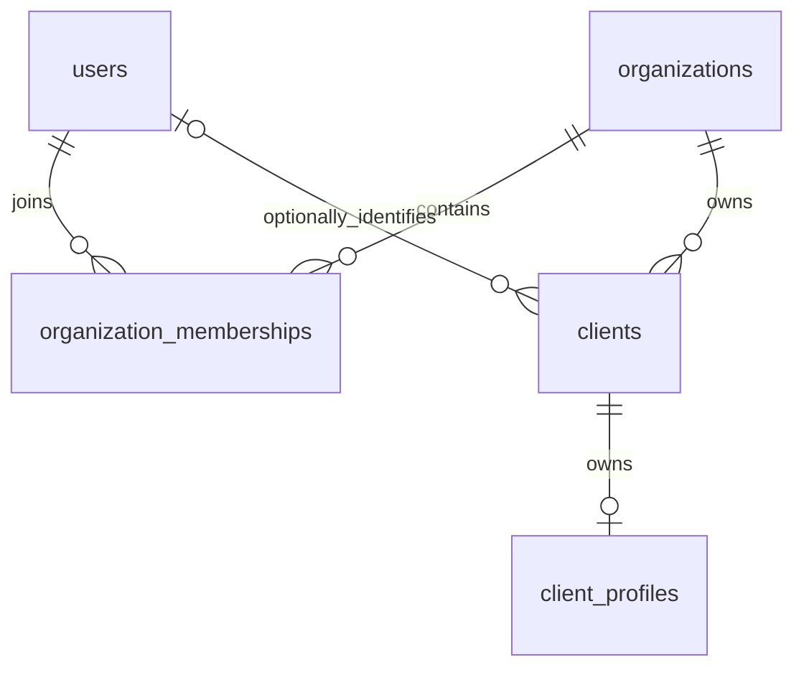

# Organization and client ownership (#73)

The SQLite model implements [issue #73](https://github.com/Michelia-L/AI-WealthPilot/issues/73), building on the [identity foundation](identity-auth.md).

## Data model



| Table | Ownership and constraints |
| --- | --- |
| `organizations` | UUID primary key and required name. The compatibility workspace uses the reserved ID `local`. Names are not unique identifiers. |
| `organization_memberships` | UUID primary key; required organization and user foreign keys; unique `(organization_id, user_id)`; required role checked against `client`, `advisor`, `admin`. |
| `clients` | UUID primary key; required organization foreign key; optional user foreign key. A client can exist without a login or profile. |
| `client_profiles` | Existing integer primary key; required, unique `client_id` foreign key. Organization is resolved through Client rather than duplicated on Profile. |

Roles belong to memberships, never User. One user can have different roles in different organizations, and an advisor can also be linked to a business Client. Linking a user to a Client does not create a membership, assign a role, or grant access. Multiple business clients may reference the same login identity; `user_id` is not a business-client identifier.

Organization and user references are indexed, as is the unique profile-to-client reference. Application engines enable `PRAGMA foreign_keys=ON` on every SQLite connection. Deleting a referenced organization, client, or user fails until its references are explicitly handled; no cascading deletion of business data is configured. This also enforces the existing auth-session user foreign key: sessions must be revoked before deleting a user.

Deleting a profile leaves its Client intact, since Client is an independent business entity. A later profile may be attached to that Client. Updating profile content preserves its Client and Organization.

## Services and current API behavior

`api/ownership.py` provides organization creation, membership creation/role changes, client creation, profile attachment, and profile-owner lookup. Services validate referenced records and flush within the caller's transaction; they do not commit. Database constraints remain authoritative for concurrent writes. Callers must roll back a failed transaction. These are internal persistence helpers, not permission checks or public management endpoints.

Profile creation and uploaded JSON import create Clients in the selected organization. An advisor creating a new profile receives an assignment to its new Client. Legacy disk import targets `local` (display name `Local workspace`); demo seeding targets the separate `demo` organization. Import deduplication is scoped to its destination organization. Demo seeding and first-boot import retain their empty-profile-table checks.

Profile HTTP payload shapes remain unchanged. [Route authorization](api-access.md) now filters requests by the selected organization and the authenticated role, client login link, or advisor assignment. The Web session selects a workspace; no organization or client ownership value from a profile payload can override the server-side association.

## Existing database migration

Application startup and the existing provisioning/import commands call `api.db.init_db()`. For the supported pre-#73 SQLite profile schema, initialization automatically:

1. Begins an explicit `BEGIN IMMEDIATE` transaction, serializing concurrent initializers and making SQLite schema changes transactional.
2. Creates missing tables. If `client_profiles` already has `client_id`, initialization verifies its NOT NULL constraint, single-column uniqueness (an unconditional unique index or table constraint), and foreign key to `clients.id` before skipping the ownership upgrade. A partially compatible schema aborts initialization without attempting an automatic repair.
3. Creates one login-independent Client per existing profile under `local`. No users or memberships are created or inferred, even if a reserved legacy `user_id` was populated.
4. Rebuilds the profile table with required ownership constraints, preserving every integer ID, timestamp, index field, raw JSON value, and legacy `user_id`. Existing references to profile IDs remain valid.
5. Recreates profile indexes, checks profile foreign keys, and commits. Any error rolls back both schema and data changes. Retrying a completed migration preserves client IDs and creates no duplicates.

The old profile `user_id` column is retained only as legacy provenance, including values that do not identify an existing User. No service uses it to resolve ownership or permissions, and new profiles leave it null. Future access control must follow `client_id → clients.organization_id` and separately validate identity/membership.

Before upgrading an existing installation, stop its writers and back up the SQLite database with SQLite's backup facility (or copy the database after a clean shutdown). Do not run old and new application versions against the same database during migration. The upgrade is forward-only; reverting to old code requires restoring the pre-upgrade backup. An unrecognized legacy column layout aborts initialization without modifying the database and needs an explicit migration. This migration targets the project's SQLite persistence; it is not a general migration framework for other database engines.

## Validation

```bash
python -m pytest -q tests/test_ownership.py tests/test_api_profiles.py tests/test_api_auth.py tests/test_api_demo_mode.py
ruff check
ruff format --check
```

Tests cover organization-scoped roles, clients without login identities, advisor/client coexistence, service validation, database rejection of dangling/duplicate/null ownership, raw legacy data preservation, migration retry and rollback after DDL, profile CRUD ownership, import deduplication across organizations, and demo ownership without inferred permissions.
