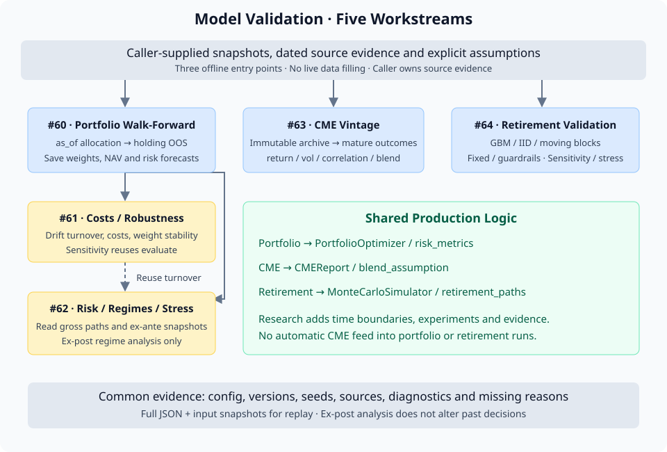

# 08 · Model Validation 与研究工作流

## 目的与边界

一个优化器可以通过全部单元测试，也可以为一段历史生成漂亮的净值曲线。这些结果分别回答实现和历史表现的问题；要判断模型是否值得继续研究，还需要约束当时能看到的信息，观察输入扰动、数据缺失和模型假设改变后，结论如何变化。

| 层次 | 回答的问题 | 本仓库入口 |
|---|---|---|
| Unit / integration tests | 公式、接口、失败路径是否按约定实现？ | `tests/`；包括验证框架自身的边界与手算测试 |
| Historical backtest | 给定固定目标组合，按月再平衡后过去表现如何？ | `src/portfolio/backtest.py`；目标权重由调用方提供 |
| Model validation | 在明确的信息边界、样本和假设下，模型是否稳健、可复现、可解释？ | `validation/`；重新拟合、保存决策证据、比较后续结果或替代模型 |

`tests/` 检查研究工具是否执行了约定，`validation/` 产出可供解释的研究证据。通过测试不能代替模型验证；一次验证也不能证明未来必然优越。退休模拟尤其是条件情景比较，不具备组合 walk-forward 的逐期历史预测含义。

本章串起 [#59](https://github.com/Michelia-L/AI-WealthPilot/issues/59) 的五条 workstream。精确参数、输出字段和完整示例继续由模块 README 维护。生产量化模型先读 [第 02 章](02-quant-engine.md)，CME 输入先读 [第 03 章](03-data-pipeline-cme.md)，测试与 CI 见 [第 07 章](07-quality-engineering.md)。

## 整体架构 · 共享模型，独立研究边界



| Workstream | 研究层增加什么 | 复用什么 |
|---|---|---|
| [#60 · Portfolio Walk-Forward](https://github.com/Michelia-L/AI-WealthPilot/issues/60) | 逐期历史切片、资格判断、OOS 路径与失败记录 | `PortfolioOptimizer` 的生产优化方法 |
| [#61 · Costs / Turnover / Robustness](https://github.com/Michelia-L/AI-WealthPilot/issues/61) | 成本后处理、集中度、权重稳定性、单因素敏感性 | 已保存的 `ValidationRun`；敏感性重新调用同一个 `evaluate` |
| [#62 · Risk / Regimes / Stress](https://github.com/Michelia-L/AI-WealthPilot/issues/62) | 风险预测校准、事后分组、历史与合成压力 | 决策时风险快照、OOS 路径、生产风险函数和历史事件窗口 |
| [#63 · CME Vintage / Calibration](https://github.com/Michelia-L/AI-WealthPilot/issues/63) | 带来源证据的不可变预测归档、到期误差与混合参数实验 | `CMEReport` 和生产 `blend_assumption` 公式 |
| [#64 · Retirement Validation](https://github.com/Michelia-L/AI-WealthPilot/issues/64) | 替代收益过程、支出诊断、敏感性、收敛与压力实验 | 生产积累计算与 `distribution_from_growth` 退休现金流规则 |

Portfolio、CME、retirement 是独立的离线入口。CME 归档不自动写入 live cache，也不自动注入历史 optimizer；退休假设可以记录 `AssumptionSource.cme_vintage_id`，但不会据此取数。这样，改变实验编排时仍能追踪同一生产公式，同时避免把今天的外部输入带进过去的决策。

## Strict no-look-ahead · 先界定信息，再运行模型

### 决策时间与训练、持有窗口

Portfolio 的 `as_of=t` 是月末决策日期。Rolling 训练区间为 `(t - training_window 个日历月末, t]`，持有区间为 `(t, holding_end]`。例如 `t=2019-12-31`、lookback 为 36 个月，训练从 2017-01-01 起，首个 OOS 收益在 2020 年 1 月。月末遇非交易日时，训练最多使用此前最后一条观测。Expanding 模式固定最初的左边界，以后只扩展右边界。

`evaluate` 先切历史，再按每个资产当时的有效观测数和覆盖率判断 point-in-time eligibility。默认至少 252 条有效收益、覆盖已提供训练日期的 90%；lookback 是最大范围，不意味着每个资产都有完整 36 个月历史。未来上市、退市或缺数情况不得改变今天的可选资产。

各策略随后选择自己的 fitting sample。Equal Weight 不需要协方差，Inverse Vol 可以使用各资产自己的有效日期，生产 optimizer 才要求参与资产的 joint complete rows。若先对整个面板 `dropna()`，不相关资产的缺数就可能错误地排除本来可用的 baseline。

入口事实见 [walk_forward.py](https://github.com/Michelia-L/AI-WealthPilot/blob/main/validation/portfolio/walk_forward.py) 的 `_history_at`、`evaluate` 与 [strategies.py](https://github.com/Michelia-L/AI-WealthPilot/blob/main/validation/portfolio/strategies.py) 的 `StrategySpec.allocate`。

### 用 future sentinel 验证边界

一种直接的检查是把某决策日之后的收益改成极端值，或把未来资产数据改成缺失，再比较该日及更早的权重、资格判断和风险快照。它们应保持不变；后续实际收益与校准误差应允许变化。全输入快照的 hash 也会变化，不能要求整个 JSON 完全相同。

现有 [test_walk_forward.py](https://github.com/Michelia-L/AI-WealthPilot/blob/main/tests/test_walk_forward.py) 的 `test_future_sentinel_and_availability_cannot_change_earlier_weights` 验证配权边界；[test_cme_validation.py](https://github.com/Michelia-L/AI-WealthPilot/blob/main/tests/test_cme_validation.py) 的 `test_future_outcomes_change_errors_but_never_archived_components` 检查未来结果只改变误差。新增研究适配器应保留这种检查，并覆盖自己的辅助输入。

`PortfolioStrategy.allocate(history, as_of, config)` 收到的是受限历史副本。普通 Python 对象仍可能通过闭包读取全量数据或调用 provider，框架不能沙箱化这些行为。历史 views、无风险利率和其他外部假设必须另有当时可用的证据；当前内置适配器使用显式固定年化无风险利率，不查询今天的利率或 CME。

### Ex-ante forecast 与 ex-post analysis label

配权使用的输入、协方差和风险预测属于 ex-ante 证据，必须停在决策边界。持有期结束后生成的 bull/bear、利率变化、通胀变化标签属于 ex-post analysis；它们解释这段结果所处的环境。即使修订后 CPI 的索引日期早于决策日，也不能据此声称当时知道其最终值。`classify_regimes` 只输出 `analysis_regime_label`，没有把标签送回 allocator 的接口。

退休 `HistoricalReturns` 的日期表示样本观测期，并不证明其历史发布时间。使用今天选取的样本进行退休情景比较是允许的，但若要提出“过去某日已能作出这一预测”的主张，调用方还须另行建立 point-in-time 样本与假设证据。

### Failure-as-unknown · 缺口必须留下来

配置不支持的策略或输入格式会直接拒绝；逐期分配失败、不可用资产、持有期缺数则保留状态与原因，继续尝试下一个决策。成功配出的权重在后续估值失败时仍被保留，以区分模型分配问题与数据问题。

失败窗口的收益为未知，JSON 中表示为 `null`。后续局部窗口仍可计算，但累计 NAV 从首个缺口起持续未知，整段收益与风险指标被抑制。完全缺失的月份也会留下失败或跳过记录。用 0% 填补相当于添加了未经定义的现金策略；删掉失败期则按评估是否成功选择样本。二者都会改变研究问题。

## Portfolio validation · 先建立可比较的参照

复杂 optimizer 必须与简单 baseline 使用同一 OOS 协议比较。只比较多个 optimizer，难以看出估计与求解的复杂度是否带来了足以抵偿换手、集中度和输入敏感性的收益。Baseline 提供不依赖收益预测或只依赖少量估计的参照；这里不预设谁应胜出。

| 策略名 | 分配规则 / 生产方法 | 分配估计样本 |
|---|---|---|
| `equal_weight` | 对当时 eligible 资产等权 | 无估计 |
| `static` / `60_40` | 显式权重；后者固定 SPY 60%、AGG 40% | 无估计，仅要求非零成分各自可用 |
| `inverse_volatility` | 各资产样本波动率倒数归一化 | 各资产自己的有效观测 |
| `mvo` / `min_variance` | `maximize_sharpe` / `minimize_volatility`（MinVol） | 联合完整行 |
| `erc` / `mean_cvar` | `risk_parity` / `minimize_cvar` | 联合完整行；CVaR 用历史损失情景 |
| `resampled_mvo` | `resampled_maximize_sharpe` | 联合完整行与显式 seed |

Static 成分不可用时不会重新分摊权重；Inverse Vol 遇零或不可用波动率也不会偷偷回退成等权。适配器复用 [optimizer.py](https://github.com/Michelia-L/AI-WealthPilot/blob/main/src/portfolio/optimizer.py) 的正则化与求解行为，记录 condition number、regularization、求解状态等诊断。v1 只支持满仓、long-only；内置 Black-Litterman 尚缺历史 views / prior vintage 适配器。

### Stitched OOS NAV 与两种样本计数

目标在决策收盘应用，持有期内固定资产数量，权重随价格漂移，下个决策再重置。单窗口财富为 `sum(w_i * product(1 + r_i))`，日收益来自财富比值。按不重叠窗口拼接这些日收益，得到 stitched OOS NAV；初始资本隐含为 1。v1 要求 `holding_window == rebalance_frequency`，不能混入重叠 cohort、计划持有缺口或日频再平衡。

| 记录字段 | 解释 |
|---|---|
| `training_window_observations` | 已切训练区间内提供的日期数，包含缺失值所在日期 |
| `estimation_observations` | 分配实际估计量：无估计 baseline 为 0；Inverse Vol 为逐资产计数字典；optimizer 为联合完整行数；未报告时为 `null` |
| `risk_forecast.estimation_observations` | 风险估计自己的样本数，可能与分配估计不同 |
| `ending_weights` | 成功持有且期末财富大于 0 时的漂移权重，供下一次换手计算 |

收益输入是日频 simple returns，调用方提供完整的预期交易日历。所有资产都缺失的一天若连行都没有，框架无法区分它与休市；应显式保留缺失行。输入必须覆盖请求的最后持有日；若最终月末休市，应明确将 `end_date` 设为实际覆盖日期，框架不猜交易所假日。

### Turnover、transaction-cost overlay 与稳定性

[costs.py](https://github.com/Michelia-L/AI-WealthPilot/blob/main/validation/portfolio/costs.py) 的 `compute_turnover` 默认计算 `0.5 * sum(abs(target - previous_ending_weights))`，资产集合取并集。即使相邻目标相同，漂移后恢复目标仍可能需要交易。`turnover_method="target"` 是显式的目标间距离近似；旧结果缺少 ending weights 时不会自动切换到该近似。

`analyze_costs` 默认不收初始建仓费；开启 `charge_initial` 时初次 one-way turnover 为 1。成本为 `turnover * rate_bps / 10000`，从持有窗口首个观测日收益直接扣除。它不重拟合、不改变原目标或漂移路径，是一阶比例成本 overlay。正费率下若上一期权重未知，净收益也未知；零成本仍能重现已有 gross 路径。

[robustness.py](https://github.com/Michelia-L/AI-WealthPilot/blob/main/validation/portfolio/robustness.py) 的 `analyze_weights` 记录最大权重、effective holdings（`1 / sum(w_i**2)`，即 HHI 的倒数）、边界权重频率与相邻目标距离。[sensitivity.py](https://github.com/Michelia-L/AI-WealthPilot/blob/main/validation/portfolio/sensitivity.py) 的 `run_sensitivity` 每次改变一个因素，记录权重距离、集中度阈值跨越、资格变化和失败；不会搜索并选出最佳参数。

| 扰动 | 可解释的比较与边界 |
|---|---|
| Expected return | 年化加性偏移，`0.01` 是 1 个百分点；MVO、resampled MVO、带目标收益约束的 MinVol 支持。随机偏移向量在每个实验中跨决策固定，扰动 seed 与 optimizer seed 分开 |
| Covariance | `sample` / `ledoit-wolf` / `oas` 在相同历史协议下比较；支持 MVO、resampled MVO、MinVol、ERC |
| Lookback | 内置策略均可比较，窗口变化也会改变 eligibility；需查看实际日期、样本数与资产差异 |

当前 Mean-CVaR 优化使用历史情景；其目标收益约束直接用情景均值，协方差只影响报告，因此不支持独立 mean-shock 或 allocation covariance 实验。无收益约束的 MinVol、ERC、简单 baseline 也不依赖预期收益。不可用的实验记录为 skipped，不能报告为“零敏感性”。完整契约见 [ROBUSTNESS.md](https://github.com/Michelia-L/AI-WealthPilot/blob/main/validation/portfolio/ROBUSTNESS.md)。

`compare_runs` 核对快照 hash、universe、OOS 日期、持有 / 再平衡协议和无风险利率。排名按每个成本场景、每项指标分列；任一候选路径不完整，该 cohort 的排名被抑制。没有综合分数，也没有把成功幸存的策略单独排榜。

## Risk calibration / regimes / stress

### 保存决策时的风险预测

[forecasts.py](https://github.com/Michelia-L/AI-WealthPilot/blob/main/validation/portfolio/forecasts.py) 的 `risk_snapshot` 保存有序资产、年化协方差矩阵、估计器、正则化状态、训练边界、样本数和 daily VaR / CVaR。预测波动率为 `sqrt(w.T @ annual_covariance @ w)`。

MVO、MinVol、ERC 与 resampled MVO 保存生产 optimizer 实际拟合的协方差，标记 `covariance_role="decision_model"`；resampled MVO 用最终权重对原拟合协方差报告风险。Mean-CVaR 的协方差是 `reporting_only`。简单 baseline 若没有快照，则只在正权重成分的联合有效历史上补做 reporting estimate；样本不足只让风险预测不可用，不推翻已经有效的配权。

大多数策略复用生产历史百分位 VaR 和 inclusive-tail CVaR；Mean-CVaR 保存 LP threshold / objective，并撤销生产报告的 `sqrt(252)` 缩放以回到日尺度。`downside_method` 区分这两种有限样本约定。旧归档没有决策快照时，报告保持 unavailable，不用全量历史事后重建。

### Predicted vs realized 与 exceedance

[risk_calibration.py](https://github.com/Michelia-L/AI-WealthPilot/blob/main/validation/portfolio/risk_calibration.py) 的 `calibrate_risk` 将快照与下一 holding window 的实际漂移 OOS 日收益配对。预测是年化的一日协方差风险，实际波动率则从下一持有期日收益估计；两者都用 `sqrt(252)` 年化，短窗口估计噪声仍然存在。

误差定义为 `realized - predicted`。Bias 观察有符号偏差，MAE 观察平均绝对误差，RMSE 对大误差更敏感；还应查看 predicted/realized ratio、严重低估频率与有效 / 缺失期数。默认需每期 20 条日观测、汇总至少 3 个有效期。失败期保留为 unpaired；可用配对上的汇总不能替代完整策略绩效比较。

VaR exceedance 比较的是日损失 `-daily_return > VaR`，等于阈值不算 breach，不能拿月度复合损失去检验日 VaR。CVaR 诊断比较 breach 条件下平均实际损失与预测 CVaR；默认历史尾部和实际 breach 样本门槛均为 5。样本不足会留下计数并抑制相应校准指标。LP 目标与严格 exceedance 条件均值在有限样本下不要求相等。这些描述性结果不提供独立性检验、正式监管 VaR 认证或 regulatory model approval。

### Regimes 必须保留时间连续性

[regimes.py](https://github.com/Michelia-L/AI-WealthPilot/blob/main/validation/portfolio/regimes.py) 的 `classify_regimes` 接收带来源、单位和 revision policy 的 `AnalysisSeries`。它按完成持有期内 benchmark 正负收益、波动率阈值、边界利率与通胀变化分别分类；规则可配置，不以全历史分位数反推阈值。缺数或过旧的宏观观测生成 unknown。

`regime_metrics` 默认要求 3 个期间、60 条日观测。Conditional CAGR 只对所选观测数年化，不代表整段日历时间上的可执行策略收益。最大回撤在每个 **contiguous regime episode** 内从资本 1 计算，再取最差 episode；分隔数年的两个 bear 片段不会直接拼成一条净值曲线。某个已选期间失败会抑制该组绩效，unknown 标签不成为绩效组。

### Historical stress 与 transparent synthetic shocks

[stress.py](https://github.com/Michelia-L/AI-WealthPilot/blob/main/validation/portfolio/stress.py) 的 `historical_stress` 复用生产 `STRESS_SCENARIOS` 的 COVID、rate shock、GFC 日期，在已保存 walk-forward 路径上截取完整事件窗口，保留期间既有再平衡。覆盖不足会标记；恢复期分析遇缺口停止。与事件波动率比较的是事件开始前严格更早的最后有效预测，两种期限差异需要留在解释中。

`synthetic_stress` 对已保存目标施加显式冲击，不重新优化。标准场景包含权益 -30%、收益率平移 +200 bps、波动率乘 1.5、相关性向 +1 混合 75%，以及叠加信用利差 +100 bps 的组合场景。久期和 spread duration 由调用方提供；损失近似含 `-duration * yield_change`，缺少必要暴露时结果未知。

协方差冲击先计算 `(1-a)*Sigma + a*outer(asset_vol, asset_vol)`，再乘波动率倍数的平方。瞬时收益冲击与年化 stressed volatility 分开报告，不赋予事件概率，也不把久期近似当成真实历史损失。各门槛、单位和情景契约见 [RISK_VALIDATION.md](https://github.com/Michelia-L/AI-WealthPilot/blob/main/validation/portfolio/RISK_VALIDATION.md)。

## CME vintage validation · 保存当时的预测与来源

### Vintage 必须成为一等对象

CME 同时含历史、forward、implied volatility 和宏观假设，只保存最后的 blended 数字不足以知道预测何时可用、用了哪个版本。运行缓存服务当前请求，研究归档则需要保存当时的输入输出与来源。`CMEVintage.from_report` 复制实际报告参数，不从当前请求默认值重建。

| 字段 / 类型 | 含义与 strict 边界 |
|---|---|
| `as_of` | UTC 预测决策日期；周一用上周五价格生成的预测属于周一 |
| `report_as_of` | 原 `CMEReport.as_of_date`，生产引擎当前设置为最后价格日期 |
| `generated_at` | 实际生成 / 捕获或重建时间，必须带时区 |
| `observed` vintage | 当日实际保存的预测；生成日期须与 `as_of` 同日，来源在生成前已观测、可用、获取 |
| `reconstructed` vintage | 后来重建的历史决策；来源在 `as_of` 的 UTC 日终前已观测且可用，可以后来获取，但 `latest_revised` / unknown revision policy 不足以证明历史可用性 |

`SourceRecord` 区分 `observed_at`、`available_at`、`retrieved_at`，保存 provider/proxy、quality、revision policy、可选数值构件和源快照 hash。Strict 校验要求时间顺序成立，并覆盖 history、实际存在的 forward / implied，以及共享 correlation、risk-free、inflation、FX 证据。固定假设也需要采用日期；quality 为 cached / stale / fallback 的来源保留自身状态，unknown 则不能通过 strict。

今天取出的 stale 报告不能因为价格较早就回填为过去的 observed vintage。当前生产报告尚不暴露全部来源时间，允许用 `sources=()` 保存，但默认 strict calibration 会排除它。不能为通过检查编造历史日期。缺少历史 forward input 时，应使用有证据的历史分支或带日期的代理，或保留为不适合严格验证的记录。

这些规则由 [vintages.py](https://github.com/Michelia-L/AI-WealthPilot/blob/main/validation/cme/vintages.py) 的 `CMEVintage.strict_issues` 检查。来源证据仍是调用方陈述，校验器不能证明其真实性；`strict=False` 只允许保留问题的探索性分析，不会把不合格记录变成 strict evidence。

### Immutable content-addressed archive

`CMEVintage` 及嵌套记录冻结，集合使用 tuple。`VintageStore.save` 将 canonical JSON 以 SHA-256 为文件名原子发布，不覆盖已存在记录；相同内容重复保存幂等，证据变化生成新 ID。`load` 验证 hash，归档接口不提供 update/delete。模型版本与 code version 必须显式提供；代理映射、混合方法、FX 或其他模型假设改变时，应区分 model version。

Content hash 可以发现意外修改，不提供签名或外部认证；还需保留原始来源快照及备份。Live API / cache 当前没有自动捕获归档的流程。

### 到期后才计算误差

[realized.py](https://github.com/Michelia-L/AI-WealthPilot/blob/main/validation/cme/realized.py) 的 `RealizedPanel` 要求 daily simple total returns、稳定资产键、精确 proxy 映射、币种 / FX 处理和日历覆盖。`evaluation_date` 必须显式给出；默认 1 / 3 / 5 个日历年 horizon 未到周年即 immature，即使输入误含未来数据也不放行。结果区间为 `(as_of, as_of + H 年]`，不包含决策日。

[calibration.py](https://github.com/Michelia-L/AI-WealthPilot/blob/main/validation/cme/calibration.py) 的 `calibrate` 比较归档 forecast 与到期收益、波动率、相关性。主收益误差是 realized CAGR 减 stored annual expected return；生产 historical component 是算术年化均值，因此差异含口径和波动拖累，不能当成已做算术到几何预测转换。报告也提供实际算术年化收益。

相关性比较使用完整共同日窗口，排除对角线；完整矩阵误差要求所有 pair 有效。缺失值、变更 proxy、币种不一致不能静默替换。汇总默认要求 3 个不同的可用预测日期，按 model、observed/reconstructed、配置和质量状态等分组。同组同日重复 capture 必须显式选择一份；重叠多年 horizon 也不是独立样本。

### Tau / omega counterfactual blending

[blending.py](https://github.com/Michelia-L/AI-WealthPilot/blob/main/validation/cme/blending.py) 的 `evaluate_blending` 复用生产 [cme_blending.py](https://github.com/Michelia-L/AI-WealthPilot/blob/main/src/portfolio/cme_blending.py) 的 `blend_assumption`，在归档构件上分别改变 tau（波动率）和 omega（预期收益）。0 选择 historical，1 在替代输入存在时选择 implied / forward；缺失替代构件仍是单独的 `historical_fallback` cohort。缺历史收益构件的旧报告不能从四舍五入的 blended 数字反解输入。

反事实实验比较同一 vintage 的误差变化、低估、跨 vintage 波动和收益排序变化。它不修改原归档，不自动调生产参数；用今天的 forward input 填进历史重建会跨过信息边界。完整 API 和多资产、多 vintage 示例见 [CME README](https://github.com/Michelia-L/AI-WealthPilot/blob/main/validation/cme/README.md)。

## Retirement model validation · 固定现金流规则，改变收益过程

### Production GBM baseline 与共同记账规则

[harness.py](https://github.com/Michelia-L/AI-WealthPilot/blob/main/validation/retirement/harness.py) 的 `run_retirement` 产生年度 gross-return paths，交给生产 `MonteCarloSimulator.simulate` 积累计算及 [retirement_paths.py](https://github.com/Michelia-L/AI-WealthPilot/blob/main/src/portfolio/retirement_paths.py) 的 `distribution_from_growth`。每年先收益，后名义年末存入或提取；年储蓄不随通胀自动增长。实际提取受可用财富上限约束，财富下限为零。

GBM gross return 为 `exp(mu - sigma**2/2 + sigma*Z)`，所以 `mu` 是漂移参数，年简单收益期望为 `exp(mu)-1`。退休阶段默认将 mu 与 sigma 分别乘 0.7，这是显式 heuristic，不是推算出的新资产组合。默认参数与相同输入 / seed 下，harness 保留生产 GBM 路径和存续行为，见 [test_retirement_validation.py](https://github.com/Michelia-L/AI-WealthPilot/blob/main/tests/test_retirement_validation.py) 的 `test_gbm_production_parity_and_reproducibility`。

Fixed 支出对目标做积累期和退休期通胀调整。Guardrails 使用生产现有时序：初始提取 anchor 已含第一个退休通胀步，第一次 tentative withdrawal 又通胀一次；因此非零通胀下二者首年实际支出并不相同。触发比例使用收益前财富，调整后的支出影响以后年度。验证层保留并披露该约定，不在比较中另写一套现金流规则。

### IID、moving-block bootstrap 与矩匹配

[bootstrap.py](https://github.com/Michelia-L/AI-WealthPilot/blob/main/validation/retirement/bootstrap.py) 接受一条完整组合的名义 total-return series，要求明确组合 / 再平衡映射、币种与 FX。月度必须逐月连续，年度必须逐年连续，不补缺、不自动配权或换汇。月收益先按 12 个源期复合，现金流仍按年处理。

IID 有放回抽取单个观测；moving-block bootstrap 抽取连续完整块，拼接后截断末块，不从样本末端环绕回开头。默认 block length 为 6 个**源期**，年度数据中这意味着 6 年。边缘观测的入选权重较低；积累与分配阶段独立抽样，不跨退休边界连块。保留的是块内局部依赖。

| 模式 | 比较时哪些假设改变了 |
|---|---|
| `empirical` | 积累期直接重采样历史，分配期对样本 log moments 应用退休倍率；不使用 scenario 的 mu / sigma，因此同时比较分布与参数估计差异 |
| `matched_gbm_moments` | 将样本 log returns 中心化、缩放到情景 GBM 的边际 log moments，再保留样本形状与块顺序；帮助隔离分布形状和依赖差异 |

Matched 不保证有依赖的块复合成年后仍与 GBM 年度矩相同。Bootstrap 输入必须大于 -100%，因为需要 log-moment mapping；确定性 supplied path 或 stress 可以有恰好 -100% 的损失。Empirical 模式下做 mu / sigma grid 会被拒绝，避免把未使用的参数报告为零敏感性。

### Sequence-of-returns 与 spending trade-off

`sequence_experiment` 重新排列同一组收益的负值位置。Fixture 从 100 开始、每年末提取 20、无通胀，把 `[-0.5, 0.5, 0.1, 0.1]` 的亏损放在早 / 中 / 晚位置，期末财富分别为 0、12.45、37.65；不提取时三者均为 90.75。相同复合收益不能消除现金流与顺序的交互。

`compare_models` 在每种收益引擎内用相同 draws 比较 fixed / guardrails，观察 survival 的同时查看 delivered real spending、shortfall、cuts / increases。Guardrail 的存续率提升可能以少花钱为代价，也可能在好路径中增加支出；不能只看一个成功率。成功定义为退休时及每个退休年末财富都严格大于零，恰好支付末次提取后剩零仍算 depleted。

### 参数、压力与两类不确定性

[experiments.py](https://github.com/Michelia-L/AI-WealthPilot/blob/main/validation/retirement/experiments.py) 的 `standard_sensitivities` 覆盖 return / vol、退休倍率、积累与分配通胀、elderly inflation preset 和规划终龄。终龄变化是 longevity horizon sensitivity，没有模拟随机死亡时间。

`stress_comparison` 使用确定性覆盖：退休首年 -30%、前最多十年 0% 收益、前最多五年 6% 通胀及组合冲击。收益覆盖原 draws，不与之相加；通胀冲击后年率回基准，但物价水平的累计影响保留。场景不是带概率的预测。

`convergence` 改变模拟数和 seed；`stability_table` 展示存续率、终值中位数和 P5 的跨 seed 均值、标准差、范围，不自动挑 seed 或宣布收敛。随机运行给出的 `sqrt(p*(1-p)/N)` 只是给定模型与固定历史样本的 MC sampling error；p 为 0 或 1 时 plug-in error 为零也不代表确定性。确定性 fixture 的 MC error 为 `null`。

相同引擎、相同规模和 seed 的支出规则比较可使用相同 draws；GBM 与 bootstrap 的相同 seed 不让两种机制的路径一一配对，增加 N 也不是嵌套样本。增大 N 可以减小 sampling uncertainty，不能消除参数估计、历史样本选择和 model uncertainty。完整约定见 [retirement README](https://github.com/Michelia-L/AI-WealthPilot/blob/main/validation/retirement/README.md)。

## Reproducibility / provenance · 保存数字的生成条件

下表是跨模块归档核对表，不表示每个对象都实现了相同字段。Portfolio 的 `as_of` 在 rebalance records 中，CME 的 horizon 在校准配置中，退休使用年龄范围而无内建历史决策 `as_of`；缺少的来源说明应伴随输入快照保存，不要填造字段。

| 信息 | 研究证据需要回答什么 |
|---|---|
| `as_of` / horizon | 何时决策，使用哪个训练、持有、到期或退休范围？ |
| Config / strategy / estimator | universe、资格规则、约束、成本、分配方法和估计器是什么？ |
| Model version / code version | 模型假设属于哪个版本，运行的是哪个 commit / build？Portfolio 的可选 `code_version` 归档时应补齐；CME / retirement 要求调用方提供 |
| Seed / numerical environment | optimizer、扰动、phase seeds 与数值库版本是否保留？ |
| Source / source dates | 数据何时观测、发布可用、获取，币种、FX、proxy 如何处理？ |
| Quality / revision policy | 使用原始 vintage、修订历史、cached / stale / fallback 还是 synthetic 数据？ |
| Historical sample | 完整输入日期和值、数据 hash 与外部源快照是否可获得？Hash 本身不能重建输入 |
| Stress / regime definition | 事件窗口、标签阈值、暴露和压力幅度是否随报告存档？ |
| Serialized diagnostics | 失败原因、缺失 / 有效计数、协方差与正则化、校准资格是否与结果一起保存？ |

Portfolio `ValidationRun.to_json()` 保存配置、逐次权重、诊断、路径与 provenance，但调用方还要保存输入快照。CME archive 保留完整输入构件与预测，源 hash 引用的原始证据须另存；retirement 输出保存实际历史日期和值、phase seeds 与收益路径 hash，`include_paths=True` 增加每条路径的终值、支出与耗尽等指标，不导出完整逐年财富矩阵。CSV 便于分析，需配完整 JSON，不能单独充当归档。

同样的输入、seed 与数值环境可复现研究计算；运行时间戳会变化，跨平台求解器也可能有浮点差异。归档只含研究参数，不能把凭证、原始 provider response 或真实客户资料塞入 diagnostics；真实退休情景含金额假设，应作为私有研究资料保管。

## 最小离线实验

先在仓库根目录按 `.python-version` 与 `requirements-dev.txt` 准备环境：

```bash
python -m pip install -r requirements-dev.txt
```

下面三个 Python 代码块各自独立，可从仓库根复制执行。安装依赖后，实验只使用内存合成数据；不调用 live provider，也不依赖 `DEMO_MODE`。示例写入系统临时目录并打印路径，使用者归档时应保留输出 JSON、源数据及代码版本。示例数字只用于理解接口。

### Walk-forward baseline vs MVO、成本与风险校准

先检查路径 complete，再看成本差异和风险误差。成本 overlay 与风险报告读同一批 runs；后者仍报告 gross 风险。

```python
from dataclasses import replace
from pathlib import Path
from tempfile import mkdtemp
import subprocess

import numpy as np
import pandas as pd

from validation.portfolio import (
    AnalysisSeries,
    CostConfig,
    StrategySpec,
    WalkForwardConfig,
    analyze_risk,
    compare_runs,
    evaluate,
)

out = Path(mkdtemp(prefix="wealthpilot-portfolio-"))
dates = pd.bdate_range("2017-01-01", "2020-06-30")
returns = pd.DataFrame(
    np.random.default_rng(71).normal([0.0003, 0.0001], [0.012, 0.004], (len(dates), 2)),
    index=dates,
    columns=["SPY", "AGG"],
)
config = WalkForwardConfig(
    start_date="2019-12-31",
    end_date="2020-06-30",
    universe=("SPY", "AGG"),
    training_window=24,
    risk_free_rate=0.02,
    risk_free_rate_source="fixed synthetic assumption",
    random_seed=71,
    data_source="synthetic daily returns, seed 71",
    code_version=subprocess.check_output(
        ["git", "rev-parse", "HEAD"], text=True
    ).strip(),
)
runs = {
    name: evaluate(returns, replace(config, strategy=StrategySpec(name)))
    for name in ("equal_weight", "mvo")
}
assert all(run.metrics["complete"] for run in runs.values())
costs = compare_runs(runs, CostConfig(rates_bps=(0, 10, 25)))
risk = analyze_risk(
    runs,
    historical_scenarios=[],  # 本例只演示校准与事后 regime
    benchmark=AnalysisSeries(
        returns["SPY"],
        source="synthetic benchmark",
        revision_policy="synthetic",
        units="daily_simple_return",
    ),
)
returns.to_csv(out / "input.csv")
for name, run in runs.items():
    (out / f"{name}.json").write_text(run.to_json(), encoding="utf-8")
(out / "costs.json").write_text(costs.to_json(), encoding="utf-8")
(out / "risk.json").write_text(risk.to_json(), encoding="utf-8")
print(costs.to_dataframe()[["name", "cost_bps", "net_cagr", "complete"]])
print(risk.tables()["calibration_summary"])
print(out)
```

进一步运行 `run_sensitivity(returns, config, ...)` 可沿同一 OOS 协议比较假设；显式 `AssetExposure` 与 `standard_scenarios` 的调用路径见 [risk README 示例](https://github.com/Michelia-L/AI-WealthPilot/blob/main/validation/portfolio/RISK_VALIDATION.md)。

### Archive / evaluate 一个 CME vintage

此例故意只构造一个资产、一个 reconstructed vintage，展示归档、到期及 fallback 行为。日期和来源证据均为合成 fixture，不代表曾经发布过真实预测。一个 vintage 可产生逐条误差，但达不到默认三个不同预测日期的汇总门槛；单资产也没有跨资产相关性或排名证据。

```python
from datetime import date, datetime, timezone
from pathlib import Path
from tempfile import mkdtemp
import subprocess

import numpy as np
import pandas as pd

from src.portfolio.cme_models import AssetClassCME, CMEReport
from validation.cme import (
    CMEVintage,
    RealizedPanel,
    SourceRecord,
    VintageStore,
    calibrate,
    evaluate_blending,
)

out = Path(mkdtemp(prefix="wealthpilot-cme-"))
available = datetime(2019, 12, 31, tzinfo=timezone.utc)
generated = datetime(2026, 9, 12, tzinfo=timezone.utc)
asset = AssetClassCME(
    name="Synthetic asset",
    key="fixture",
    ticker="FIXTURE",
    historical_return=0.05,
    expected_return=0.05,
    volatility=0.12,
    sharpe_ratio=0,
    max_drawdown=0,
    var_95=0,
    cvar_95=0,
)  # 描述性风险字段为占位；没有 forward / implied 构件
report = CMEReport(
    as_of_date="2019-12-31",
    data_lookback_years=3,
    risk_free_rate=0.02,
    risk_free_rate_source="synthetic fixed assumption",
    inflation_assumption=0.025,
    asset_classes=[asset],
    correlation_matrix={"fixture": {"fixture": 1.0}},
)
sources = tuple(
    SourceRecord(
        component=component,
        provider="synthetic fixture",
        proxy="FIXTURE",
        observed_at=available,
        available_at=available,
        retrieved_at=generated,
        quality="fresh",
        revision_policy="fixed_assumption",
    )
    for component in ("history", "correlation", "risk_free", "inflation", "fx")
)
vintage = CMEVintage.from_report(
    report,
    as_of=date(2019, 12, 31),
    generated_at=generated,
    vintage_type="reconstructed",
    model_version="synthetic-fixed-v1",
    code_version=subprocess.check_output(
        ["git", "rev-parse", "HEAD"], text=True
    ).strip(),
    base_currency="CNY",
    fx_treatment="synthetic CNY total returns",
    cache_status="fresh",
    sources=sources,
)
assert not vintage.strict_issues()
store = VintageStore(out / "vintages")
saved = store.load(store.save(vintage))
dates = pd.bdate_range("2019-12-31", "2024-12-31")
returns = pd.DataFrame(
    {"fixture": np.random.default_rng(71).normal(0.0002, 0.008, len(dates))},
    index=dates,
)
panel = RealizedPanel(
    returns,
    {"fixture": "FIXTURE"},
    "CNY",
    "synthetic CNY total returns",
    source="synthetic daily outcome",
    revision_policy="synthetic",
    coverage_start="2019-12-31",
    coverage_end="2024-12-31",
)
calibration = calibrate([saved], panel, evaluation_date="2024-12-31")
blending = evaluate_blending([saved], panel, evaluation_date="2024-12-31")
returns.to_csv(out / "input.csv")
for name, result in (("calibration", calibration), ("blending", blending)):
    (out / f"{name}.json").write_text(result.to_json(), encoding="utf-8")
print(saved.vintage_id, out)
```

这里没有替代构件，tau / omega 实验应留在 historical fallback。要观察非平凡 blend 和相关性误差，沿 [CME README 的三资产 / 三 vintage 示例](https://github.com/Michelia-L/AI-WealthPilot/blob/main/validation/cme/README.md) 运行，仍无需联网。

### GBM vs IID vs block bootstrap retirement comparison

下面生成六个运行，即三个收益引擎各配 fixed / guardrails。Empirical 与 matched 两份报告分别回答“整体模型差异”和“控制边际 log moments 后的差异”。

```python
from pathlib import Path
from tempfile import mkdtemp
import subprocess

import numpy as np
import pandas as pd

from validation.retirement import HistoricalReturns, RetirementScenario, compare_models

out = Path(mkdtemp(prefix="wealthpilot-retirement-"))
scenario = RetirementScenario(
    current_age=55,
    retirement_age=65,
    life_expectancy=90,
    current_savings=800_000,
    annual_savings=40_000,
    desired_annual_income=80_000,
    expected_return=0.06,
    volatility=0.15,
    base_currency="CNY",
    inflation_rate=0.025,
    distribution_inflation_rate=0.03,
    n_simulations=1000,
    seed=71,
    code_version=subprocess.check_output(
        ["git", "rev-parse", "HEAD"], text=True
    ).strip(),
)
history = HistoricalReturns(
    dates=tuple(pd.date_range("2000-01-31", periods=240, freq="ME").date),
    returns=tuple(np.tile([-0.08, -0.02, 0.01, 0.02, 0.04, 0.07], 40)),
    frequency="monthly",
    source="deterministic synthetic fixture",
    portfolio_mapping="synthetic whole-portfolio nominal total returns",
    currency="CNY",
    fx_treatment="already CNY",
    sample_kind="synthetic",
)
for mode in ("empirical", "matched_gbm_moments"):
    comparison = compare_models(scenario, history, block_length=6, bootstrap_mode=mode)
    (out / f"{mode}.json").write_text(comparison.to_json(), encoding="utf-8")
    print(mode, comparison.tables()["comparison"])
print(out)
```

然后沿 `sequence_experiment` → `standard_sensitivities` → `stress_comparison` → `convergence` / `stability_table` 的路径提出更具体的问题；[retirement README](https://github.com/Michelia-L/AI-WealthPilot/blob/main/validation/retirement/README.md) 提供独立配置与导出示例。不要依据这组合成收益的成功率决定实际支出。

## 已知近似与边界

| 边界 | 当前研究结果不能替代什么 |
|---|---|
| 历史样本选择 | 不能修复调用方 universe 的 survivorship bias、事后筛选、缺失退市收益或错误 revision history |
| 实施成本 | 比例成本与假想久期不覆盖真实 execution impact、逐证券 spread、税费 / tax lots、流动性与已执行交易 |
| 风险校准 | 描述性 VaR / CVaR、regime 和 stress 不构成正式监管认证、宏观预测或事件概率 |
| CME 历史证据 | 尚无自动历史重建 loader 或 live 归档调度；实际 vintage 不足时不能以合成重建替代真实预测质量证据 |
| 退休模型 | 年度现金流与固定规划终龄不覆盖 stochastic mortality、税务、养老金、医疗及完整家庭负债模型 |
| 结论外推 | OOS、参数稳定或较低误差都依赖样本与协议，不能证明未来策略必然优越，也不构成投资建议审批 |

## 自检问题

1. 修改下一持有期收益后，哪些权重 / 预测必须不变，哪些误差与 provenance 可以变化？
2. 为什么 baseline 的分配样本数可以为 0，而风险报告仍需足够联合历史？
3. 某一期失败后仍有局部收益，为什么不能恢复累计 NAV 或删除失败期排榜？
4. 周一捕获一份基于周五价格的 CME，`as_of` 与 `report_as_of` 各是什么？缺少来源时间如何处理？
5. 两段不连续 bear 期间的回撤为什么要在各自 episode 内计算？
6. Guardrails 的存续率提高时，应同时查看哪些支出指标？增加模拟数能消除模型之间的差异吗？

## 代码入口与推荐阅读路径

| 阅读目的 | 路径与关键符号 |
|---|---|
| 理解配权和估值边界 | [portfolio README](https://github.com/Michelia-L/AI-WealthPilot/blob/main/validation/portfolio/README.md) → [walk_forward.py](https://github.com/Michelia-L/AI-WealthPilot/blob/main/validation/portfolio/walk_forward.py) `evaluate` → [strategies.py](https://github.com/Michelia-L/AI-WealthPilot/blob/main/validation/portfolio/strategies.py) `StrategySpec.allocate` |
| 比较成本与输入稳定性 | [ROBUSTNESS.md](https://github.com/Michelia-L/AI-WealthPilot/blob/main/validation/portfolio/ROBUSTNESS.md) → [costs.py](https://github.com/Michelia-L/AI-WealthPilot/blob/main/validation/portfolio/costs.py) `analyze_costs` → [sensitivity.py](https://github.com/Michelia-L/AI-WealthPilot/blob/main/validation/portfolio/sensitivity.py) `run_sensitivity` |
| 查看风险报告组合方式 | [RISK_VALIDATION.md](https://github.com/Michelia-L/AI-WealthPilot/blob/main/validation/portfolio/RISK_VALIDATION.md) → [risk_report.py](https://github.com/Michelia-L/AI-WealthPilot/blob/main/validation/portfolio/risk_report.py) `analyze_risk` |
| 从预测证据走向到期评估 | [CME README](https://github.com/Michelia-L/AI-WealthPilot/blob/main/validation/cme/README.md) → [vintages.py](https://github.com/Michelia-L/AI-WealthPilot/blob/main/validation/cme/vintages.py) `CMEVintage` / `VintageStore` → [calibration.py](https://github.com/Michelia-L/AI-WealthPilot/blob/main/validation/cme/calibration.py) `calibrate` |
| 比较退休收益过程与支出规则 | [retirement README](https://github.com/Michelia-L/AI-WealthPilot/blob/main/validation/retirement/README.md) → [harness.py](https://github.com/Michelia-L/AI-WealthPilot/blob/main/validation/retirement/harness.py) `run_retirement` → [experiments.py](https://github.com/Michelia-L/AI-WealthPilot/blob/main/validation/retirement/experiments.py) `compare_models` |

新增研究功能的 PR 应检查是否改变本章的信息边界、模型假设或跨模块工作流。模块 README 维护精确 contract，本章维护系统解释；大型 workstream 的设计依据应能从 guide 找到，避免只留在 issue / PR 历史中。
